# Jagged Alliance 2 Game Editor

A savegame, game data and map editor for **Jagged Alliance 2** in one window.
Change your squad, edit the campaign in progress, rebalance items and mercs, or build maps without digging through XML and binary files by hand.

<p align="center">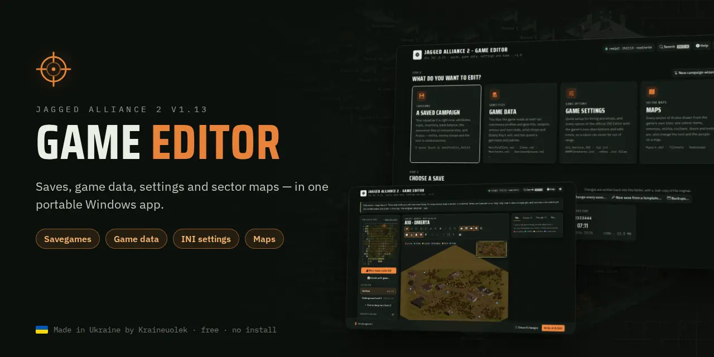</p>

**It's free.** No price, no ads, no sign-up.
*Downloads are strictly for true fans only* — if you still hum the laptop theme and know which merc hates whom, you qualify. 😉

> [!CAUTION]
> **Selling this editor is strictly forbidden!**
> The editor was created by the community of **Jagged Alliance 2** fans, for the fans. It is free and must stay free: do not sell it, do not bundle it into paid packs and do not put it behind a paywall. If someone charged you for it, you were scammed. See [License](#license).

**[⬇ Download the latest release](../../releases/latest)**

> [!WARNING]
> **After downloading, check the files for viruses!**
> Before running any `.exe` you got from the internet — this one included — upload it to an online multi-engine scanner:
> - [MetaDefender](https://metadefender.com/) — scans the file with dozens of antivirus engines at once
> - [VirusTotal](https://www.virustotal.com/) — 70+ antivirus engines and URL/file reputation
> - [Hybrid Analysis](https://www.hybrid-analysis.com/) — scan plus sandbox run showing what the file does
> - [Jotti's malware scan](https://virusscan.jotti.org/) — free scan with a set of popular engines
>
> The full source code of the editor ships with it (⚙ → *Unpack the source code*), so you can also read it or build it yourself.

> [!IMPORTANT]
> **Back up your game before using the editor!**
> The editor changes saves, game data and maps directly on disk, and there is always a chance it **damages your game files**. Before you start, copy your whole game folder (at least `Data`, `Data-1.13` and `SavedGames`) somewhere safe — just in case. The editor's own `.bak` copies and save history help, but they do not replace a full backup of your own.

## 📑 Contents

- [🌐 Available languages](#-available-languages)
- [🤝 Developers wanted](#-developers-wanted)
- [Features](#features) — [🚀 Start](#-start) · [💾 Savegame editor](#-savegame-editor) · [📦 Game data editor](#-game-data-editor) · [🗺️ Map editor](#%EF%B8%8F-map-editor)
- [✅ Compatibility](#-compatibility)
- [Getting started](#getting-started) · [Verify the download](#verify-the-download-sha-256)
- [Keyboard shortcuts](#keyboard-shortcuts) · [Troubleshooting / FAQ](#troubleshooting--faq) · [Reporting bugs](#reporting-bugs)
- [💬 Community](#-community)
- [Changelog](#changelog) · [Credits](#credits) · [License](#license) · [Disclaimer](#disclaimer)

## 🌐 Available languages

<p align="center">
  <a href="README.md"></a>
  <a href="README.es.md"></a>
  <a href="README.de.md"></a>
  <a href="README.fr.md"></a>
  <a href="README.it.md"></a>
  <a href="README.pt.md"></a>
  <!-- Language switcher (same row in the "Available languages" section of every README.*.md; that file's language is green with ✓).
       To add a language: copy README.md to README.xx.md, translate it and add a badge to the row in every file. -->
</p>

## 🤝 Developers wanted

> [!TIP]
> **Are you a developer and ready to help? Join us!**
> The editor is a fan project and every extra pair of hands makes it better — bug fixes, new features, support for more mods, testing or docs.
> Take a look at the [open issues](../../issues) (start with [`good first issue`](../../issues?q=is%3Aopen+label%3A%22good+first+issue%22)), open a new one to say what you'd like to work on, or send a pull request. Any help is welcome!

**Not a programmer?** You can still help:

- 🌍 **Translate the editor** — copy [`lang/en.json`](lang/en.json) to `es.json`, `de.json`…, translate the right side of each line (keep `{0}`, `{1}`), and send it in an issue or a pull request.
- 🧪 **Test** — play with your saves and maps and report what breaks (⚙ → *Report a problem…* makes a ready `.zip`).

**Built with:**


| Folder | What's inside |
|---|---|
| `ja2-editor/` | The editor itself (JavaScript, PHP views, CSS). Run it without building: `php -S 127.0.0.1:8080` in that folder. |
| `desktop/` | The Windows app in Go (local file server + WebView2 window). |
| `installer/` | The setup and the portable zip (NSIS). |

How to build everything: see [HOW TO BUILD](HOW%20TO%20BUILD.txt).

---

## Features

Every feature, where to find it and what it does. The same list is in the editor's **Help (F1)**.

### 🚀 Start

<p align="center">
  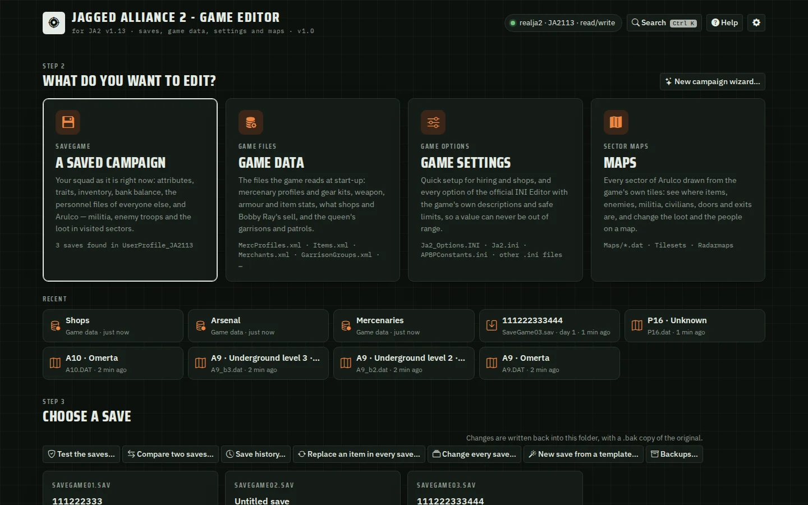
  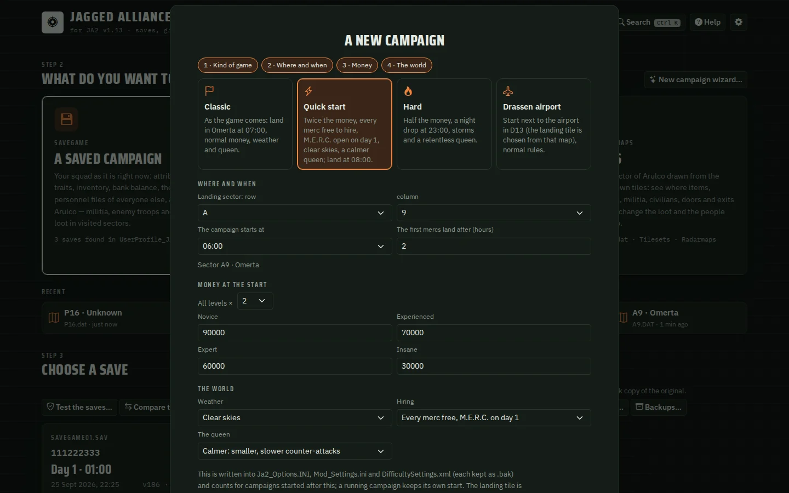
</p>

| Feature | Where | What it does |
|---|---|---|
| **Game folder** | Start page | Type or **Browse** to the folder with `ja2.exe`, press **Connect** (the portable app reads and writes on disk). Items, pictures, maps and saves are all read from it. The editor's own settings live in `%APPDATA%\Jagged Alliance 2 - Game Editor`. |
| **Start screen** | On start | A loading bar while the editor reads the game folder. |
| **Play** | Top bar | Starts the game (`ja2.exe` of the game folder) right from the editor, with a reminder when changes are not written yet. |
| **Recent** | Start page | The saves, maps and game-data pages you opened last, one click away (per game folder). |
| **New campaign wizard…** | Start page | A kind of game (Classic, Quick start, Hard, Drassen airport) or your own mix — landing sector and hour, money per difficulty, weather, hiring, the queen — written for the next *New game*. |
| **Backups on write** | Everywhere | Every write keeps the original as `.bak`. |
| **Changes** | Bottom bar | The session's change log for saves and game data; go back to before any change. |
| **Undo / redo** | Bottom bar, Ctrl+Z / Ctrl+Y | In saves, game data and maps. |
| **Autosave** | Every minute | Changes not written yet (save, map, game data, `Ja2_Options.INI`) go into `Editor autosave` in the game folder; after a crash or a close without writing, the editor offers them back. |
| **Dialogs** | Everywhere | Open in place without the page jumping, and close only by their ✕, **Close** / **Cancel** or the button that does the work — not by a click beside them or Esc. |
| **Search everything** | Ctrl+K, top bar | Items, mercs, sectors, settings, help topics and actions in one box. |
| **Hotkeys** | Keyboard | Ctrl+S write, Ctrl+F search box, Ctrl+Shift+F find an item in the save, Alt+1…9 tabs, Ctrl+↑/↓ previous / next merc, Ctrl+M music, F1 guide, F11 full screen — full list in [Keyboard shortcuts](#keyboard-shortcuts). |
| **Help** | F1 | The guide with **How to…** step-by-step guides (a button opens the right page) and a tour of each page the first time. |
| **Language** | ⚙ menu | English and every file in the `lang` folder. **Translate the editor (en.json)…** — every English text in one file for translators; an `es.json`, `de.json`… in the `lang` folder next to the app switches the whole editor, dialogs and map labels included, without a restart. |
| **Settings** | ⚙ menu | Theme (light / dark / system), music from your game's `Music.slf` (on / off, any track or all shuffled), text size A / A+ / A++, back up all saves on start. |
| **Window** | ⚙ menu, F11 | A normal window, **Maximized**, or **Full screen** without a frame (F11); remembered for the next start. |
| **Changes as a mod folder** | ⚙ menu | Every data file the editor writes goes into `Data-Editor`, linked into the game's `vfs_config`. The originals stay untouched; switch it off to go back. |
| **Mod archive** | ⚙ menu | Export the mod folder as one `.zip`, import someone else's mod, and **Check the mod**: added / changed / left-out records, numbers used twice, broken XML, broken references. |
| **Source code** | ⚙ menu | **Unpack the source code** next to the app (a `Source code` folder with every file of the editor and `HOW TO BUILD.txt`), or **Download the source code** (`.zip`). |
| **Updates** | ⚙ menu, once a day | **Check for updates**; **Update now** downloads the new `.exe` and restarts. |
| **Report a problem…** | ⚙ menu | Your text, the version, the log and — if you tick them — the open save, map and `Ja2_Options.INI` in one `.zip` for the editor's [Issues](../../issues) page. |
| **Favourites** | Any list | Star items and mercs; they come first in every list and picker. |
| **Narrow windows and tablets** | Everywhere | Below 1000 px wide every page rearranges itself: panels stack, tabs wrap, dialogs fit. |

<p align="center">
  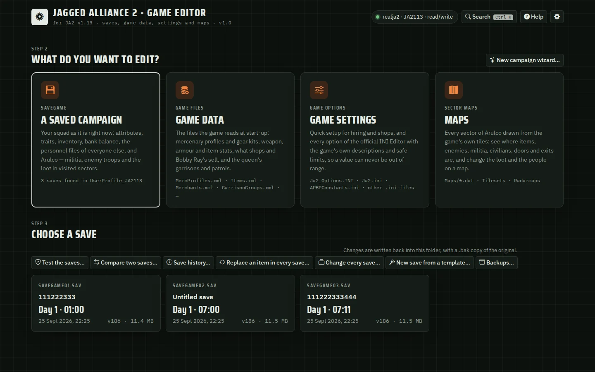
  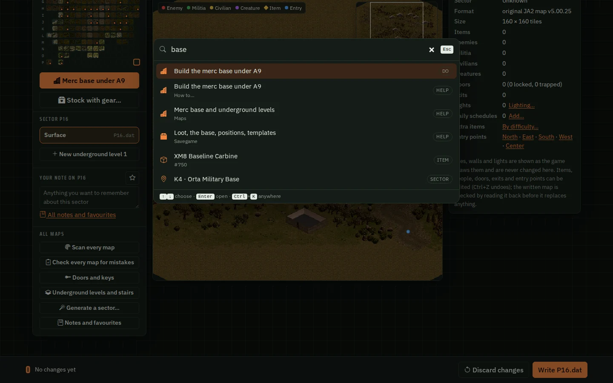
</p>
<p align="center">
  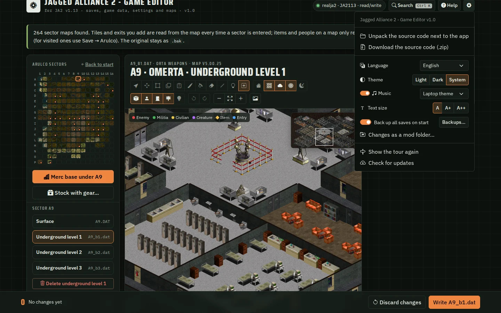
  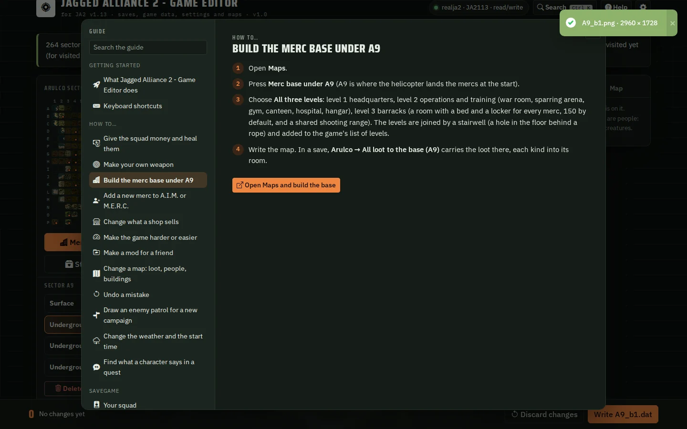
</p>
<p align="center">
  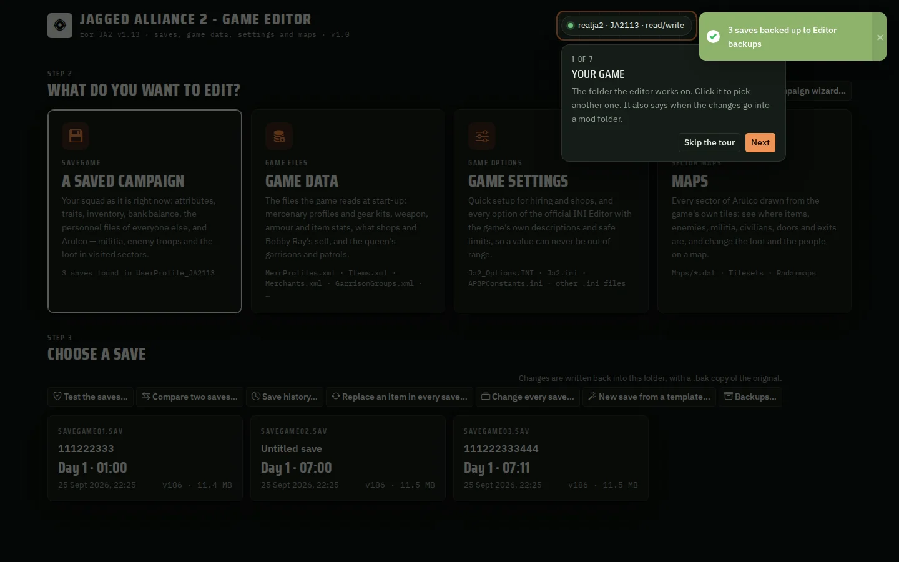
  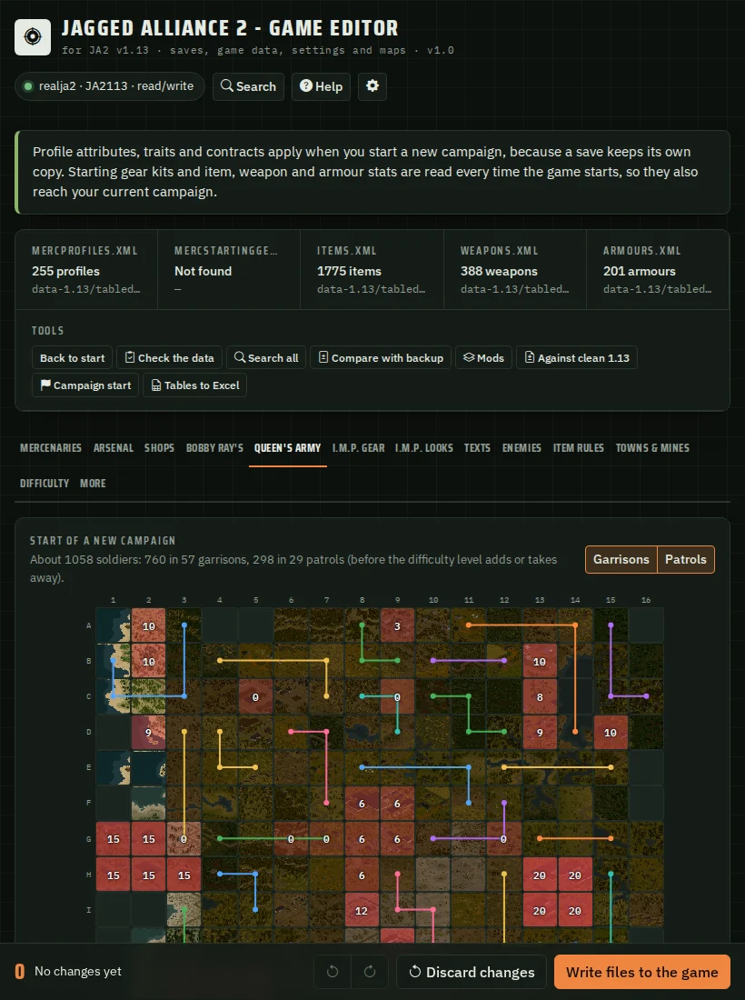
</p>

### 💾 Savegame editor

#### Squad

<p align="center">
  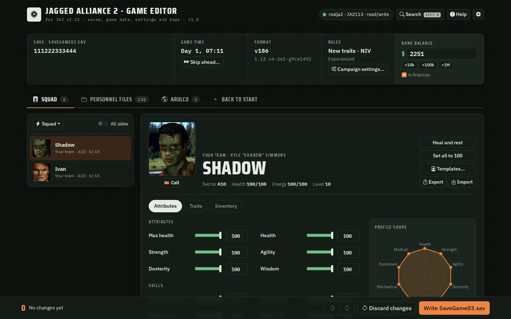
  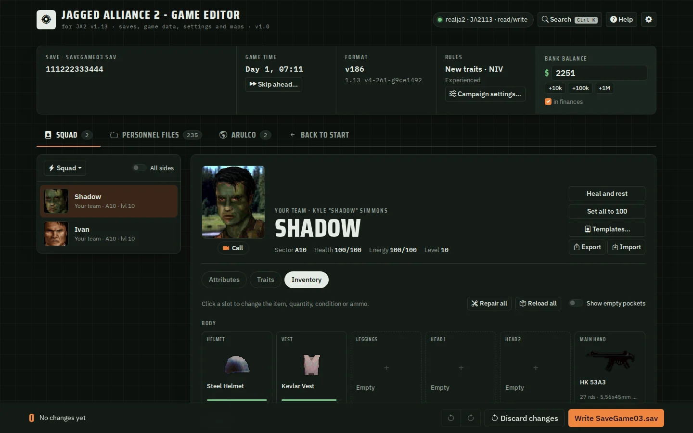
</p>

| Feature | What it does |
|---|---|
| **Each merc** | Attributes, level, skills and traits, inventory (items, condition, ammo, attachments, LBE; drag and drop between pockets and onto another merc), relations, name, portrait. |
| **Traits tab** | What the traits do in *this* game — every setting of each trait from `Skills_Settings.INI` with the game's own explanation. |
| **Money and time** | Balance, +10k / +100k / +1M (written into the laptop finances); **Skip ahead** game time. |
| **Campaign settings…** | Difficulty, Iron Man, tons of guns, style, Bobby Ray, item progress, turn limit. |
| **Templates…** | Merc page: roles, or your own saved mercs (attributes, skills, gear), applied to any merc. |
| **Export / import a merc** | A `.ja2merc` file moves a merc's attributes, skills and gear to another campaign. |
| **Squad menu** | Squads and assignments (doctor, patient, repair, training, militia training, sleep); heal and rest (also cures); move a squad to any sector and level; extend contracts; free prisoners; cure drugs, disease and hunger; Bobby Ray's orders now; morale; repair all, reload all; repair + reload + refuel everything; everyone to 100; **Campaign report**; **Presets** (easy start / hardcore). |
| **Gear by role…** | Each merc of a squad armed for his role (assault, sniper, machine gunner, close quarters, medic, demolitions — guessed from his skills): a gun, magazines of its calibre, a medical kit or grenades, armour in empty slots. Taken from the loot where the squad stands and in the base under A9, or new gear of the level you pick. |
| **Battle odds (auto-resolve)…** | The auto-resolve fight against the soldiers of a sector worked out up to 400 times — the chance to win, how many soldiers are left, how often each merc is wounded or dies; what if they were rested first, with or without the militia. Nothing in the save changes. |
| **Into battle…** | A squad straight into a sector held by the queen, from the side and at the time you choose (healed, repaired and reloaded if you like); the fight starts when the save is loaded. |
| **Send a group at the squad** | An ambush: a group of the queen's soldiers, with extra elites if you like, gets a route straight to the sector of your squad. |
| **Fallen mercs** | Every merc of yours who died in the campaign — back to life (hireable again), and his gear carried from where he fell to your squad. |
| **Money: the next days** | Bank, mine income and daily fees, a chart for 7–60 days, the day money runs out. Change a mine's output or a merc's fee there, and pay out the mine income of those days now. |
| **Training…** | Each merc trains a skill, teaches it, learns it from a teacher, or trains militia; presets; how far the militia training of each town sector has come and whether it is paid. |
| **Chronicle of the campaign…** | Day by day — the laptop's history, the e-mails and the money in and out; search; save as text. |
| **Campaign statistics…** | Money, sectors, enemies, militia, mercs, town loyalty and mine income as charts over the history and the backups of the save. |
| **Who likes whom…** | Opinions, buddies and people hated in this campaign as a grid; **Everyone here gets along**. |
| **Story characters** | Where each quest character is, alive or dead, talked to; move or revive them. **Warnings** before writing when a change can break a quest. |
| **Carry the squad to another save** | Attributes, skills, gear and money into the same mercs of another save, with their relations and records (kills, assists, battles, wounds…). |
| **Find an item in this save** | Ctrl+Shift+F — mercs, profiles, sector ground and dealers. |
| **Check this save for mistakes** | Unknown items, values out of range, soldiers off the map, empty groups, broken squads — with **Fix**. |
| **Test before playing** | The save read as the game reads it, written back and read again. |
| **Compare / History** | Compare with another save; the history of this save. |
| **Another 1.13 build** | A save made by another 1.13 build than the game's is flagged. |

<p align="center">
  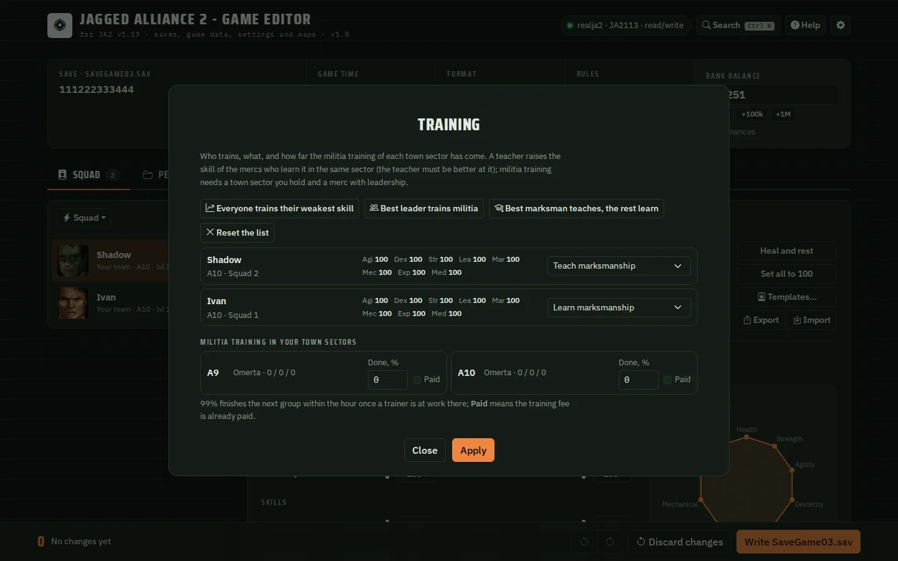
  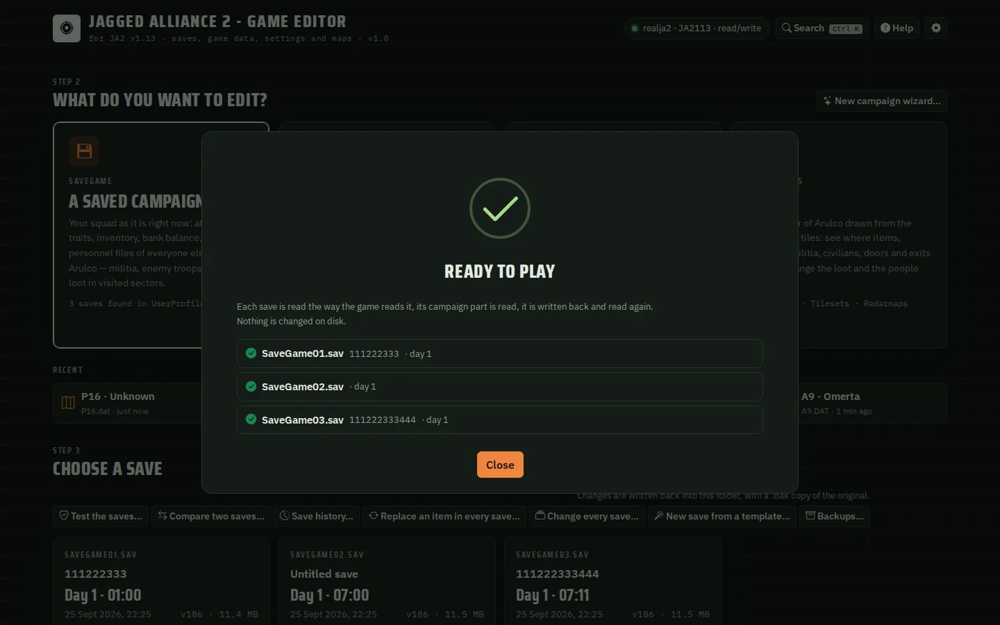
</p>

#### Personnel files

<p align="center">
  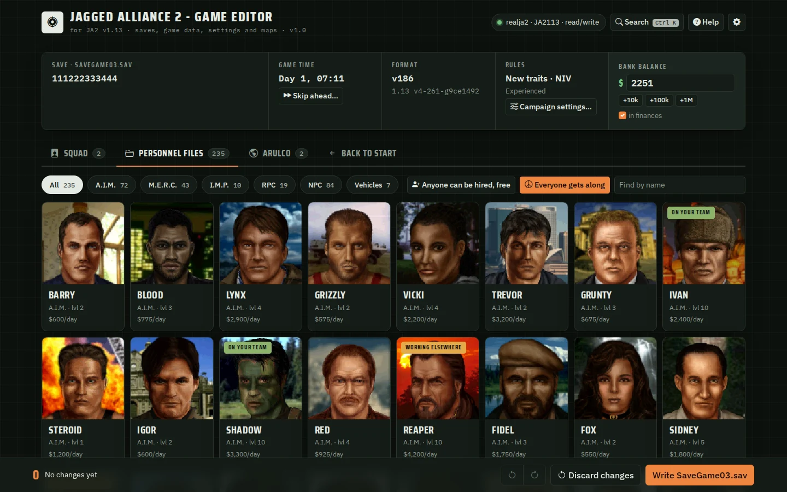
</p>

Every profile in the save — stats, traits, status, prices and relations. **Bring the dead back**, and **hire anyone for free**.

#### Arulco

<p align="center">
  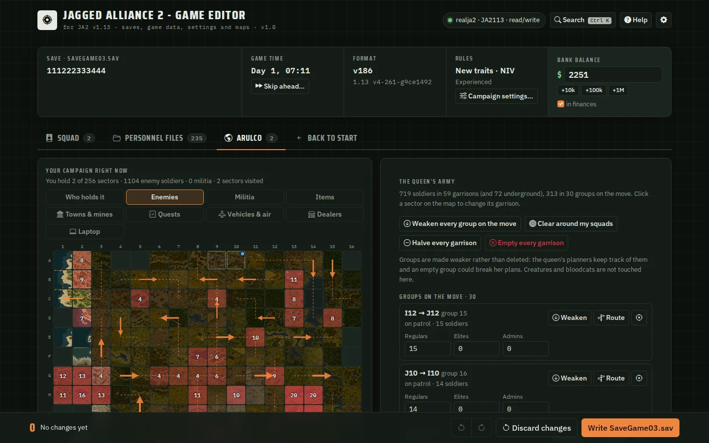
  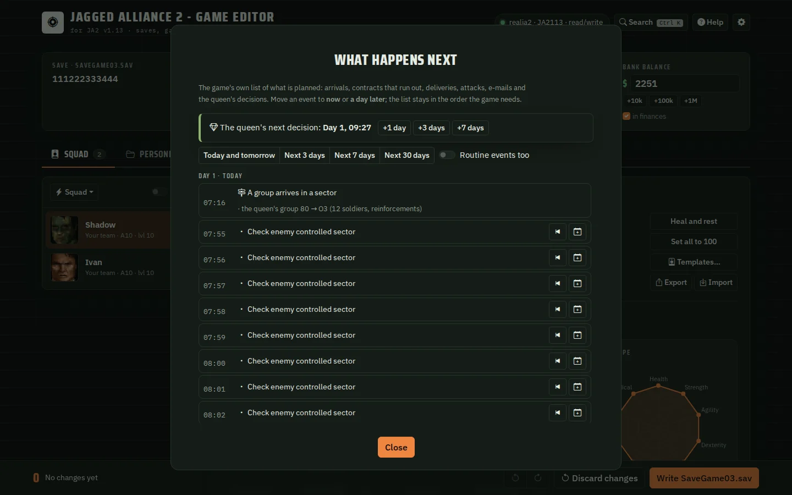
</p>

| Feature | What it does |
|---|---|
| **Who holds it** | Sector owner; per sector: garrison, militia, underground levels. **Reveal the map.** |
| **Notes and favourite sectors** | Your own note and a star on any sector, shown on every sector grid, all in one list. |
| **Strength** | The queen's strength per sector (elites, tanks, jeeps and robots count more; groups passing through included); the strongest places in a list, with ½ and empty for each garrison. |
| **Enemies** | Groups on the move (edit, weaken), clear around squads, halve or empty garrisons; soldiers on the loaded map (disarm, weaken, remove); route arrows and dashed full routes of every group. **Route**: draw a new route for a group on the map. |
| **What happens next** | Squad menu: the game's planned events by day — move one to now or a day later, put off the queen's next decision. |
| **Militia** | Numbers per sector, everyone elite, named militia promoted and healed, **Heal all**, repair their gear. |
| **Items** | Loot lying in visited sectors (add, repair, reveal); move one item or everything to another visited sector, or to the base under A9, sorted into its rooms. |
| **Loaded sector** | **Clear and collect the loot**; **Who stands where** — move people on the map. |
| **Plan a trip on the map…** | Squad menu: legs with travel times; go there with the time passing. |
| **Towns and mines** | Loyalty, full militia, take a mine, make it pay, output. **Town…**: one town in one window — loyalty, its sectors with their militia, its dealers, the story characters standing there, its mine. |
| **Quests** | Quest states and facts. |
| **Vehicles and air** | Repair and refuel vehicles and the helicopter; SAM sites (take, wreck, repair, free the skies); enemy airspace tinted on the map, SAM coverage on hover. |
| **Dealers** | Cash, stock (add / remove), reopen, repairs and orders now. |
| **Laptop** | E-mail (read / unread / delete, restore lost ones from other saves or older versions, send again, **write an e-mail of your own** from any sender) and history. |

<p align="center">
  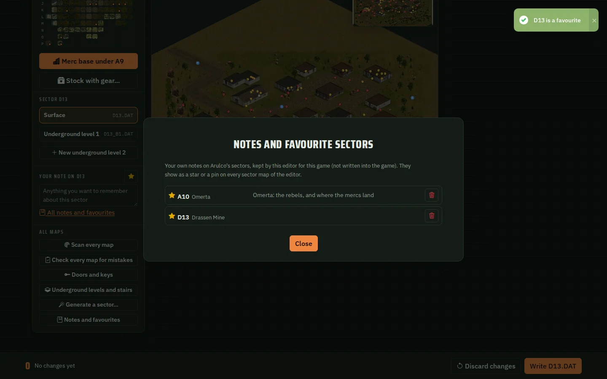
</p>

#### Save list

| Feature | What it does |
|---|---|
| **Timeline…** | Every save on the days of its campaign; pick two dots to compare. |
| **Compare two saves** | Side by side. |
| **Save history** | The last 30 versions of each save in `SavedGames/Editor history`; restore, compare, delete. |
| **Test the saves…** | Every ticked save read, written back and read again, before you play. |
| **Replace an item in every save** | One item swapped for another everywhere. |
| **Change every save…** | Heal, cure, morale, repair, reload, everyone to 100, add money — in all ticked saves at once. |
| **Backups…** | The save folder copied to `Editor backups/<date>` when the editor starts (newest 5 kept); restore one or all. |
| **New save from a template…** | A sandbox copy with the squad, money and gear set up. |

### 📦 Game data editor

<p align="center">
  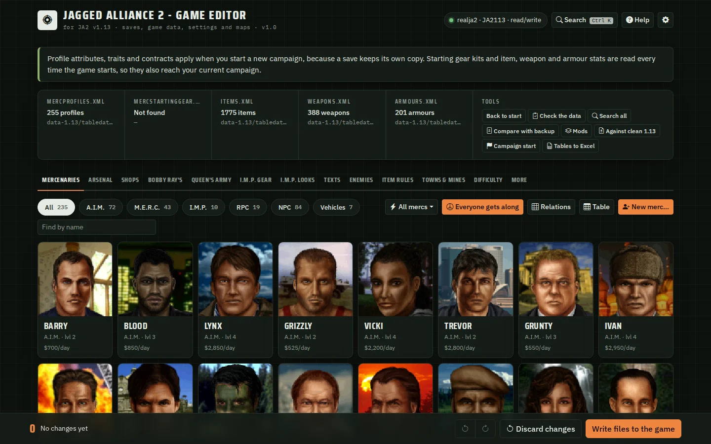
  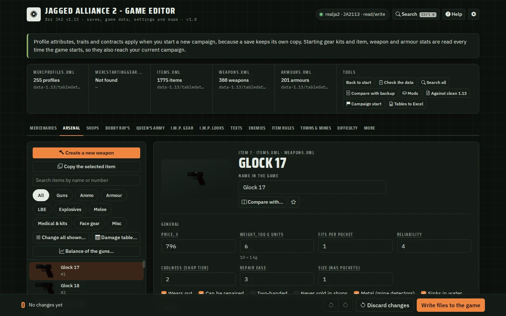
</p>

| Tab | What it does |
|---|---|
| **Mercenaries** | `MercProfiles.xml`: stats, traits, prices, gear kits, portrait; bulk changes. **Table** — every merc side by side, sortable, CSV. **Relations** grid, everyone gets along. **New merc…** — a new A.I.M. / M.E.R.C. merc from a copy (name, pay, voice, bio, portrait, site entry), a made-up name and biography fitting his best skill, hear the voice. |
| **Arsenal** | Items / Weapons / Armours / Magazines: every field and flag, with what each field means on its label; bulk changes by class; **Compare…** two items side by side; **Where is it used?** — every table, map and save that names the item. **Damage table**: hits per gun through each vest, with ammo types and editable damage. **Balance of the guns**: *too strong? / too weak?* against the same calibre and level. |
| **New item (any kind)…** | Armour, magazines, medical, kits, face gear, load-bearing gear, grenades, knives or anything else, copied from an item you pick — name, price, weight, level, Bobby Ray's stock, the picture of another item and the main values of its kind (protection and coverage, rounds, damage). **Create a new weapon**: a gun with its calibre, a new magazine made for it, its level and the picture of another gun. |
| **Shops** | Dealer inventories, every merchant as a table; **By game progress…** — what a merchant sells at each stage of the campaign (often, less often, rarely or never); **New merchant…** — a trader of your own in any surface sector, with hours, looks, cash and a stock copied from another. **Bobby Ray's**: stock, and **By game progress…** — every item of the site by level and the campaign progress it is sold from; move an item to another level or off the site. |
| **Queen's army** | Army compositions, garrisons and patrols; **draw a patrol** on the map, **Make up patrols…** from the garrisons. |
| **Enemies** | The guns and gear the queen's soldiers and your militia carry at each stage of the campaign, and what they drop. |
| **Difficulty** | Difficulty levels, enemy ranks, enemy names per sector, the queen's attacks (with calmer / relentless presets). **Easier or harder…** (file strip): the whole game one step easier or harder in one go, every changed value listed. |
| **Item rules** | Attachments, merges, transforms, random item classes, ammo types, explosives, locks, attachment slots (NAS). **Attachments → Table: what fits on which gun…** — guns as rows, attachments as columns, a click adds or takes away. |
| **Towns and mines** | Town sectors painted on the grid, loyalty, militia, hidden towns, rebel support (`Cities.xml`); mines — sector, ore, output, tunnels, creatures (`initmines.lua`). **Travel**: how squads cross each side of every sector (road, plains, woods, hills, river, closed…) with the time on foot, and the ground of the sector itself (`MovementCosts.xml`), both directions at once. |
| **I.M.P.** | Starting gear (`IMPItemChoices.xml`). Looks: portraits (also from your own picture) and voices offered on the I.M.P. site, body preview in the chosen colours; **A voice of your own…** from your `.ogg` / `.wav` / `.mp3` files. |
| **Texts** | A.I.M. / M.E.R.C. biographies, item names and descriptions; dialogue of characters and mercs with when each line is said and what it does (`NPCData` `.npc` scripts); **Dialogue by quest…**; ▶ hear a line and **Call** the character. **Edit the script**: every record of a character's `.npc` file. |
| **More** | Vehicles (seats), backgrounds, diseases, food, militia names, looks and pay (with generated names), facilities, helicopter sites, bloodcats, creature groups. |
| **Pictures** | Portraits and item pictures: view, save as PNG, replace. |
| **Checks** | File strip: **Check the data** — broken references, duplicates, missing rows, with **Fix** (also after every write); **Against clean 1.13** field by field (the exact release of your game when it is known); **Compare with backup**. |
| **Mods and search** | **Mods**: which folder or library each file comes from; **Search all**: text in every TableData XML. |
| **Campaign start** | Landing sector and tile, start time, arrival delay, starting money. |
| **Tables to Excel** | Any table as `.xlsx` or `.csv` and back, changes shown before they go in. |
| **Game settings** | `Ja2_Options.INI` and the other INI files, with a quick-setup page: hiring, I.M.P., shops, militia, weather and the start time of a new campaign. |

<p align="center">
  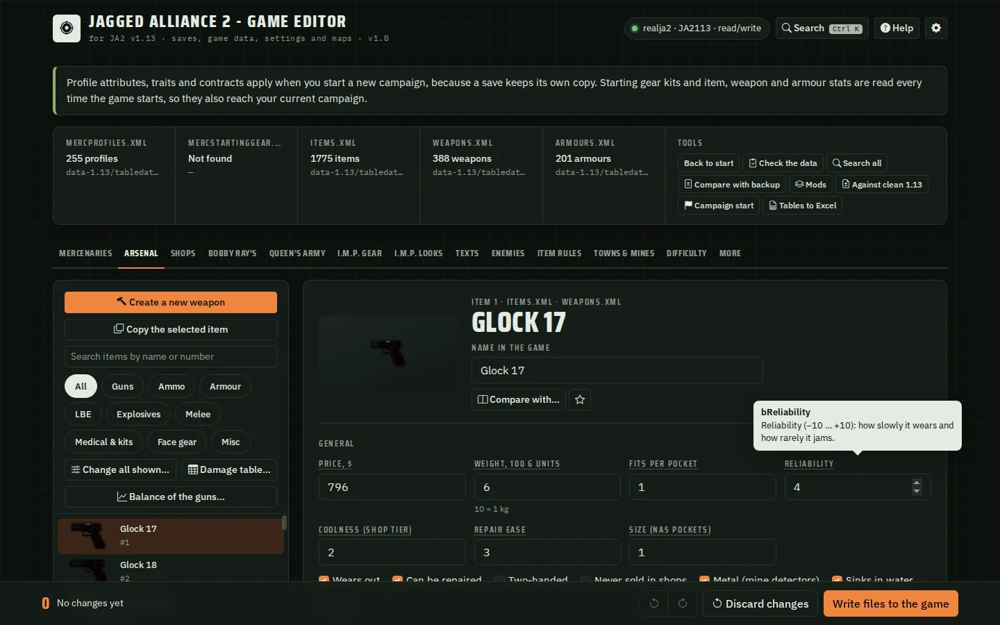
  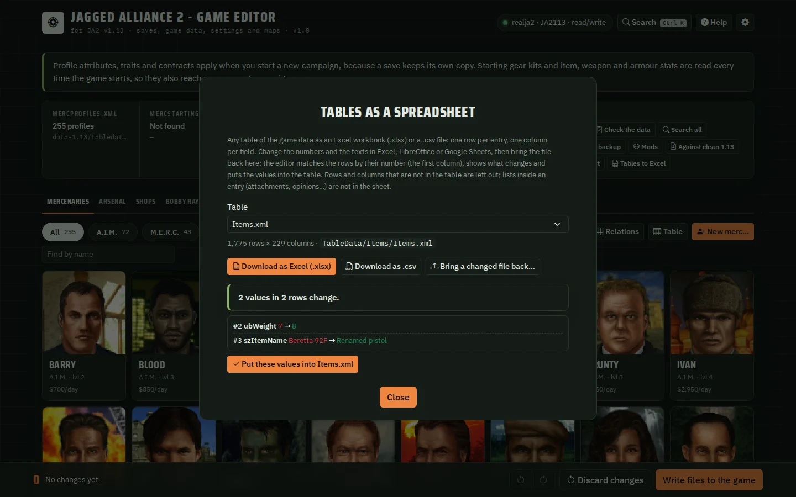
</p>
<p align="center">
  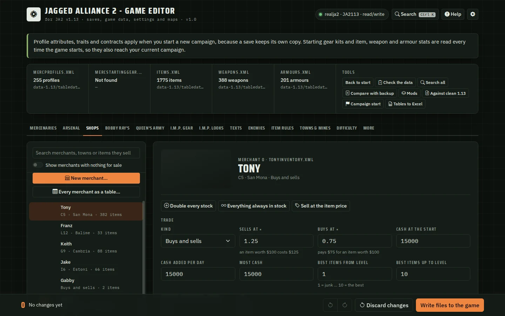
  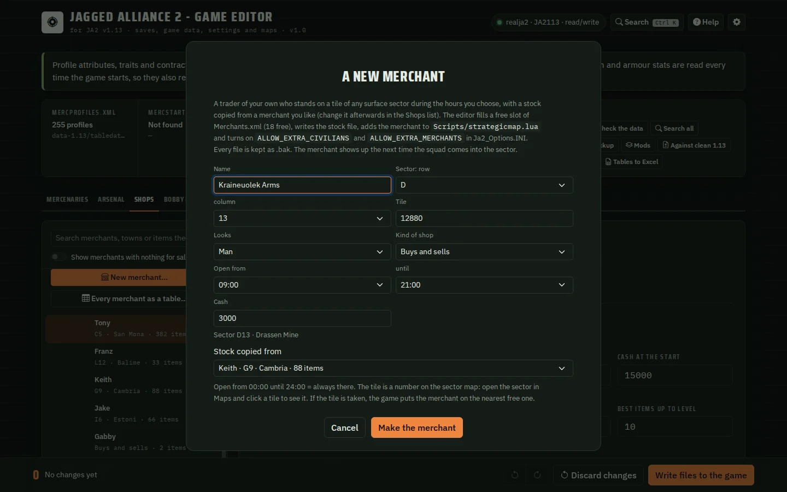
</p>
<p align="center">
  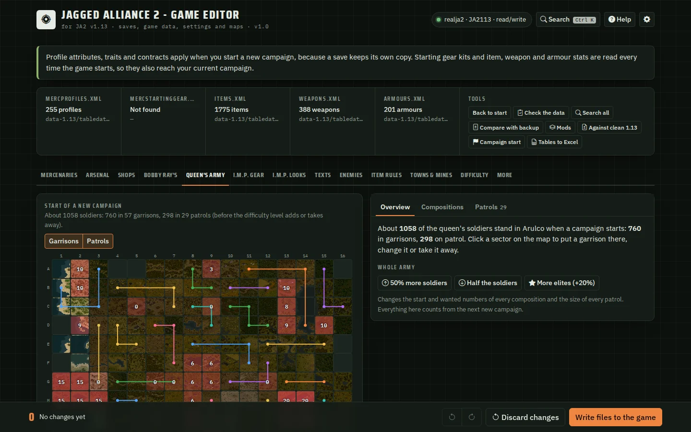
  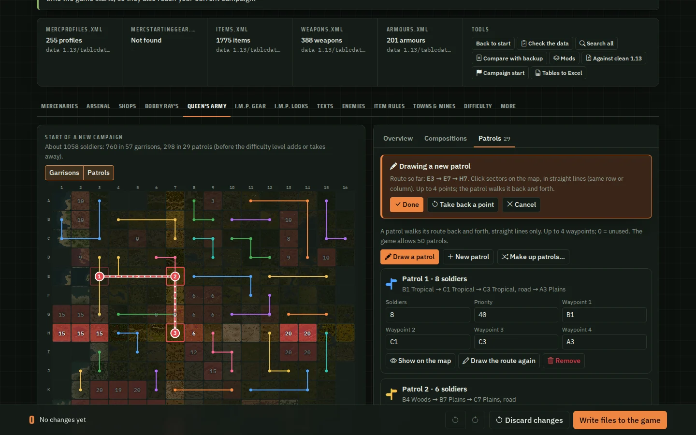
</p>
<p align="center">
  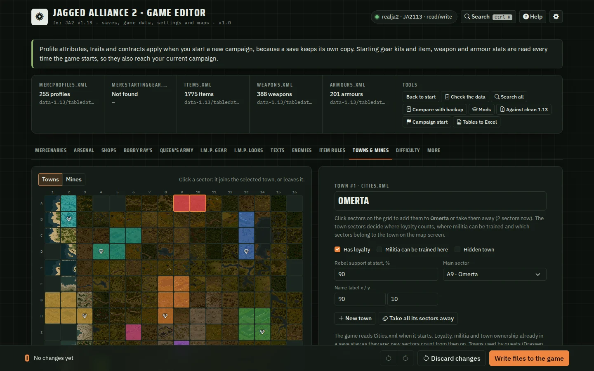
  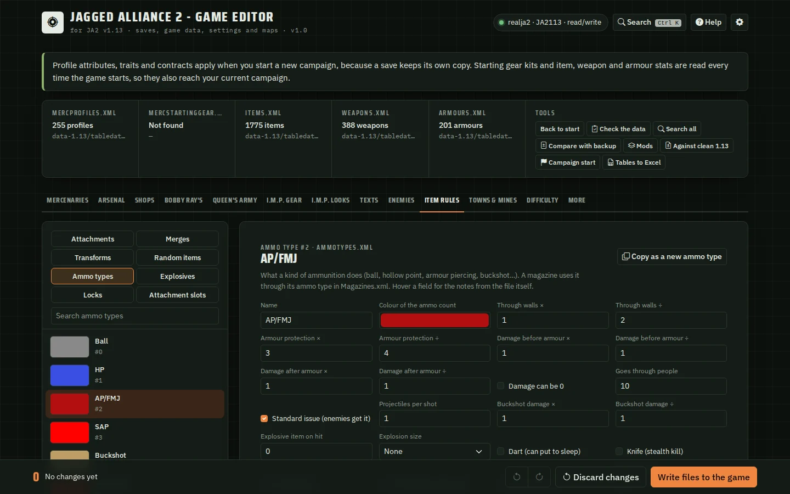
</p>
<p align="center">
  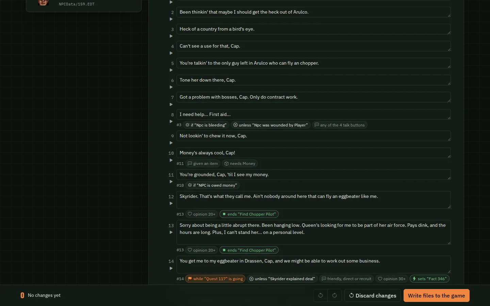
  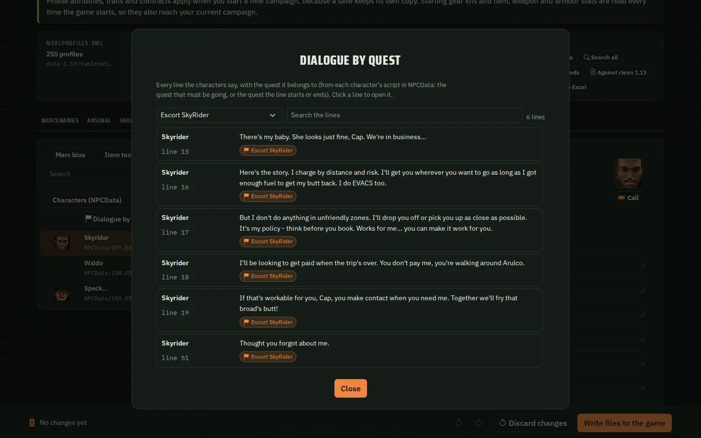
</p>
<p align="center">
  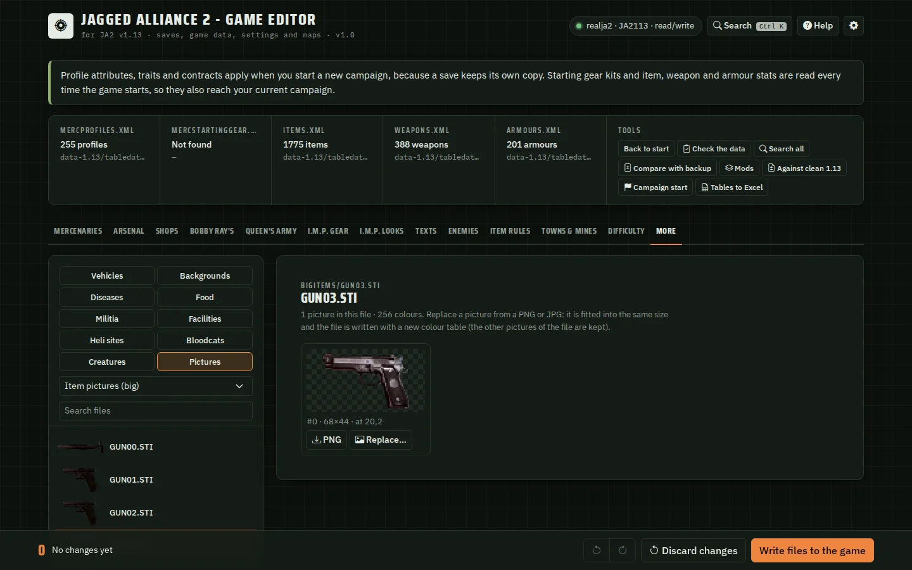
  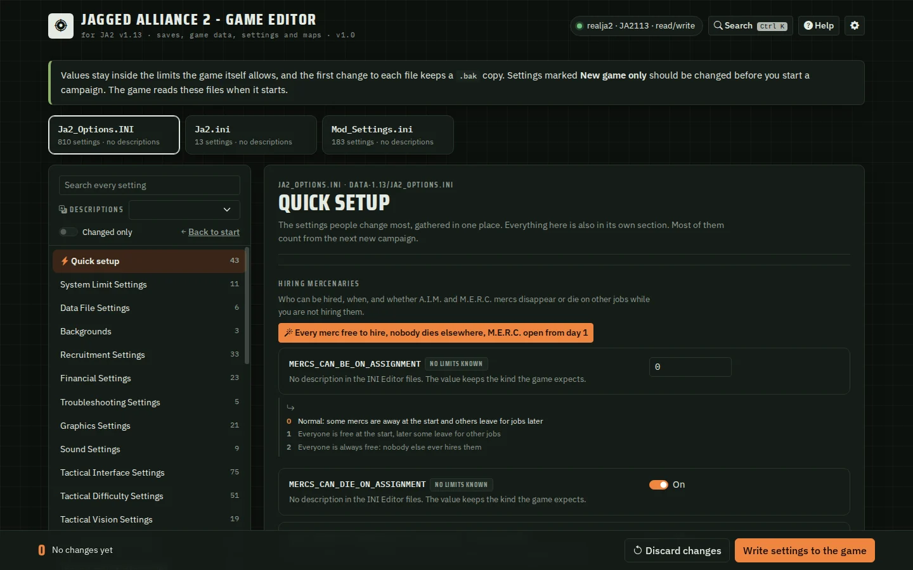
</p>
<p align="center">
  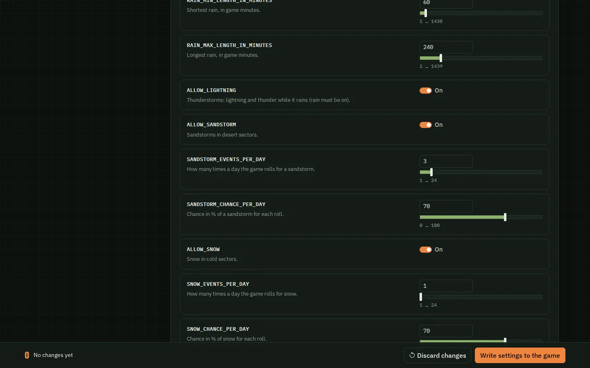
</p>

### 🗺️ Map editor

<p align="center">
  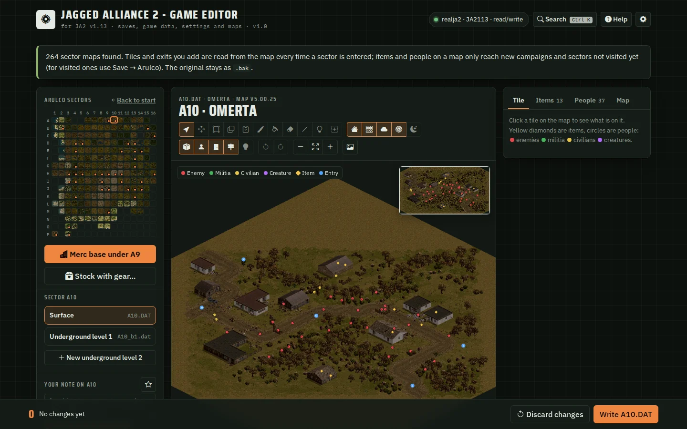
  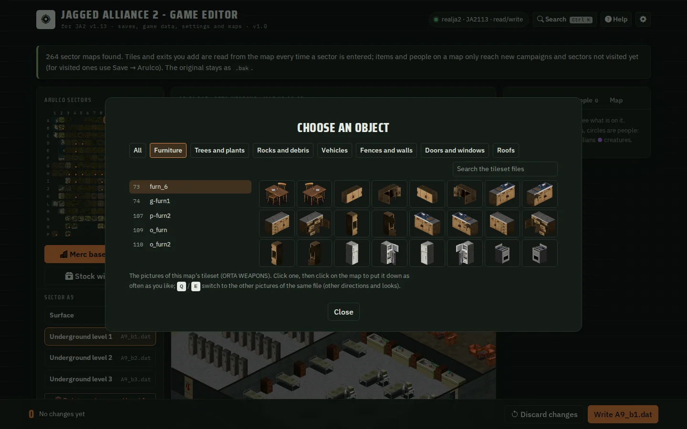
</p>

| Feature | What it does |
|---|---|
| **View** | Any sector map: items, people, doors, exits, lights. |
| **Edit** | Items, people (side, kind, attributes, gear, orders), **Group…** (up to 32 at once), patrol routes, doors and locks, exits (stairs, ladders, holes), entry points. |
| **Template…** | Tile tab: a ready group around the picked tile — guard post, ambush, patrol, sniper nest, HQ, militia post, a few townsfolk standing there, supply cache, weapons stash. |
| **Build** | Move tool, room tool (floor, walls, door, windows, roof), copy / paste a piece of a map (also into another sector), brush, fill, eraser, Wall tool, Lights tool; tiles here (turn, move, copy, add any picture). |
| **Place objects** (O) | Any single piece of the tileset — furniture, a tree, a rock, a car… — with a preview. |
| **Lines tool** (D) | A dirt road 6 tiles wide with corners and ends made for you (worn in places if you like), a line of cliff, a fence (the tileset's own: barbed wire, planks, chain link…), a low wall of sandbags, or a hedge of bushes — click the corners, Enter makes it; a gap is left where a road crosses. |
| **River tool** (A) | Click the way, width 2–8, winding, deep water in the middle, banks smoothed like the game's editor; roads stay dry as a crossing. |
| **Plants and battle marks** (T) | Trees, bushes or grass and weeds of the tileset, light / medium / dense, brush 5–21 tiles, or take them away; battle marks scatter scorch marks, cracks, rubble, litter and bones of the tileset, also on roads. |
| **Fortify… / Ruin… / Minefield…** | Tile tab: a sandbag ring with openings, cover inside, barbed wire outside and guards; a room as after a battle (three grades); buried, armed mines in a square of 7–21 tiles, with a safe lane if you like. |
| **Hide loot caches…** | Map tab → More: crates in quiet corners, loot matched to the enemies on the map. |
| **Can they get there?** | Map tab → More: tiles nobody can reach in red, behind locked doors in amber. |
| **Bring the town to life…** | Map tab → More: townsfolk in the houses, each with a day — wakes at home, walks out to the street or a neighbour's door, comes home, sleeps. |
| **Ambush along the road…** | Map tab → More: the queen's soldiers in cover on both sides of the way in from an entry point, all looking at it. |
| **Loading screen…** | Map tab → More: a picture of your own shown while the sector loads, by day and at night; underground levels too. |
| **Windows and roofs** | Map tab: **Put windows into rooms…**, **Put roofs on rooms…**. |
| **Daily schedules** | The people on a map — time, what, tile; **Add…** gives one person a schedule, or one new civilian with a schedule on the picked tile. |
| **Lighting** | Tint of the lamps, darkness underground, every lamp at once, a lamp in every room; **night preview**. |
| **Extra items** | Per difficulty, surface sectors. |
| **Generate a sector…** | The ground of any map without its buildings, with a new village, outpost, camp or open ground on it (walls, doors, floors, windows, roofs and furniture of that tileset), on request with the queen's soldiers, their loot and fortifications. |
| **Photo** | Picture button over the map: size, markers, each layer on or off, a transparent background, room names (the base under A9), character names, a caption; PNG or WebP. |
| **Merc base under A9** | Only A9, where the mercs land, on three levels: headquarters; operations and training; barracks with a room, bed and locker for every merc and a shared shooting range; joined by stairwells. Five plans for each level, drawn in the build window (classic, mirrored and three other layouts), remembered. **Way down** (stairs from the house in A9 nearest to the landing), **Light it** (a lamp in every room), **Stock with gear**; delete an underground level. |
| **Scan every map** | An item or character on all maps, every item of a calibre or kind; the grid coloured by enemies, people, loot or value. |
| **Check every map** | Mistakes on all maps at once. |
| **Doors and keys** | Every lock, where its keys lie, keys held in a save. |
| **Underground levels and stairs** | Where the stairs lead, what is broken. |

<p align="center">
  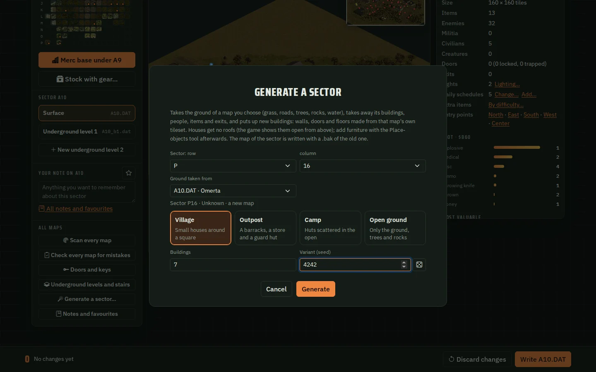
  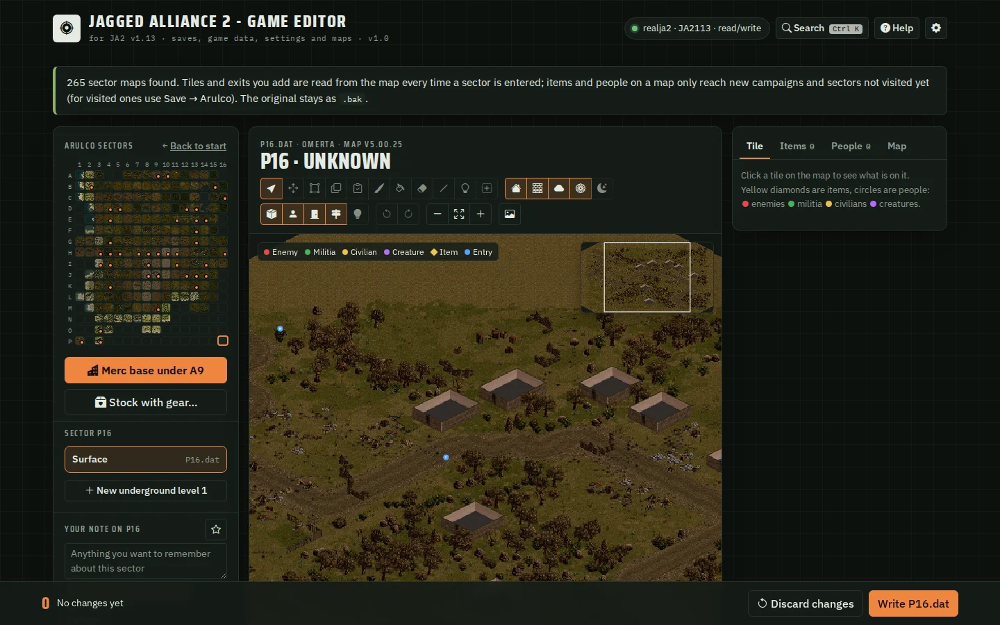
</p>
<p align="center">
  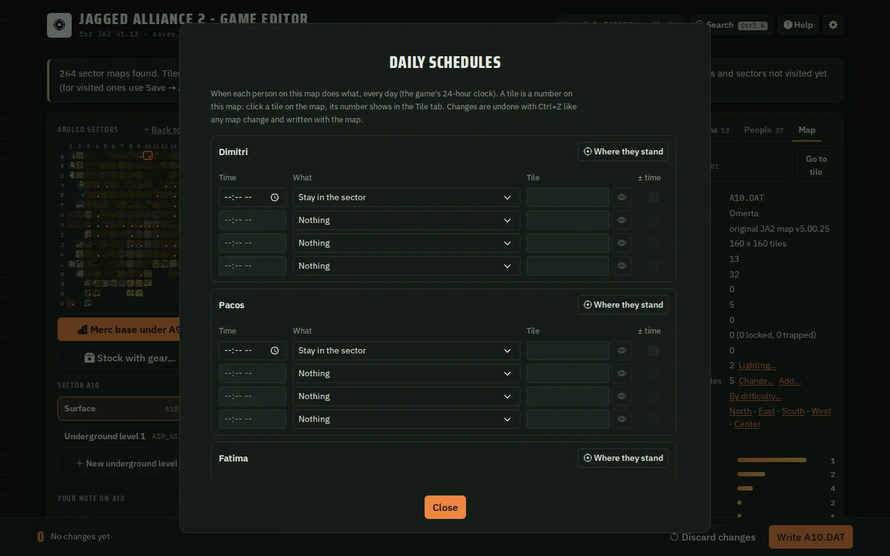
  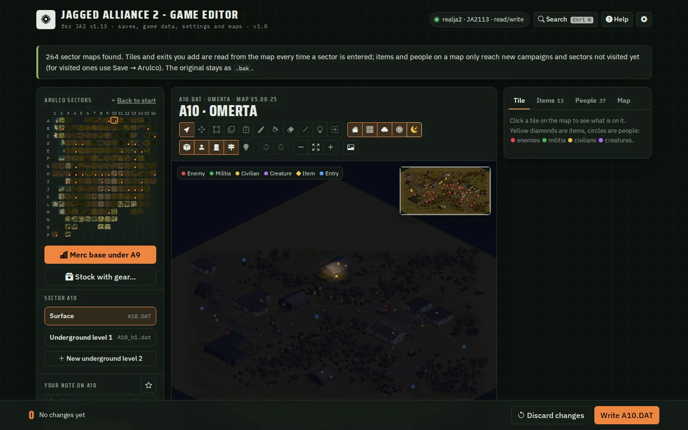
</p>
<p align="center">
  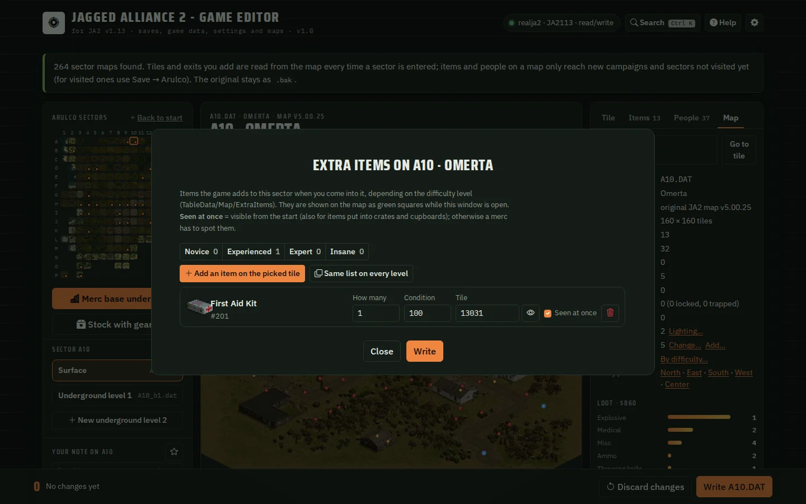
  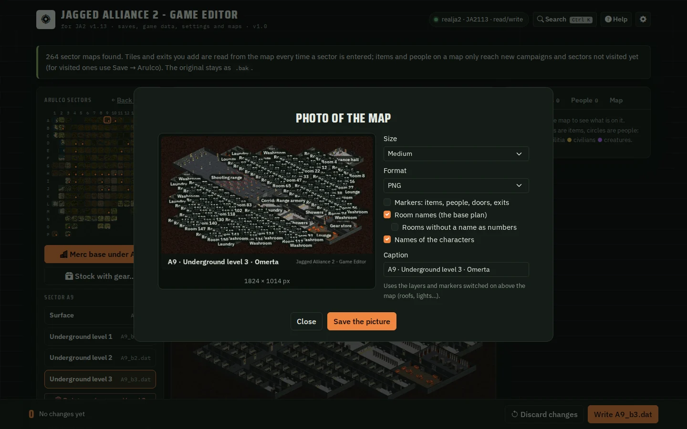
</p>
<p align="center">
  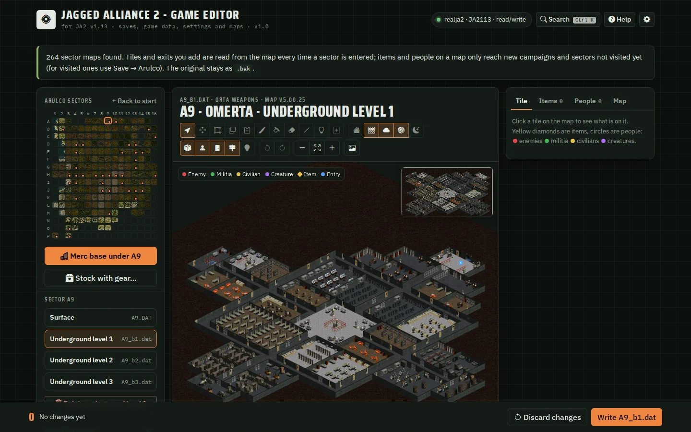
  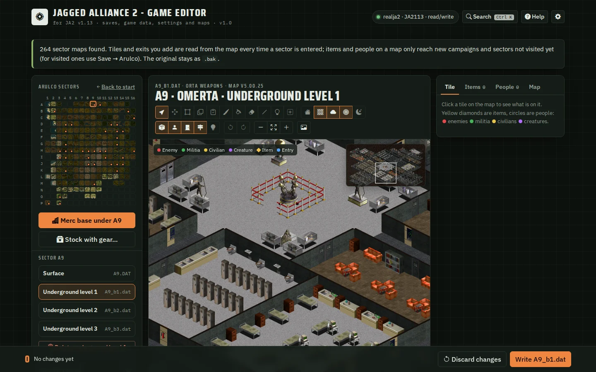
</p>
<p align="center">
  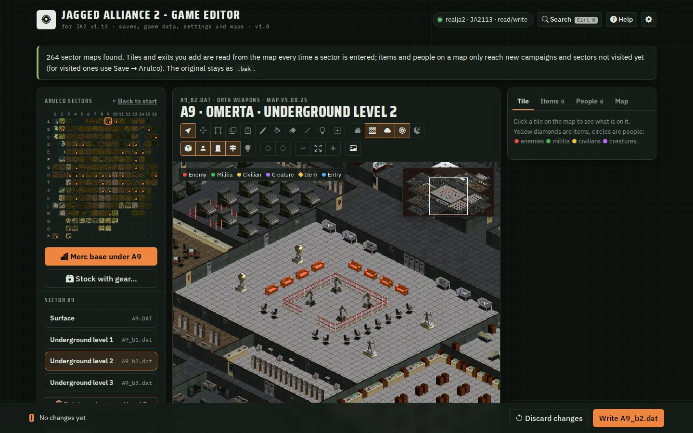
  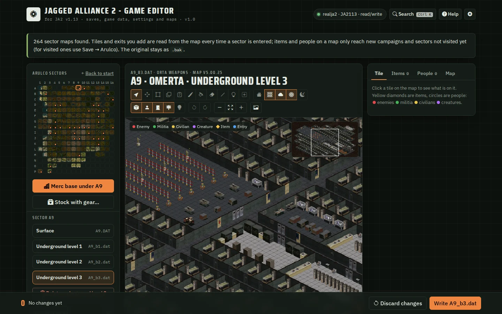
</p>
<p align="center">
  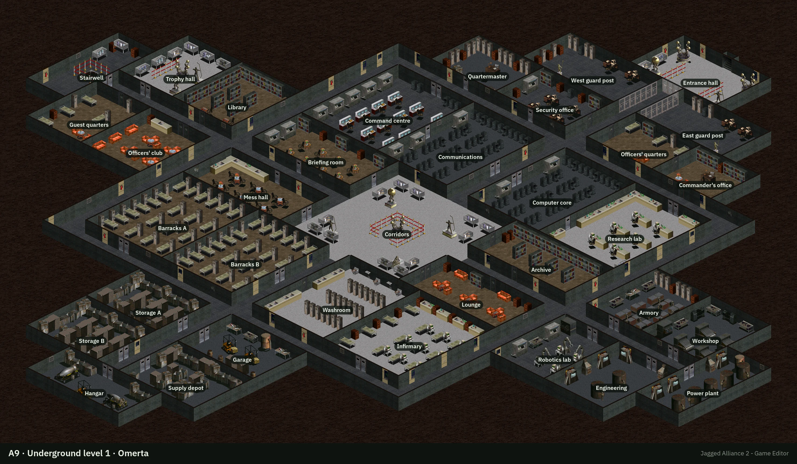
</p>
<p align="center">
  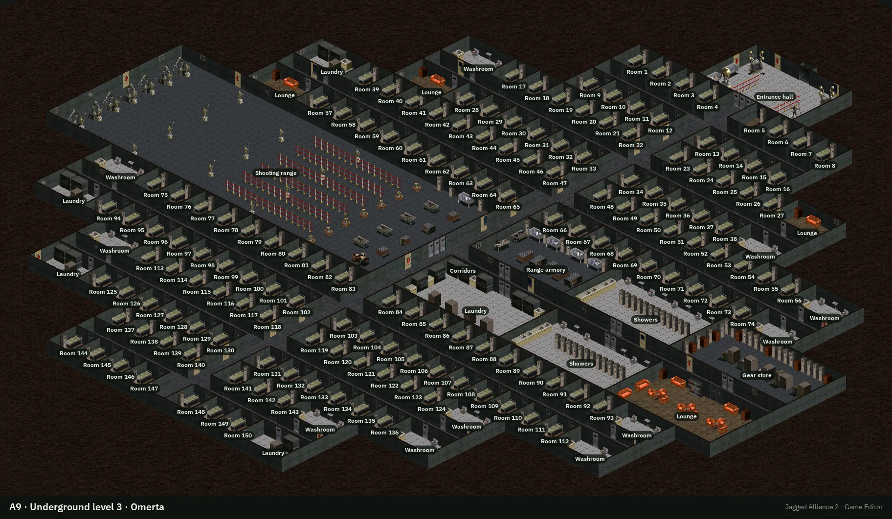
</p>

---

## ✅ Compatibility

| Game | Status |
|---|---|
| **Jagged Alliance 2 v1.13** | ✅ Supported — the editor is made and tested for it. |
| Other versions and mods (original JA2, Unfinished Business, Wildfire, other mods…) | ❔ Not tested yet — may work in part or not at all. Back up your game first. |

The editor is a Windows app. Tried it with another version or mod? Tell us in an [issue](../../issues) — whether it works or not, it helps.

## Getting started

1. [Download the latest release](../../releases/latest) and unpack it.
2. **Scan the files for viruses** (see the links above).
3. **Back up your game folder and saves** — the editor can damage game files.
4. Run `JA2-Game-Editor.exe`.
5. Type or *Browse* to your game folder (the one that contains `ja2.exe`) and press **Connect**.

### Verify the download (SHA-256)

Every release lists the SHA-256 checksum of its files. Download the editor **only from this repository** and compare the checksum before running it.
In PowerShell, in the folder with the downloaded file:

```powershell
Get-FileHash .\JA2-Game-Editor.exe -Algorithm SHA256
```

or in the Command Prompt:

```bat
certutil -hashfile JA2-Game-Editor.exe SHA256
```

If the value differs from the one in the release notes, **do not run the file** — it was changed by someone else.

## Keyboard shortcuts

| Keys | Action |
|---|---|
| `Ctrl+S` | Write changes |
| `Ctrl+K` | Search everything |
| `Ctrl+F` | Search box |
| `Ctrl+Shift+F` | Find an item in the save |
| `Alt+1` … `Alt+9` | Switch tabs |
| `Ctrl+↑` / `Ctrl+↓` | Previous / next merc |
| `Ctrl+M` | Music on / off |
| `F11` | Full screen on / off |
| `F1` | Guide |

The full list is in the built-in guide (*Keyboard shortcuts*).

## Troubleshooting / FAQ

**Windows SmartScreen says "Windows protected your PC".**
Windows shows this for new programs downloaded from the internet that it does not know yet. Check the file with the scanners and the SHA-256 checksum above, then press *More info* → *Run anyway*.

**Connect does not work / the game folder is not found.**
Pick the folder that contains `ja2.exe` itself, not a folder above it or a shortcut. If the game is in `Program Files`, Windows may block writing there — move the game to another folder (for example `C:\Games\JA2`) or run the editor as administrator.

**Something went wrong after an edit — how do I undo it?**
Every file the editor writes keeps the original next to it as a `.bak` copy: delete the edited file and remove `.bak` from the copy's name.
For saves it is even easier: *Save list* → *Save history* keeps the last 30 versions of each save — pick one and *Restore*.

**Where are my editor settings?**
In `%APPDATA%\Jagged Alliance 2 - Game Editor`. Delete that folder to reset the editor to defaults.

## Reporting bugs

Found a bug or have an idea? The quickest way: in the editor open **⚙ → Report a problem…** — it packs the details, the log and (if you tick them) the open save, map and `Ja2_Options.INI` into one `.zip` and opens the [Issues](../../issues) page to attach it. Otherwise open an [issue](../../issues) and include:

- the editor version and your game version (and any mods you use);
- what you did, what you expected and what happened instead;
- a screenshot, and the save or data file if the problem is with one.

Please check the [open issues](../../issues) first — maybe it is already reported.

## 💬 Community

Questions, ideas, mods and talk about Jagged Alliance 2 — come and join the fans:

<p align="center">
  <a href="https://thepit.ja-galaxy-forum.com/"></a>
  <a href="https://discord.com/invite/Ku2H9Hf"></a>
</p>

- **[The Bear's Pit — JA Galaxy Forum](https://thepit.ja-galaxy-forum.com/)** — the home of Jagged Alliance 2 and 1.13 modding: mods, maps, tools and help.
- **[Discord](https://discord.com/invite/Ku2H9Hf)** — chat with other players and modders.

## Changelog

What's new in each version is listed on the [Releases](../../releases) page.

## Credits

Thanks to the whole **Jagged Alliance 2** fan community — the modders, map makers and players who have kept this game alive for decades and whose research into its file formats made this editor possible. This editor is made by fans, for fans.

## License

The editor is licensed under [CC BY-NC-SA 4.0](LICENSE): you may share and change it, but **not sell it or use it commercially**, and changed versions must stay under the same license.

## Disclaimer

This is a fan-made tool and is not affiliated with the owners of Jagged Alliance 2. The editor does not include any game files; you need your own copy of the game. **The editor may damage your game files — always keep a backup copy of your game folder and saves.** You use it at your own risk.
