<h1 align="center">Jagged Alliance 2 Game Editor</h1>

<p align="center">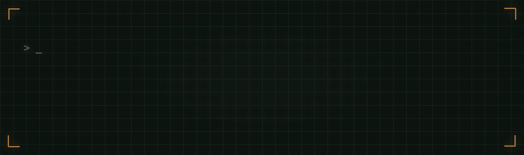</p>

<p align="center">
  <b>A savegame, game data, settings and map editor for Jagged Alliance 2 v1.13 and Unfinished Business — in one window.</b><br>
  Change your squad, edit the campaign in progress, rebalance items and mercs, or build maps<br>without digging through XML and binary files by hand.
</p>

<p align="center">
  <a href="../../releases/latest"></a>
</p>

<p align="center">
  
  
  
  
  <a href="LICENSE"></a>
  <a href="https://discord.com/invite/Ku2H9Hf"></a>
  <a href="../../discussions"></a>
</p>

<p align="center">
  <a href="#features">Features</a> ·
  <a href="#-compatibility">Compatibility</a> ·
  <a href="#getting-started">Getting started</a> ·
  <a href="#troubleshooting--faq">FAQ</a> ·
  <a href="#-community">Community</a>
</p>

<p align="center">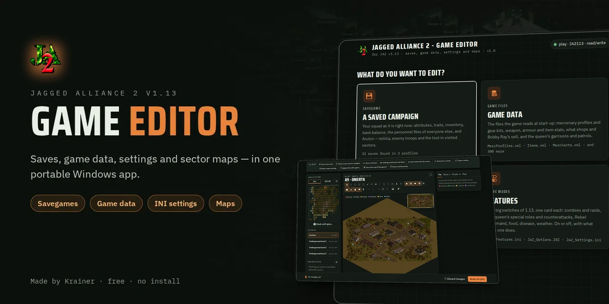</p>

<p align="center">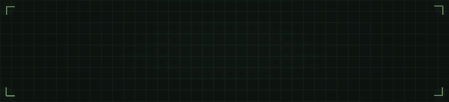</p>

**It's free.** No price, no ads, no sign-up.
*Downloads are strictly for true fans only* — if you still hum the laptop theme and know which merc hates whom, you qualify. 😉

> [!CAUTION]
> **Selling this editor is strictly forbidden!**
> The editor was created by the community of **Jagged Alliance 2** fans, for the fans. It is free and must stay free: do not sell it, do not bundle it into paid packs and do not put it behind a paywall. If someone charged you for it, you were scammed. See [License](#license).

> [!WARNING]
> **After downloading, check the files for viruses!**
> Before running any `.exe` you got from the internet — this one included — upload it to an online multi-engine scanner:
> - [MetaDefender](https://metadefender.com/) — scans the file with dozens of antivirus engines at once
> - [VirusTotal](https://www.virustotal.com/) — 70+ antivirus engines and URL/file reputation
> - [Hybrid Analysis](https://www.hybrid-analysis.com/) — scan plus sandbox run showing what the file does
> - [Jotti's malware scan](https://virusscan.jotti.org/) — free scan with a set of popular engines
>
> The full source code of the editor ships with it (⚙ → *Unpack the source code*), so you can also read it or build it yourself.

<p align="center">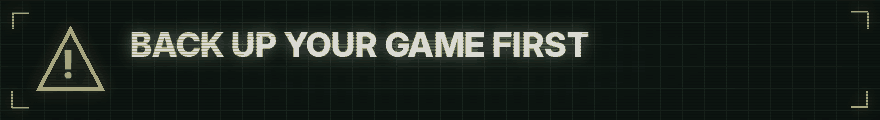</p>

> [!IMPORTANT]
> **Back up your game before using the editor!**
> The editor changes saves, game data and maps directly on disk, and there is always a chance it **damages your game files**. Before you start, copy your whole game folder (at least `Data`, `Data-1.13` and `SavedGames`) somewhere safe — just in case. The editor's own `.bak` copies and save history help, but they do not replace a full backup of your own.

## ✨ At a glance

<p align="center"></p>

| | What you can do |
|---|---|
| 💾 **Saves** | Mercs, inventory, squads, money, quests, sectors, militia, the queen's army, dealers, laptop — plus dozens of planners and checks (battle odds, enemy dossier, campaign progress, save history). |
| 📦 **Game data** | Mercs, the arsenal, shops, the queen's army, item rules, towns and mines, texts and dialogue, pictures, sounds, Lua scripts — with checks, comparisons and mod packaging. |
| ⚙️ **Game settings** | `Ja2_Options.INI` and the other INI files explained, every XML table, quick setup pages. |
| 🗺️ **Maps** | View and edit any sector, build with rooms, roads, rivers and plants, generate whole sectors, check a map before playing. |
| 🎛️ **Features** | The big switches of 1.13, one card each: zombies and raids, the queen's special roles and counterattacks, Rebel Command, food, disease, weather — on or off, with what each one does. |
| ❄️ **Unfinished Business** | UB saves, data, story and Tracona maps work with UB's own files. |

## 📑 Contents

<p align="center">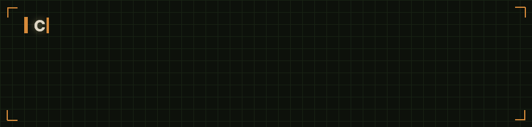</p>

<table align="center">
<tr>
<th>📖 About</th>
<th>🛠️ Features</th>
<th>🆘 Help &amp; info</th>
</tr>
<tr valign="top">
<td>

[🌐 Available languages](#-available-languages)<br>
[🤝 Developers wanted](#-developers-wanted)<br>
[✅ Compatibility](#-compatibility)<br>
[▶️ Getting started](#getting-started)<br>
[🔐 Verify the download](#verify-the-download-sha-256)

</td>
<td>

[🚀 Start and everywhere](#start)<br>
[💾 Squad](#squad)<br>
[🗂️ Save list](#list)<br>
[🌍 Arulco](#arulco)<br>
[📦 Game data](#data)<br>
[🗺️ Maps](#maps)<br>
[❄️ Unfinished Business](#ub)

</td>
<td>

[⌨️ Keyboard shortcuts](#keyboard-shortcuts)<br>
[❓ Troubleshooting / FAQ](#troubleshooting--faq)<br>
[🐞 Reporting bugs](#reporting-bugs)<br>
[💬 Community](#-community)<br>
[📝 Changelog](#changelog)<br>
[🏅 Credits](#credits) · [License](#license) · [Disclaimer](#disclaimer)

</td>
</tr>
</table>

## 🌐 Available languages

<p align="center">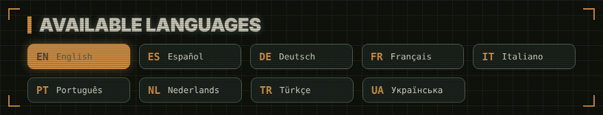</p>

<p align="center">
  <a href="README.md"></a>
  <a href="docs/lang/es/"></a>
  <a href="docs/lang/de/"></a>
  <a href="docs/lang/fr/"></a>
  <a href="docs/lang/it/"></a>
  <a href="docs/lang/pt/"></a>
  <a href="docs/lang/nl/"></a>
  <a href="docs/lang/tr/"></a>
  <a href="docs/lang/uk/"></a>
  <!-- Language switcher (same row in the "Available languages" section of README.md and every docs/lang/xx/README.md; that file's language is green with ✓).
       To add a language: copy README.md to docs/lang/xx/README.md, translate it and add a badge to the row in every file. -->
</p>

## 🤝 Developers wanted

<p align="center">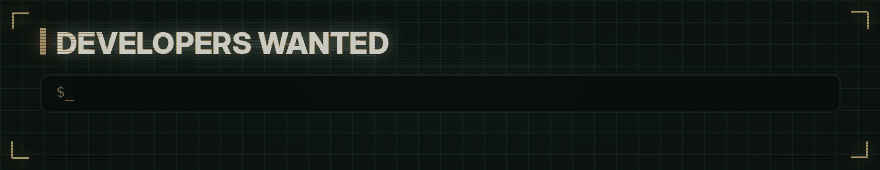</p>

> [!TIP]
> **Are you a developer and ready to help? Join us!**
> The editor is a fan project and every extra pair of hands makes it better — bug fixes, new features, support for more mods, testing or docs.
> Take a look at the [open issues](../../issues) (start with [`good first issue`](../../issues?q=is%3Aopen+label%3A%22good+first+issue%22)), open a new one to say what you'd like to work on, or send a pull request. Any help is welcome!

**Not a programmer?** You can still help:

- 🌍 **Translate the editor** — copy [`docs/translations/en.json`](docs/translations/en.json) to `es.json`, `de.json`…, translate the right side of each line (keep `{0}`, `{1}`), and send it in an issue or a pull request.
- 🧪 **Test** — play with your saves and maps and report what breaks (⚙ → *Report a problem…* makes a ready `.zip`).

<p align="center">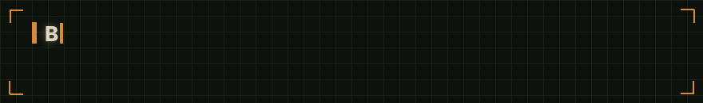</p>

<p align="center">


</p>

| Folder | What's inside |
|---|---|
| `ja2-editor/` | The editor itself (JavaScript, PHP views, CSS). Run it without building: `php -S 127.0.0.1:8080` in that folder. |
| `desktop/` | The Windows app in Go (local file server + WebView2 window). |
| `installer/` | The setup and the portable zip (NSIS). |

### 🔨 How to build

1. **Get the source code.** It ships with the editor: ⚙ → Web developing → **Unpack the source code next to the app** (an `app` folder with `ja2-editor`, `desktop` and `installer`) or **Download the source code (.zip)**. The same source is attached to every [release](../../releases/latest) as `app.zip`.
2. **Run it without building.** Install [PHP](https://www.php.net/downloads), then in the `ja2-editor` folder run `php -S 127.0.0.1:8080` and open `http://127.0.0.1:8080` in a browser.
3. **Build the Windows app.** Install [Go](https://go.dev/dl/) and build the program in the `desktop` folder (`go build`). The app shows the editor in a [WebView2](https://developer.microsoft.com/microsoft-edge/webview2/) window, so the WebView2 Runtime must be on the computer (Windows 10 and 11 normally have it).
4. **Build the setup and the portable zip.** Install [NSIS](https://nsis.sourceforge.io/Download) and compile the script in the `installer` folder with `makensis`.
5. **Texts for translators.** `en.json` is made from the editor's own scripts and pages by `tools/i18n-extract.js` each time the app is built.

The exact commands, options and tool versions are in `HOW TO BUILD.txt`, which lies in the `app` folder next to the source code (also inside `app.zip`).

<p align="center"></p>

## Features

<p align="center"></p>

Everything the editor can do — a short list of every feature, where to find it, and what it does. The same list is in the editor's **Help (F1)**.

**The editor opens 99.7% of the game's files** — 94,095 of 94,388 (98.7% even without pictures), each on a page or window of its own.

<details>
<summary>📊 <b>What the editor covers</b></summary>

| Kind of file | JA2: files | JA2: open | JA2 % | UB: files | UB: open | UB % |
|---|---:|---:|---:|---:|---:|---:|
| Pictures (`.sti`) | 71,315 | 71,315 | 100 | 72,048 | 71,747 | 99.6 |
| Sector maps | 261 | 261 | 100 | 37 | 37 | 100 |
| Sounds | 13,599 | 13,599 | 100 | 14,832 | 14,832 | 100 |
| Lip-sync (`.gap`) | 6,008 | 6,008 | 100 | 7,116 | 7,116 | 100 |
| Tile shapes (`.jsd`) | 1,517 | 1,457 | 96.0 | 1,697 | 1,526 | 89.9 |
| Dialogue and texts (`.edt`) | 826 | 814 | 98.5 | 834 | 820 | 98.3 |
| Character scripts (`.npc`) | 153 | 152 | 99.3 | 155 | 154 | 99.4 |
| XML tables | 303 | 303 as text — 254 of 254 table kinds have a page | 100 | 324 | 324 as text — 259 of 259 table kinds have a page | 100 |
| Tile properties (XML) | 157 | 152 | 96.8 | 157 | 152 | 96.8 |
| Lua scripts | 14 | 14, each with a form | 100 | 16 | 16 as text — 13 with a form | 100 |
| INI files | 16 | 16 — 2,174 of 2,174 settings explained | 100 | 17 | 17 — 2,320 of 2,320 settings explained | 100 |
| BinaryData (`.dat`, `.bin`) | 15 | 1 | 6.7 | 16 | 1 | 6.2 |
| Other (`.pcx`, `.png`, `.smk`, `.txt` …) | 204 | 3 | 1.5 | 242 | 18 | 7.4 |
| **All files** | **94,388** | **94,095** | **99.7** | **97,491** | **96,760** | **99.3** |
| **All files without pictures** | **23,073** | **22,780** | **98.7** | **25,443** | **25,013** | **98.3** |

Measured on full Jagged Alliance 2 v1.13 and Unfinished Business installs. Your numbers depend on your build and mods — the editor counts them for your own game in **Game data → What the editor covers**.

**Not covered yet:** most of the BinaryData files and a few rare formats. Need one of them? [Say so in an issue](https://github.com/OleksandrKhrashchevskyi/Jagged-Alliance-2-Game-Editor/issues).

</details>

### 🎖️ Jagged Alliance 2

<a name="start"></a>
#### 🚀 Start and everywhere

<p align="center">
  <a href="https://oleksandrkhrashchevskyi.github.io/Jagged-Alliance-2-Game-Editor/template/#start">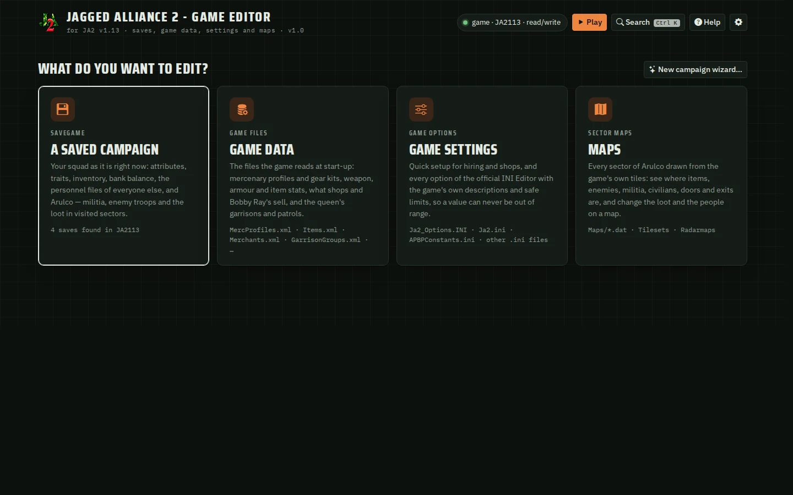</a>
</p>

<p align="center">
  <a href="https://oleksandrkhrashchevskyi.github.io/Jagged-Alliance-2-Game-Editor/template/#start"></a>
</p>

<p align="center">
  <a href="https://oleksandrkhrashchevskyi.github.io/Jagged-Alliance-2-Game-Editor/template/#start">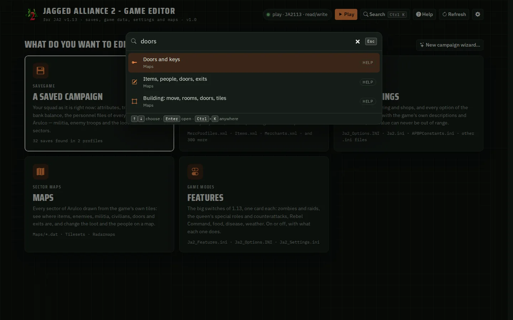</a>
  <a href="https://oleksandrkhrashchevskyi.github.io/Jagged-Alliance-2-Game-Editor/template/#start">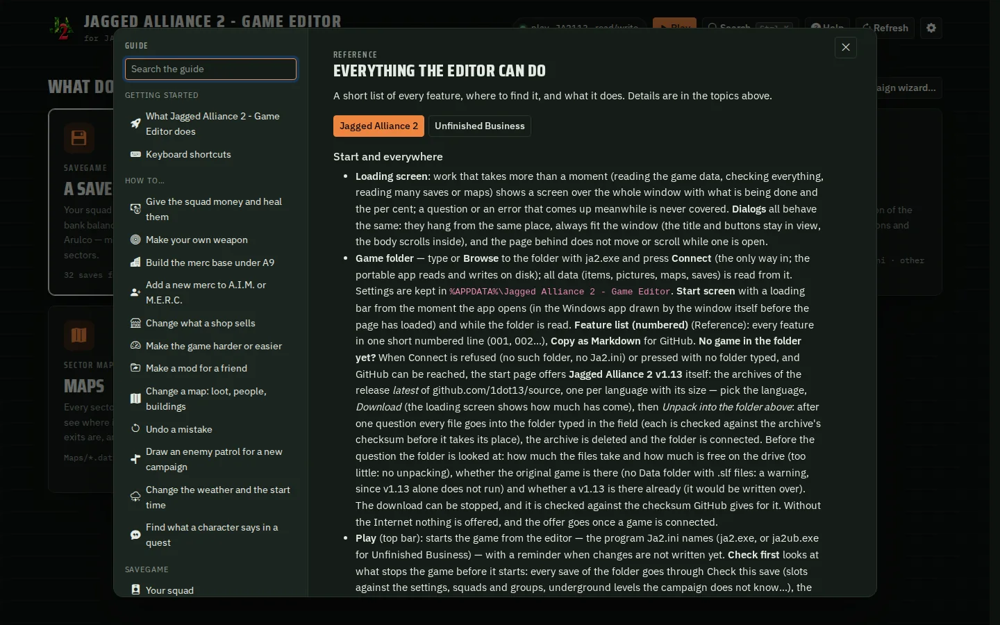</a>
  <a href="https://oleksandrkhrashchevskyi.github.io/Jagged-Alliance-2-Game-Editor/template/#start">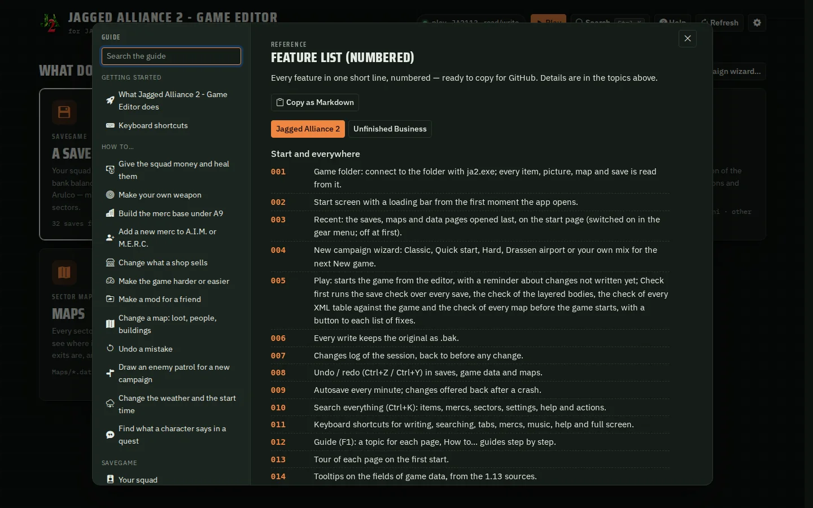</a>
  <a href="https://oleksandrkhrashchevskyi.github.io/Jagged-Alliance-2-Game-Editor/template/#start">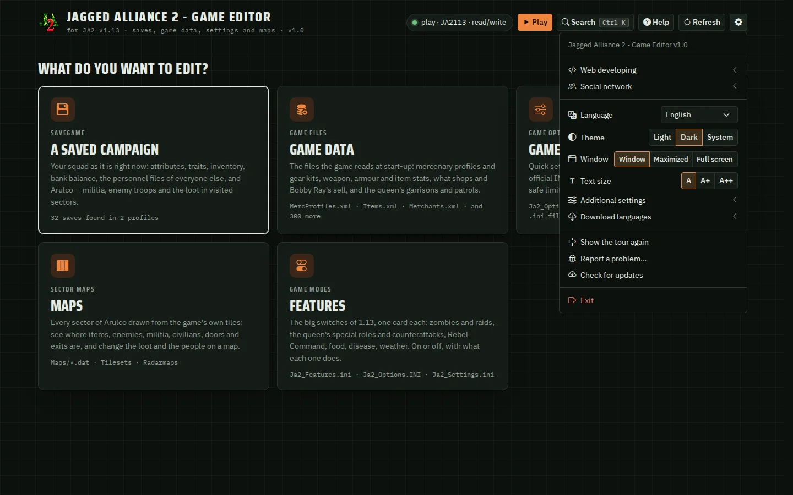</a>
</p>

<details>
<summary>📋 <b>Full feature list</b> (20)</summary>

- **Loading screen:** work that takes more than a moment (reading the game data, checking everything, reading many saves or maps) shows a screen over the whole window with what is being done and the per cent; a question or an error that comes up meanwhile is never covered. Dialogs all behave the same: they hang from the same place, always fit the window (the title and buttons stay in view, the body scrolls inside), and the page behind does not move or scroll while one is open.
- **Game folder** — type or Browse to the folder with ja2.exe and press Connect (in the Windows app the only way in; it reads and writes on disk); all data (items, pictures, maps, saves) is read from it. Settings are kept in `%APPDATA%\Jagged Alliance 2 - Game Editor`. Start screen with a loading bar from the moment the app opens (in the Windows app drawn by the window itself before the page has loaded) and while the folder is read. Feature list (numbered) (Reference): every feature in one short numbered line (001, 002…), Copy as Markdown for GitHub. No game in the folder yet? When Connect is refused (no such folder, no Ja2.ini) or pressed with no folder typed, and GitHub can be reached, the start page offers Jagged Alliance 2 v1.13 itself: the archives of the release latest of github.com/1dot13/source, one per language with its size — pick the language, Download (the loading screen shows how much has come), then Unpack into the folder above: after one question every file goes into the folder typed in the field (each is checked against the archive's checksum before it takes its place), the archive is deleted and the folder is connected. Before the question the folder is looked at: how much the files take and how much is free on the drive (too little: no unpacking), whether the original game is there (no Data folder with .slf files: a warning, since v1.13 alone does not run) and whether a v1.13 is there already (it would be written over). The download can be stopped, and it is checked against the checksum GitHub gives for it. Without the Internet the editor says that the list of releases could not be fetched and offers Try again; the offer goes once a game is connected.
- **Play** (top bar): starts the game from the editor — the program Ja2.ini names (ja2.exe, or ja2ub.exe for Unfinished Business) — with a reminder when changes are not written yet. Check first looks at what stops the game before it starts: every save of the folder goes through Check this save (slots against the settings, squads and groups, underground levels the campaign does not know…), the layered bodies through their check, every XML table through Check the tables against the game (files the game cannot read, numbers that do not fit) and every map through the map check (an entry point on a blocked tile, people who cannot be reached…); the answer stands on top of the Play window, with Test the saves and fix…, Open the table check… and Open the map check (Fix all there)….
- **Recent** (start page): the saves, maps and pages of the game data you opened last, one click away (per game folder). Off at first: switch on Recent on the start page in the gear menu (Additional settings) to see it.
- **New campaign wizard…** (start page): a kind of game (Classic, Quick start, Hard, Drassen airport) or your own mix — landing sector and hour, money per difficulty, weather, hiring, the queen — written for the next New game.
- **Safety:** every write keeps the original as `.bak`. Changes (bottom bar): the change log of the session for saves and game data, back to before any change; undo / redo (Ctrl+Z / Ctrl+Y, arrows in the bottom bar) in saves, game data and maps.
- **Autosave:** every minute, changes not written yet (save, map, game data, the .ini files) go into an `Editor autosave` folder (next to the saves for a save, in the game folder for the rest); after a crash or a close without writing, the editor offers them back.
- **Dialogs** open in place without the page jumping, and close only by their ✕, Close / Cancel or the button that does the work — not by a click beside them or Esc.
- **Search everything** (Ctrl+K, Search in the top bar): items, mercs, sectors, settings, help topics and actions in one box.
- **Hotkeys:** Ctrl+S write, Ctrl+F search box, Ctrl+Shift+F find an item in the save, Alt+1…9 tabs, Ctrl+↑/↓ previous / next merc, Ctrl+M music, F1 guide, F11 full screen (full list: Keyboard shortcuts).
- **Guide** (F1 / Help) with How to… step-by-step guides (a button opens the right page) and a short tour of the start page the first time (gear menu → Show the tour again). The ? next to the ✕ of every window (or F1 while it is open) opens the guide at the part about that window and marks its name there; the window stays open under the guide.
- **Start page:** five cards — A saved campaign, Game data, Game settings, Maps, Features. Each opens its page in place of the cards; A saved campaign opens the list of saves (the tools for every save, the JA2 and UB tabs; the cards three in a row and nine to a page, the pages with their arrows under them), and Back to start — a button above the name of the page (Choose a save, Game data, Game settings, Features, Maps) — brings the five cards back.
- **Gear menu** (⚙ top right): language (English and every file in the lang folder), Translate the editor (en.json)… — every English text in one file for translators; a `es.json`, `de.json`… in the lang folder next to the app switches the whole editor, dialogs and map labels included, without a restart; theme light / dark / system; window: normal, maximized or full screen without a frame (F11), remembered; music from your game's Music.slf (on / off, any track or all shuffled); text size A / A+ / A++; back up all saves on start.
- **Gear menu → Additional settings** (a list under Text size that opens to the left, or inside the menu when there is no room): Music and its theme, Back up all saves on start with Backups…, Recent on the start page, and Changes as a mod folder….
- **Gear menu → Additional settings: Changes as a mod folder** — every data file the editor writes goes into `Data-Editor`, linked into the game's vfs_config; the originals stay untouched; switch off to go back. Export as an archive (the mod folder as one .zip), Import a mod archive… (someone's mod), Check the mod (added / changed / left out records, numbers twice, broken XML, broken references).
- **Top bar → Refresh:** reads the game folder again — the saves, the game data, the pictures — and lists the languages again, for when something made outside the editor does not show; refused while changes are not written.
- **Gear menu → Download languages:** English, Español, Deutsch, Français, Italiano, Português, Nederlands, Türkçe, Українська. A language is downloaded from the translations folder of the editor on GitHub (docs/translations/&lt;code>.json) into the folder the app reads its languages from and switched on at once; a click on the name of any language that is there switches to it (as the Language list does); the same button downloads the newest again; the bin removes it. English is the app's own text and the language in use cannot be removed, so one always stays. When GitHub has no file for a language yet, or the file is not a valid one, the editor says so and changes nothing. What en.json holds: it is made from the editor's own scripts and pages each time the app is built (tools/i18n-extract.js): every text a page can show, a text with numbers or names in it as one line with {0}, {1}… — also where the editor joins it from parts — and the pieces of a sentence around a bold word as lines of their own. Names of the game's tables and settings (RandomDexterity, ARMOURLIST, TRUE) and the languages' own names (Español, Українська…) have no lines: they are shown as they are in every language. What comes from the game folder — item names, the game's own notes on its settings — is not the editor's text and is not in the file. A line left as it is keeps the English. Search (Ctrl+K) finds an entry by its translated name and search words as well as by the English ones.
- **Gear menu: Web developing** (a list that opens to the left on hover or a click, or inside the menu when the window has no room: Unpack the source code next to the app, Download the source code (.zip), Translate the editor (en.json)…) and Social network (Download the editor (GitHub), The Pit — JA forum, Discord chat, Facebook page, JA2 v1.13 source code (GitHub), opened in your browser). Unpack the source code next to the app (an `app` folder: ja2-editor with the languages in `assets/json`, desktop, installer and HOW TO BUILD.txt) or Download the source code (.zip); Check for updates (also once a day: Update now downloads the new .exe and restarts); Report a problem… (your text, the version, the log and, if ticked, the open save, map and Ja2_Options.INI in one .zip for the editor's GitHub Issues page); the links of Social network open in your browser; Exit at the very end closes the app (handy in full screen); it and the ✕ of the window ask first when edits are not written yet. The window does not zoom with Ctrl + / Ctrl − / Ctrl + wheel, like any other app. The chip in the top bar (folder · config · read/write) is the game folder, the VFS profile named in Ja2.ini, and whether the editor can write there; a click picks another folder.
- **Favourites:** star items and mercs, they come first in every list and picker.
- **Narrow windows and tablets:** every page rearranges itself in a narrow window (panels stack, tabs wrap, dialogs fit).

</details>

<p align="right"><a href="#-contents"></a></p>

<p align="center"></p>

<a name="squad"></a>
#### 💾 Savegame → Squad

<p align="center">
  <a href="https://oleksandrkhrashchevskyi.github.io/Jagged-Alliance-2-Game-Editor/template/#squad">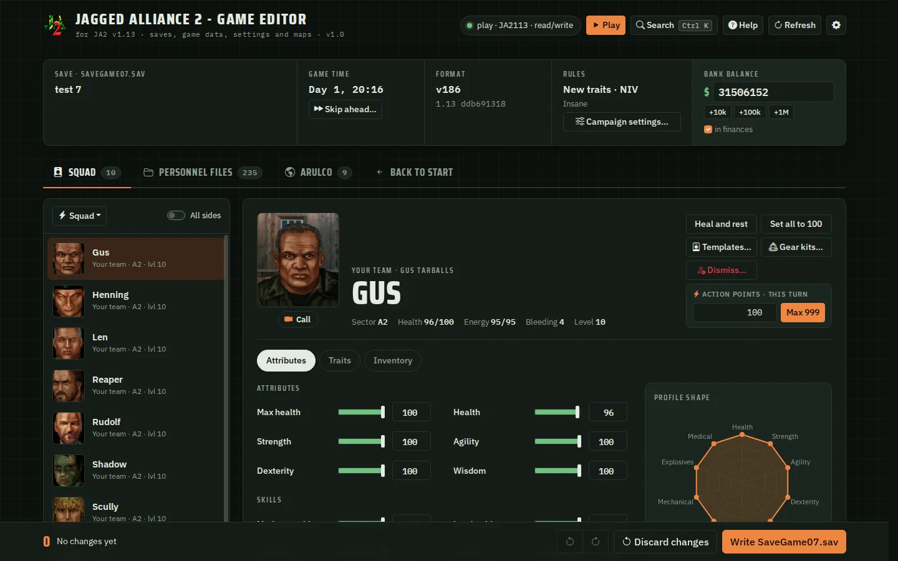</a>
</p>

<p align="center">
  <a href="https://oleksandrkhrashchevskyi.github.io/Jagged-Alliance-2-Game-Editor/template/#squad"></a>
</p>

<p align="center">
  <a href="https://oleksandrkhrashchevskyi.github.io/Jagged-Alliance-2-Game-Editor/template/#squad">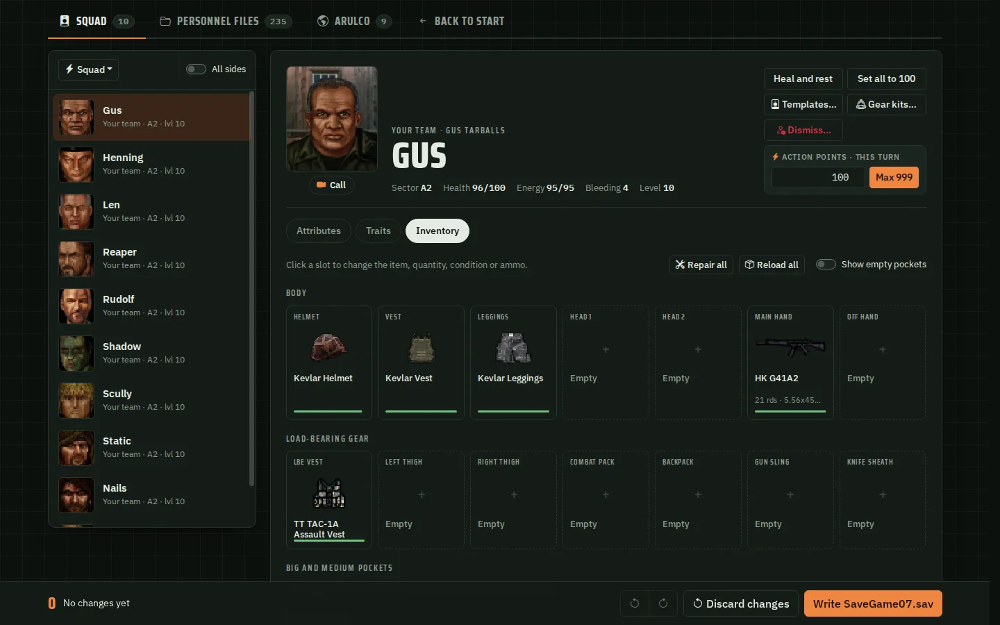</a>
  <a href="https://oleksandrkhrashchevskyi.github.io/Jagged-Alliance-2-Game-Editor/template/#squad">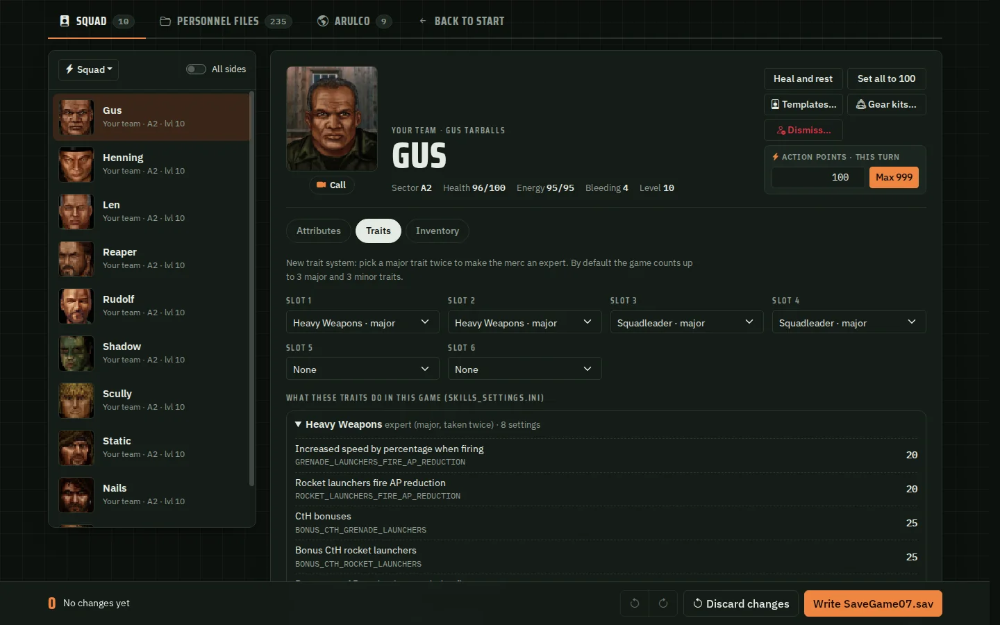</a>
  <a href="https://oleksandrkhrashchevskyi.github.io/Jagged-Alliance-2-Game-Editor/template/#squad">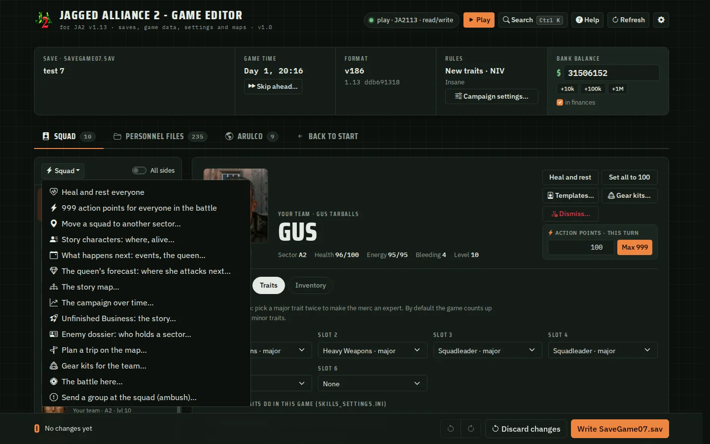</a>
  <a href="https://oleksandrkhrashchevskyi.github.io/Jagged-Alliance-2-Game-Editor/template/#squad">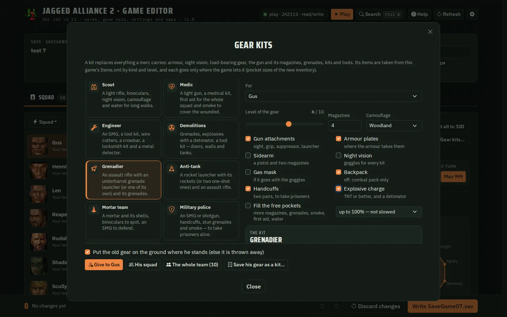</a>
</p>

<details>
<summary>📋 <b>Full feature list</b> (57)</summary>

- **Each merc:** attributes, level, skills and traits, inventory (items, condition, ammo, attachments, LBE; drag & drop between pockets and onto another merc), relations, name, portrait. Traits tab: what these traits do in this game (every setting of each trait from Skills_Settings.INI with the game's explanation).
- **Action points** (merc dossier): when the merc is in the sector where a battle is going on, his points for this turn can be set (up to 999; the points he starts a turn with are raised to match) or given at once with Max 999; out of a battle the box is shown with 0, since the points count only in a fight. Squad menu → 999 action points for everyone in the battle gives them to every merc of yours fighting there, without opening each one.
- **Squad menu → The battle here…:** when the save is in a battle (turn-based, in the loaded sector), everyone else fighting in it — the queen's soldiers, creatures and your militia — with their health (from 15 — below it a soldier is dying and stands still — up to their most; nobody is killed or added, so the counts of the sector stay right), the action points left in this turn (0–999), their energy (breath), bleeding and morale, and what they hold; Every enemy weakened (15 health), Enemies: no points left this turn, Enemies: worn out, shaken (energy 20, morale 10), Militia: healed, rested, reloaded, 999 points. Written with the save.
- **Squad menu → Gear kits for the team…** (and Gear kits… in a merc's dossier): nineteen ready sets — Rifleman, Sniper, Marksman, Heavy sniper, Machine gunner, Ammo bearer, Close quarters, Breacher, Commando, Night raider, Scout, Medic, Engineer, Demolitions, Grenadier, Anti-tank, Mortar team, Military police (an SMG or shotgun, handcuffs, stun grenades and smoke), Officer. The Grenadier gets a gun that has a launcher of its own or takes one under the barrel, and only the grenades that launcher fires (Launchables.xml: VOG-25 for the GP-25 and GP-30, 40 mm for the M203 and its kin); a launcher of its own with its grenades when no gun of the level takes one; no launcher is given without rounds and no rounds without their launcher (the same for a pistol and its magazines, a mortar and its shells). A launcher on a gun keeps its own empty slot, as the game gives every item it makes — without it the game shows no place for the grenade and it cannot be loaded (checked in the game: VOG-25 into the Groza's GP-25, 40 mm into an M203 on a Galil). Each takes this game's items by kind and a level (1–10): helmet, vest and leggings with their plates, night vision, load-bearing vest, thigh rigs and the best combat pack with a backpack that fits it (only pairs the game allows), the gun loaded with its magazines and its attachments (those it comes with, then the best the game lets onto it: scopes, lasers, suppressors, grips, an under-barrel launcher for the grenadier — one of each kind, none that clash, at most 4 in the old attachment system and 8 in the new one), a second pistol in the other hand for the officer, a sidearm pistol for the sniper kits, grenades, rockets, mortar shells, lock-busting shells, medical, tool and lock kits, wire cutters, a crowbar, a metal detector, binoculars, canteen and knife. Camouflage (woodland, urban, desert, snow or none) is put onto the armour itself: of everything the game lets onto a piece — the ghillie cover on the helmet, the ghillie jacket on the vest, the ghillie leggings, the helmet covers, camouflage shirts and jackets, the camo kit on the vests that take it — the one that hides best on that ground and is within the level; between two pieces that protect alike, the one that takes the better camouflage is worn, and a piece that can take none is named. The options are separate: Gun attachments (off: only what the gun comes with), Armour plates (off: bare armour), Sidearm (a pistol with two magazines for every kit that has none), Night vision (goggles for every kit), Gas mask (on the face; beside the goggles only when the game lets the two be worn together — CompatibleFaceItems.xml), Backpack (off: vest, thigh rigs and combat pack only), Handcuffs (two pairs, to take prisoners), Explosive charge (TNT, C1, HMX or C4 by the level, and a timed detonator; never an ingredient or a mine), Magazines, and Fill the free pockets: the pockets still empty in the vest, the thigh rigs, the combat pack and the backpack take more magazines, grenades, smoke, launcher rounds, first aid and water in turns, until every pocket is used or the load reaches the limit chosen — up to 100% of what this soldier carries (not slowed) or up to 120% (twice the magazines, grenades and smoke; at 120% the game leaves him 83% of the action points and moving costs 160% of the breath). The weight is added up as the game does it (attachments, the rounds in the gun, as in Too heavy?) and checked after every thing put in, so the limit is never passed; a kit that is over the limit by itself gets nothing more, and this is said. The preview says the weight, its share of what he carries by the game's own formula, and what an overload costs; after a kit is given to a group, those who carry over 100% are named. Whatever this game lacks for the kit is said. The preview shows every piece with its attachments; For picks one of your mercs, a militiaman or one of the queen's soldiers on the loaded map; Give to him, His squad or The whole team (or everyone of his side on the map) — the confirmation stays in sight at the bottom of the window; a group is given under the loading screen, and for more than six only the sums and those something did not fit on are listed; the old gear goes onto the ground where he stands or is thrown away; Save his gear as a kit keeps your own. Written with the save.
- **Squad menu → This save with two mods…:** every item the save holds (inventories, the loot on the ground) looked up in the Items.xml of two data folders — missing there, or there under another name (a mod that moved its items). Only shows.
- **Money:** balance, +10k / +100k / +1M, written into the laptop finances. Game time: Skip ahead. Rules: Campaign settings… — difficulty, Iron Man, tons of guns, style, Bobby Ray, item progress, turn limit.
- **Templates…** (merc page): roles, or your own saved mercs (attributes, level, skills, gear) applied to any merc. A template goes to a .ja2merc file and back (Open a .ja2merc file… adds it to your templates), and the merc on the page goes straight to a file — a merc you built up taken into another campaign or computer; the name, face and voice stay those of the merc it is applied to, the inventory comes only from a save of the same game build.
- **Squad menu:** squads and assignments (doctor, patient, repair, training, militia training, sleep — kept as the game keeps them: a merc outside the squads has a movement group of his own, an emptied squad stands nowhere, nobody standing in a battle is reassigned), heal and rest (also cures; a fallen merc is left to Stand up…), move a squad to any sector / level (the sector is marked as visited and, on a first arrival, gets the extra items the game lays out there — TableData/Map/ExtraItems for the save's difficulty), free prisoners, cure drugs / disease / hunger, Bobby Ray's orders now, morale, repair all, reload all, repair + reload + refuel everything, everyone to 100; Campaign report, Presets (easy start / hardcore).
- **Squad menu → Extend contracts…:** when each contract ends, the price of a day, a week, two weeks, 30 or 90 days (his own rates), the total and the bank after it, pay from the bank or not, and a warning when the money is short. A day, a week or two weeks are the game's own three renewals: the save notes which one was last and gets the "contract extended" line of the history, as when you renew in the game.
- **Squad menu → The wounded: how long to heal…:** how long each wounded merc needs to heal resting, on the move, in a hospital and with a doctor (the game's own rates from Ja2_Options.INI and Skills_Settings.INI); Heal now one by one, or pick a doctor and make him the doctor of the others.
- **Squad menu → Who comes to help the enemy…:** pick a sector: who holds it, who joins from the four sectors next to it as soon as the fight starts (every group there, each garrison down to the 12 it keeps; barriers, the difficulty's reinforcement settings and Omerta counted), groups on their way there and others within a day's walk, with the hours. Nothing is changed.
- **Squad menu → Bobby Ray's shopping list…:** with the money you set, what to buy from what Bobby Ray's sells now (the item level progress and his quality allow): a better gun for each merc's role with magazines, a better vest, helmet or leggings — the most for the money first. Nothing is changed.
- **Squad menu → Growth: next level and skill points…:** for each merc how far he is to his next level and to the next point of every attribute and skill (the sub-points kept in his profile, the INI's _SUBPOINTS_TO_IMPROVE), the chance of each try, and who is about to go up. Nothing is changed.
- **Squad menu → Town loyalty: what moves it…:** every town's loyalty, sectors held, enemies and militia, what holds it back, and what each event is worth there (battles, kills, sectors, mines, SAM sites, murdered townsfolk…) by distance and the town's rebel sentiment. Nothing is changed.
- **Squad menu → Campaign progress…:** the game's progress % worked out as the game does — kills (the game's own counter), sectors held, mine income, sectors visited — with the milestones it opens (Mad Lab, Mike, Iggy), what taking a whole town would add, the highest progress the campaign has reached (read from the save; dealers, Bobby Ray's and the queen's gear go by it, so the shopping list and the dealers' days use it too), the enemies killed by rank and the mercs lost, and the dealers' and Bobby Ray's level. Nothing is changed.
- **Squad menu → Ready for battle?…:** every squad checked before a fight — wounds, energy, sickness, hunger, the gun in hand (condition, loaded, spare magazines of its calibre), magazines no gun takes, a vest, morale, contracts, sleep, a first aid kit — each problem with its Fix (heal, rest, cure, feed, repair, load, add magazines, give a kit, wake), or Fix all.
- **Squad menu → Why the morale is low…:** a merc's morale taken apart as the save keeps it (starting point, the team, fights, the campaign, progress, drugs); the team part the game aims at every hour worked out from what he thinks of everyone around him (opinion, looks, manners, nationality, racism, what happened between them) and the best leader; what drags it down (someone he hates, hunger, sickness, wounds, a contract, the death rate, sleep) with a fix for each, when the rest fades, and the laptop history of the last days.
- **Squad menu → What next in the quests…:** every quest going, not started or done; from the characters' scripts who starts or ends it, where he is now in this save, what must be true first (green / red) and the first words of his line; quests moved on by the game itself are explained.
- **Squad menu → Where to sell the loot…:** everything seen lying in visited sectors and the base, what each dealer who buys would pay (his price rules, the item's condition, the ammo and attachments, his buying rate), each thing to the dealer who pays most while his cash lasts; totals per dealer and what to take where.
- **Squad menu → Militia plan: towns in danger…:** every town sector you hold that can train militia — its militia, the queen's groups heading there or within two days' walk, garrisons next door, loyalty, who can train there and the cost of filling it; the sectors to train first.
- **Squad menu → Rebel Command…:** the rebels' site of 1.13 as the save keeps it — supplies, the directive of the day and every directive's level (the costs and progress each needs from RebelCommand_Settings.ini), the militia training level, and in every town its admin team, highest loyalty and six actions with their levels, on or off; Set it up now for a campaign that started with it off, as the game would. Whether it is on (REBEL_COMMAND_ENABLED or FF_REBEL_COMMAND) is shown.
- **Squad menu → Your reputation…:** the bad reputation (0 spotless, 100 the worst) and the death rate, which A.I.M. mercs would refuse to sign and who on your team loses morale over it (a buddy on the team makes one sign anyway), what moves it (Reputation_Settings.INI); set it, to 0 or low enough for everyone.
- **Squad menu → Doors: locks and traps…:** the doors with a lock or a trap in every sector the squad has been in, as the save keeps them (the door table the game writes for a visited sector): per sector how many are locked and trapped; each door with its tile, its lock by name (Locks.xml: kind, how hard to pick or force), trap and trap level — unlock it or lock it again, take the trap off or set one; Unlock every door here, Take the traps off here, and the same everywhere. What the mercs believe about a door is set to match. A sector not entered yet still takes its doors from its map.
- **Squad menu → Campaign statistics…:** the totals behind the laptop's campaign history — killed, wounded, prisoners and shots of eleven sides (your mercs, three kinds of militia, civilians, administrators, soldiers, elites, tanks, creatures, zombies), the money earned by source and what was used up — each number can be changed; below them the battle reports the save keeps (when, where, killed, wounded, shots): whether a battle counts as won can be changed, and a report can be taken out of the history — the game itself forgets reports the same way.
- **Squad menu → Behind the scenes…:** what the save keeps after the strategic status and no screen of the game shows. The queen's planning: soldiers in reserve, whether she is awake (woken by the first palace scene or after a few sectors are taken from her), alertness and how fast it drops, fights she is on full alert for, sectors you have taken from her, reinforcement points she can spare and has been asked for, garrisons and patrol groups, the smallest group she sends, the hours a sector you took is left alone, the start sizes of her groups, whether the towns were ordered to be fortified, her defence phase. Bobby Ray's shipments on their way: state, destination, the day of the order and every item in the box. Contracts up for renewal, what dismissed mercs left behind for you, the schedules of the loaded sector and the item that was on the cursor. Also shown: the creatures (whether they have come, the lair, how far they have spread) and keys found (where and on which day each key was first picked up). Three of these lists can be changed: the parcels of a shipment (how many of an item, and in what condition they arrive), the renewal list (take a merc off it — he does not ask about his contract this time; “Each name once” when the game added the same names day after day) and what was left behind (“Bring it to” the sector a squad stands in, or throw it away). Shown only when every block of that part of the save lines up to the end; otherwise the dialog says so and shows nothing rather than something wrong.
- **Squad menu → Hidden towns, encyclopedia, script values…:** six small lists of the save no other tool shows. Hidden towns — Tixa, Orta, or any town a mod starts hidden: switch it to known (it is on the map with its name) or hidden again. Encyclopedia — how many items are known at each of its five levels; Every item known or Forget all (the usual 1.13 programs are built without the encyclopedia screen — ENCYCLOPEDIA_WORKS is not set in the source — so there the list has no visible effect). Briefing room — the missions that were opened or started: shown or not, and not started / started / done. Script values — the 1000 numbered places the Lua scripts keep a switch and a number in (SetGlobalVal, CheckGlobalBool…): change them or set a new one. Modder values — 1000 more numbers for a mod's scripts (SetModderLUAFact), in saves of format 171 and later. M.E.R.C. roster (shown only) — who is on the site and from which day and payment the others come. Found by walking back from the campaign statistics and forward from the postal service; used only when both walks meet.
- **Squad menu → What the sectors keep…** (read only): the temp files of every sector the squad has been in, sector by sector — how much of the map your mercs have seen, the bodies (who, when they died), the doors the game remembers as open, the changes to the map (damaged, taken away, put there, opened, windows hit, mines, marks, blood), whether the queen's soldiers or civilians are kept as they stood for your return and when that was written, smoke and lights still there.
- **Squad menu → The queen's special division (ASD)…:** the Arulco Special Division of 1.13 as the save keeps it — its budget and fuel, the helicopters, jeeps, tanks and robots in stock and on order, what it has unlocked (with the progress each needs), every helicopter with its troops, health and fuel (Destroy one), the costs and delivery times from the INI, and the queen's income from her mines that pays for it; whether it is on (ASD_ACTIVE, ENEMYHELI_ACTIVE) is shown. Militia one by one…: every militiaman individual militia remembers — name, rank, health, kills and assists, where he serves, his service record; rename him from the name lists of MilitiaIndividual.xml, promote him (the sector's green, regular and elite numbers follow), heal him or everyone serving. Intel…: the intel, the militia volunteers and the militia's gun, armour and gear resources, set to any number, with whether each is on, and the map regions bought this hour. The intel market…: what the laptop's intel site sells, bought here as on the site (with intel, or free): the enemies of any of the 16 parts of the map until the next 8-hour mark (where they are, or also how many and where they go), where the queen's generals are, a helicopter's flight plans, where Carmen's fugitives hide while his hunt is on, and today's bloodcat, zombie and bandit raids when they are on. The sectors in detail…: what 1.13 keeps for every sector besides soldiers and militia (saves of the current 1.13 build) — prisoners of six kinds (administrators, regulars, elites, officers, generals, civilians) held in the prisons of FacilityTypes.xml, set in a prison and only let go elsewhere, interrogation started over; turncoats in the garrison (never more than the garrison); disease as a share of the sector with whether you diagnosed it; corpses lying there and Bury them at the next hour; planned fortification work and All the planned work done; workers (never more than the sector's maxworkers of SectorNames.xml) and the training of the next one; the weather now; exploration. Tanks, jeeps and robots stay with the garrison on the Arulco tab. Generals, SAM hacking, militia orders…: the queen's generals on the map — shown on your map, or taken away the way the game does when one dies (one fewer left, his bodyguards stay); how far each SAM site is hacked (0 switches it off); the marching orders you gave militia, taken back one by one. Whether generals, prisoners, disease and workers are on is shown.
- **Squad menu → Take back from another save…:** from another save of the campaign (or an older version of this save the editor kept), the queen's soldiers in the sectors, her groups on the move (those still in the game, by their number), who holds the sectors, the militia, town loyalty, quests and facts, the bank, and your mercs (attributes, health, traits and gear of each merc alive in both) — each part with its differences, only what you tick; where everyone stands, squads, contracts and the loot in the sectors stay.
- **Squad menu → The PMC: militia for hire…:** the militia for hire on the laptop — whether the PMC is on, what a regular and a veteran cost, how many are for hire now (change it, up to the INI's limits), the ones on their way with the hour they land (change how many and where), and the airports where they can land now.
- **Squad menu → Enemy dossier: who holds a sector…:** pick a sector with enemies (garrison, groups standing there or on the way): how many of each kind, their vests, helmets and the guns they carry at this stage of the campaign, vehicles; your squad against them — how many hits their guns need on each of your mercs, how many his gun needs on them, and the ammo of his calibre that would do better; tips, Battle odds and Who comes to help one click away. Nothing is changed.
- **Squad menu → Ambush points on the map…:** the routes of the queen's groups on the move with their hours, and the sectors on them where a squad of yours gets at least an hour earlier — woods, hills and swamps first, your militia there, away from towns.
- **Squad menu → Whom to hire next…:** the A.I.M. and M.E.R.C. mercs you have not hired, best first for the skills your team lacks (or the one you pick), with the daily and two-week fee, whether they are free, and how they get on with each of your mercs both ways.
- **Squad menu → The campaign advisor…:** the open save on one page — which town to take next (the queen's strength in its sectors, the distance of your nearest squad, what its mine pays), enemy groups within two sectors of your towns and squads and the town sectors with few militia near them, who will not renew or whose contract ends within two days, the badly wounded and those low in spirits, when the money runs out, the quests under way; each part opens the window that goes into it. Only reads; JA2 and UB saves.
- **Watch while I play** (save list, the Play window, the eye in the top bar): every save the game writes is tested as Test the saves does as soon as the game has finished writing it — checked with a save written by the game itself — and the result told at once; a ⚠ in the window title until it is looked at. Test the saves also tells a save that is cut short: from version 166 the blocks the game writes last (PMC, ASD, militia, Rebel Command) are read up to the last byte.
- **Squad menu → Your I.M.P. character as a file…** (or As an I.M.P. file… on his personnel page): your own I.M.P. character written as the game writes one — CODE.dat2 in a profile folder of the same game (9999, the save version, his profile number, his portrait number of IMPPortraits.xml, his whole personnel file); in another campaign the I.M.P. site hires him by that code with everything he has, alive, at full health. The code is checked as the site takes it (1–8 letters, digits, _ . or spaces, not XEP624 / 90210 / GP97SL); a file of that name is kept as .bak; a face that is not an I.M.P. portrait is refused. Checked in the game: the site hired him with his face, attributes, skills and level.
- **Squad menu → Who may leave…:** every merc against the game's own rules for a new contract — someone he hates on the team, too many of your mercs dead, morale under his tolerance, a buddy who keeps him anyway, a contract signed with someone else — and what he grumbles about every day (a bad reputation, days without fighting, money owed), with the way to Squads, Contracts and Morale. Your gear against the enemy's…: the queen's administrators, regulars and elites where a squad stands, at the progress the campaign has reached — their guns, vests and range — and how many hits their guns need on each of your mercs and his gun on them, with the way to Gear by role and Bobby Ray's list.
- **Squad menu → Too heavy?…:** what each merc carries (items, attachments, the rounds in a gun, the pockets of his vest and packs) against his strength as the game adds it up — half his strength in kilos at 100 %, strength over 80 counting double, Bodybuilding — and what more costs him: APs and agility checks × 100 ÷ load, more breath per step, a slower and more tiring march; the three heaviest things and who in his sector has room. Life insurance…: the insurance site's own price (pay × 5 % × a risk from his skills, health, level and your death rate), days covered against days of contract, what it would pay; Insure covers him to the end of his contract and pays from the bank; a first insurance gets its line in the history and the minute it was bought, as on the site (a death within the hour after looks suspicious to the insurer, here as there). Food and disease ahead…: hours until each merc is hungry or thirsty and until his health may drop, by what he does (on duty, marching, in a vehicle, asleep, fighting) and the heat; food and drink he carries; how long until a disease breaks out. Battle records…: the personnel file of every merc who ever served — kills by kind, assists, shots and hits (hit %), battles and retreats, wounds, damage dealt and taken, locks, traps, repairs, bandaging, surgery, militia trained — sortable, the best of each column marked, saved as CSV. Bombs and mines in the sectors…: mines, tripwires and timed or remote bombs armed on the ground of the visited sectors, yours or the queen's; Disarm all leaves them as items to pick up, Take all away removes them.
- **Squad menu → Repairs: what is broken, how long…:** everything worn on your mercs and on the ground where they stand, the repair points it needs and the hours the mechanics there need by the game's own rate (tool kit, skill, dexterity, level); Put on repair gives a mechanic the assignment, or repair everything at once.
- **Squad menu → If you leave a sector…:** for every sector where a squad stands, the queen's groups coming within a day and the chance its militia hold it alone and with your squad still there (the auto-resolve fight, as in Battle odds).
- **Squad menu → Money by days…:** the laptop's finance records as a chart — in, out and the balance each day for 14, 30 days or the whole campaign — and where the money came from and went.
- **Squad menu → Prisoners' and the fallen's gear…:** what the queen took from captured mercs and left hidden at Alma, Tixa or the interrogation in Meduna (Mod_Settings.ini), with who is held there; bring it to your squad or leave it there in plain sight; links to Fallen mercs and Free prisoners.
- **Squad menu → Gear by role…:** each merc of a squad armed for his role (assault, sniper, machine gunner, close quarters, medic, demolitions — guessed from his skills): a gun, magazines of its calibre, a medical kit or grenades, armour in empty slots; taken from the loot where the squad stands and in the base under A9, or new gear of the level you pick.
- **Squad menu → Battle odds (auto-resolve)…:** the auto-resolve fight against the soldiers of a sector worked out up to 400 times — the chance to win, how many soldiers are left, how often each merc is wounded or dies; what if they were rested first, with or without the militia. Nothing in the save changes.
- **Squad menu → Into battle…:** a squad straight into a sector held by the queen, from the side and at the time you choose (healed, repaired and reloaded if you like); the fight starts when the save is loaded.
- **Squad menu → Send a group at the squad (ambush):** a group of the queen's soldiers, with extra elites if you like, gets a route straight to the sector of your squad.
- **Squad menu → Fallen mercs:** every merc of yours who died in the campaign. Stand up… — while his dead record is still on your team's list: the record stays as it is (what he is and carries; for an A.I.M. merc the days of contract he had left) and he arrives again like someone hired, at the landing zone a minute after the game runs on; health, breath, the "dead" mark, assignment and group are put back as saves of the game show them for the living. The line in the history, the count of deaths, a claim the insurer already has and the body on the ground stay. The only way back for your own character, whom no site hires again. Back onto the team… — once the game's Remove Merc took him off the list: alive again and straight into the Hire window. Bring back to life only clears the death: his file (available again), the dead record of an A.I.M. or M.E.R.C. merc or a story character, the laptop's list of the dead and a story character's "recruited" mark, so that he stands on his map again. His gear can be carried from where he fell to your squad. All three also clear the file's "suspicious death" mark. The game sets it when an insured merc dies within an hour of being insured, by your own team's hand or with no enemy around, and never takes it back — left in place, an honest death later would be refused by the insurer too. (An investigation of the first death that is still running then ends with the claim paid.)
- **Squad menu → Money: the next days:** bank, mine income and daily fees, a chart for 7–60 days, the day money runs out; mine output and a merc's fee can be changed there, and the mine income of those days paid out now.
- **Squad menu → Training…:** each merc trains a skill, teaches it or learns it from a teacher, or trains militia; presets; how far the militia training of each town sector has come and whether it is paid.
- **Squad menu → The campaign over time…:** the campaign set out by game time — money, sectors held, mercs on the team, mercs lost, kills (from the personnel files), militia, the queen's soldiers (sectors, levels below, groups), average town loyalty and mine income a day — as a chart per value and a table with the change from one moment to the next; save as CSV. From the saves of the folder (untick those of another campaign) or from this save and its older versions the editor kept (its history, and its backups if ticked). Only reads.
- **Squad menu → Chronicle of the campaign…:** day by day, the laptop's history, the e-mails and the money in and out; search; save as text.
- **Squad menu → Who likes whom…:** opinions, buddies and people hated in this campaign as a grid; Everyone here gets along. Story characters: where each quest character is, alive or dead, talked to; move or revive them. Warnings before writing when a change can break a quest.
- **Squad menu → Carry the squad to another save:** attributes, skills, gear and money into the same mercs of another save, with their relations and records (kills, assists, battles, wounds…).
- **Squad menu:** Find an item in this save (Ctrl+Shift+F: mercs, profiles, sector ground, dealers), Check this save for mistakes (what a hire, a dismissal or a death can leave half done — a merc on the way with no arrival planned, someone alive on the team and on a list of those gone, a story character marked recruited who is on no team, a file that says "on the way" with nobody coming, a dead record whose file says available, the game's count of your team below the records of the team — each with Fix; unknown items, values out of range, soldiers off the map, empty groups, broken squads — with Fix). Check this save also compares the slots the save was made with (mercs and vehicles, enemies, creatures, militia, civilians) with Ja2_Options.INI — the game refuses a save that has more — and looks for what makes the game crash on loading (an item with a count of 0 or in a broken condition, more mercs than MAX_NUMBER_PLAYER_MERCS, a merc in a group that is gone, one merc in two squads, items off the map, a vehicle without its movement group, a squad with a route or a "between sectors" mark left from before it was moved), with Fix where it is safe; Test before playing lists the same. Squad menu → The queen's forecast…: when she decides next and then about how often, the sectors she will most likely send soldiers to (yours = an attack to take it back, hers = reinforcements) with the chance over the next day, 3 or 7 days, and her groups already on the way with their arrival; The story map… (also in Game data).
- **A merc of your team → Dismiss…:** he leaves the way the game sends one away (StrategicRemoveMerc) — out of his squad and its group, "returning home" in his file, into the laptop's list of those who left, a line in the history, what the game had planned for him cancelled. His things stay on the ground of his sector or go with him; the medical deposit of an A.I.M. merc comes back if you tick it — all of it for a healthy one, in proportion to his health for a wounded one, as in the game — and A.I.M.'s letter about it lands in the inbox (the same record the game writes). A character of the story goes back to stand where he was and can be asked again (Slay keeps his mark, as in the game). Works in Unfinished Business saves as well (A.I.M. and M.E.R.C. mercs; no letter there). Refused with the reason for your own character, a vehicle, a prisoner, someone in a vehicle or still on the way, a squad between two sectors, a fight on screen, and the last one of your team. Undo brings him back. Compared byte for byte with a save the game wrote after its own dismissal; the editor's dismissal loads in the game and the gear lies in the sector inventory.
- **A dead A.I.M. or M.E.R.C. merc or story character of your team → Remove…** (where Dismiss… stands for the living): Remove Merc of the contract menu on the game's map screen — his record leaves the team's list, the team's count goes down, his name goes onto the laptop's list of the dead; the body and what lies beside it stay. Compared with a save the game wrote after its own Remove Merc with A.I.M.'s letter that it keeps the medical deposit; a merc who died on an assignment of his own loses the group of one he kept, as in the game. His personnel file says "Dead (still on your team's list)" and has Bring back to life too.
- **Squad menu → M.E.R.C. account…:** Speck's bill as the M.E.R.C. site keeps it — the state of the account and its number, who is on the bill (the M.E.R.C. mercs of your team and those gone with days unpaid), days × daily pay plus gear bought with him, the money and days paid so far, and what comes when: a reminder after 7 unpaid days, suspended after 9, invalid after 12 (then the M.E.R.C. mercs leave). Open an account as the site's button does; Settle the bill in full as the site does — days to 0, gear paid, account valid, Speck's reminder off, a line in the history — from the bank or free. Hiring a M.E.R.C. merc from the editor opens the account when there is none (the site hires only for someone who has one); with Pay as in the game his gear goes onto the bill. Not for Unfinished Business (one fee at hiring there).

</details>

<p align="right"><a href="#-contents"></a></p>

<p align="center"></p>

<a name="list"></a>
#### 🗂️ Savegame → save list, Personnel files

<p align="center">
  <a href="https://oleksandrkhrashchevskyi.github.io/Jagged-Alliance-2-Game-Editor/template/#saves">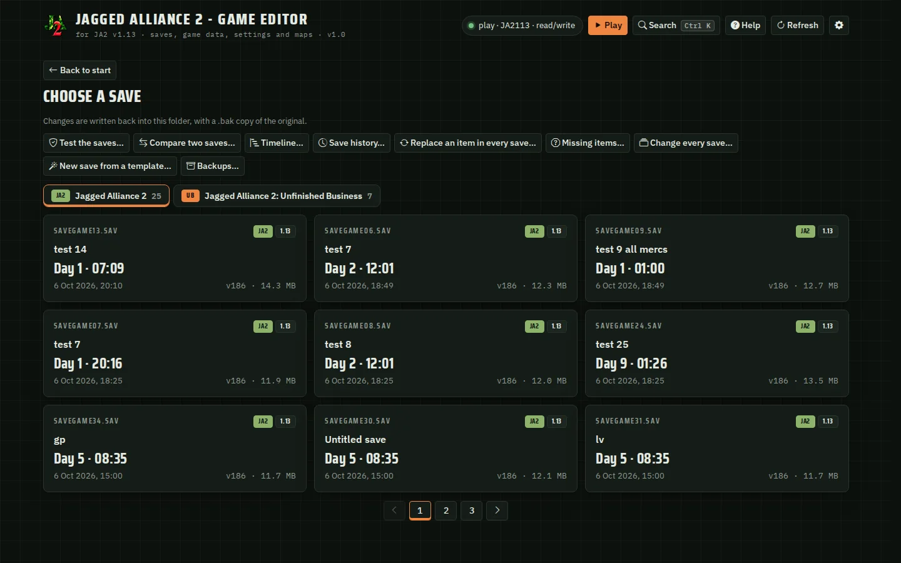</a>
</p>

<p align="center">
  <a href="https://oleksandrkhrashchevskyi.github.io/Jagged-Alliance-2-Game-Editor/template/#saves"></a>
</p>

<p align="center">
  <a href="https://oleksandrkhrashchevskyi.github.io/Jagged-Alliance-2-Game-Editor/template/#saves">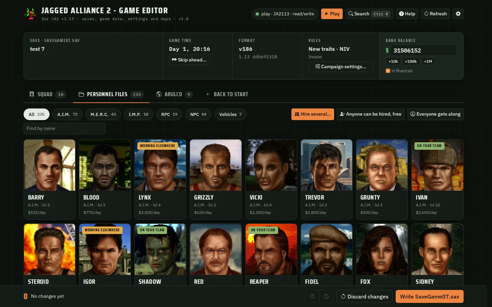</a>
  <a href="https://oleksandrkhrashchevskyi.github.io/Jagged-Alliance-2-Game-Editor/template/#saves">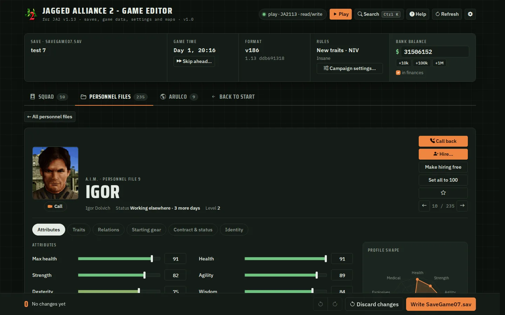</a>
  <a href="https://oleksandrkhrashchevskyi.github.io/Jagged-Alliance-2-Game-Editor/template/#saves">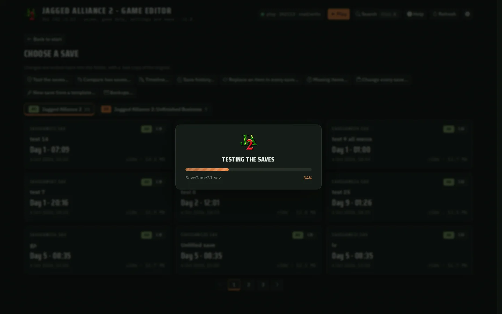</a>
  <a href="https://oleksandrkhrashchevskyi.github.io/Jagged-Alliance-2-Game-Editor/template/#saves">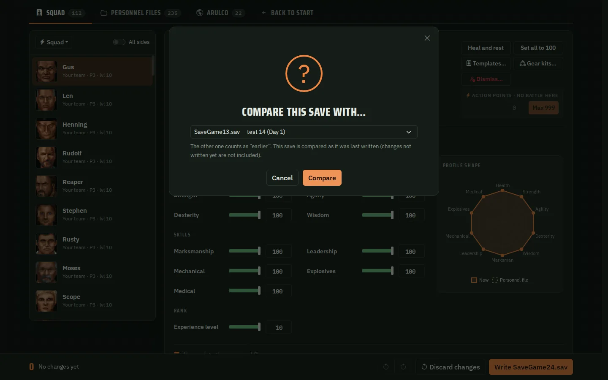</a>
</p>

<details>
<summary>📋 <b>Full feature list</b> (9)</summary>

- **Save list:** two tabs, Jagged Alliance 2 and Jagged Alliance 2: Unfinished Business (with how many saves each has; the game in use first), and on every save card a JA2 or UB mark (the profile folder in its tip) and a Vanilla or v1.13 mark (a save of the original game: its folder or its save version). Timeline… (every save on the days of its campaign; pick two dots to compare), Compare two saves… (also Compare with another save in the squad menu), Save history… (also History of this save in the squad menu; last 30 versions of each save in `SavedGames/Editor history`: restore, compare, delete), Test the saves… (also Test before playing in the squad menu for the open save: read as the game reads it, written back and read again), Replace an item in every save…, Change every save… (heal, cure, morale, repair, reload, everyone to 100, add money in all ticked saves), Backups… (the save folder copied to `Editor backups/<date>` when the editor starts, newest 5 kept; restore one or all), New save from a template… (a sandbox copy with the squad, money and gear set up).
- **Search (Ctrl+K) → Missing items in the saves and maps:** item numbers the saves still hold (inventories with attachments and LBE contents, the loot on the ground) — and, if ticked, every sector map — that this game's Items.xml no longer has, with where they are; pick a replacement for each and every save (history kept) and map (.bak) is written at once.
- **Personnel files:** every profile in the save — stats, traits, status, prices, relations; bring the dead back; anyone can be hired, free.
- **Personnel file of anyone who can join and is not on your team → Hire…:** he joins the open campaign as if hired in the game — in transit, with the game's own arrival event, so the game lands him a minute after it runs on and puts him into a squad. For the mercs of A.I.M. and M.E.R.C. and for the characters of the story (Ira, Dimitri, Miguel, Maddog, Dynamo…): those are marked as recruited, come off their map, get the "joined" line of the history with the sector, Dynamo's quest is closed the first time he joins, and a character standing in the sector on screen as a civilian leaves that place. Where: the campaign's landing zone, or a sector you hold with no enemy in it. A contract of a day, a week or two weeks (M.E.R.C.: by the day; a story character has none). With his own gear: the things of his file, and the scopes and other attachments go onto the gun as the game puts them (grenades stay in the pockets). Pay as in the game (off at first): the contract, the medical deposit and the gear are taken from the balance. A merc who served before leaves the laptop's list of the departed. Refused with the reason when the file is not one who can join, he is away, the team is full, he stands in a fight on screen, or — for a M.E.R.C. merc, as on the site — days of his are unpaid or the account is suspended. Unfinished Business saves too: A.I.M. and M.E.R.C. mercs to the landing zone (M.E.R.C. takes a week's pay at once there, the gear is free; its story characters join in the game only) — the hires arrived in the real UB game. A story character's name is marked as known when he is hired, as after talking to him — else the game writes "???" over his head even on your team (GENERAL_SAVE_INFO.HiddenNames; Tactical/Interface.cpp); Check this save for mistakes finds those hired by an older editor and makes their names known. Slay ("Terry"), whom the story keeps in a wheelchair, is hired on his feet — the soldier and his file get the body of a man standing, as the game leaves them when he joins (Tactical/Soldier Ani.cpp KickOutWheelchair); the same check takes one hired in the wheelchair by an older editor out of it. A character of the story is hired only with Story characters and vehicles on (below); Hire… asks for it when it is off. Undo takes the hire back. Checked in the real game: Manuel, Maddog, Dimitri, Dynamo, Barry and Biff arrived, stood in A9 with faces, bodies and weapons, and the game saved again.
- **Personnel file of an A.I.M. or M.E.R.C. merc who is away → Call back:** working elsewhere, returning home, annoyed at you, or simply "back in N days" (the status line says which and how many days are left) — he is available again at once: the status and the count of days are set as the game itself sets them on the morning he returns. Then Hire… on the same page or the laptop as usual. Not for the dead (Fallen mercs), not for someone on your team or on his way to you, not for one dismissed while a prisoner (the game never lets him return). Checked on real saves (19 and 20 mercs away) and written and read back.
- **Personnel file → the arrows under the star:** the file before and the file after, in the order of the list as it is shown (the kind picked, the name typed, favourites first), round the ends; the tab of the file stays. All personnel files still goes back to the list.
- **Personnel files → Hire several…:** tick any number of mercs and — with Story characters and vehicles on — story characters in one list (search by name, A.I.M. / M.E.R.C. / Story), one contract and one landing place for all, gear and pay as above; the window counts the room left on the team and the total fee. One step for Undo.
- **Personnel files → Story characters and vehicles** (the box beside Find by name, with All, RPC or Vehicles picked; JA2 saves): switching it on shows what it can cost — a character taken from here no longer stands at his place on the map, so what he says, sells or gives there is gone and a quest that starts or ends with him may never open or close; a vehicle no longer waits where the story keeps it — and only after Switch on are story characters hired and vehicles added. It stays on until the editor is closed; Hire… on a story character and Add to your team… on a vehicle ask the same question while it is off.
- **Personnel file of a vehicle → Add to your team…**, or Arulco → Vehicles & air → Add a vehicle…: the Hummer, the El Dorado, the ice-cream truck or the Jeep (the vehicles Vehicles.xml has switched on, without the helicopter, tanks and the armed jeep) becomes yours the way it does in the game once a merc has sat in it: a record in one of the team's vehicle places, a place on the vehicle list with its own movement group, the file marked as recruited so that it no longer stands on its map, and — for the Hummer and the ice-cream truck — the fact of the story that lets mercs get in. It is parked empty, assignment "Empty", in a sector you pick: one you hold, with no enemy, not the one on screen, and with a way out for it (a car needs a road; the Hummer goes off the road when HUMVEE_OFFROAD is on). No helicopter brings it: the game sets it down near the middle of the map when the sector is opened, and a merc there gets in through his assignment (Vehicle). Refused with the reason when it is yours already, stands in the sector on screen, the team's vehicle places are full (MAX_NUMBER_PLAYER_VEHICLES) or the save is not a JA2 1.13 save of the newest format; Unfinished Business has no vehicles to drive. Undo takes it back. The record the editor writes for the Hummer is the game's own byte for byte (but the time and its number); checked in the real game: four vehicles listed on the map screen, two set down side by side in one sector, a merc assigned to the El Dorado drove it to the next sector.

</details>

<p align="right"><a href="#-contents"></a></p>

<p align="center"></p>

<a name="arulco"></a>
#### 🌍 Savegame → Arulco

<p align="center">
  <a href="https://oleksandrkhrashchevskyi.github.io/Jagged-Alliance-2-Game-Editor/template/#arulco">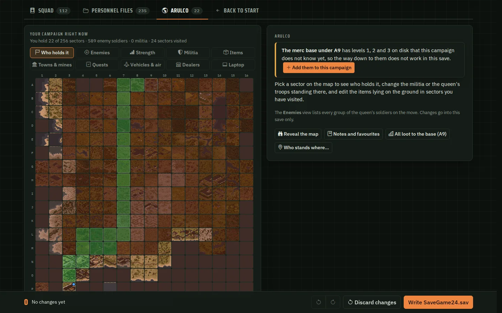</a>
</p>

<p align="center">
  <a href="https://oleksandrkhrashchevskyi.github.io/Jagged-Alliance-2-Game-Editor/template/#arulco"></a>
</p>

<p align="center">
  <a href="https://oleksandrkhrashchevskyi.github.io/Jagged-Alliance-2-Game-Editor/template/#arulco">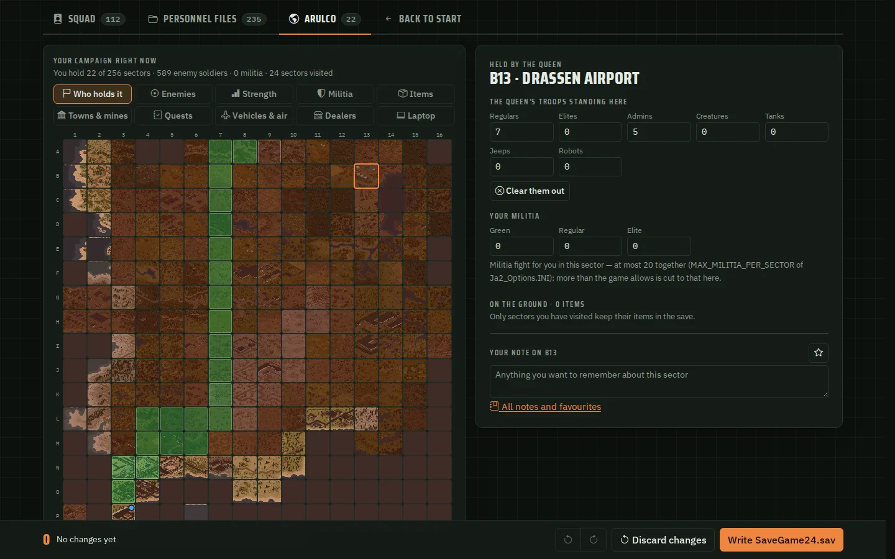</a>
  <a href="https://oleksandrkhrashchevskyi.github.io/Jagged-Alliance-2-Game-Editor/template/#arulco">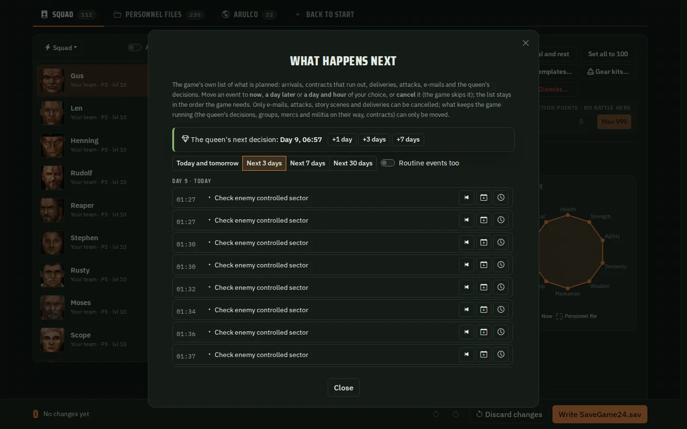</a>
  <a href="https://oleksandrkhrashchevskyi.github.io/Jagged-Alliance-2-Game-Editor/template/#arulco">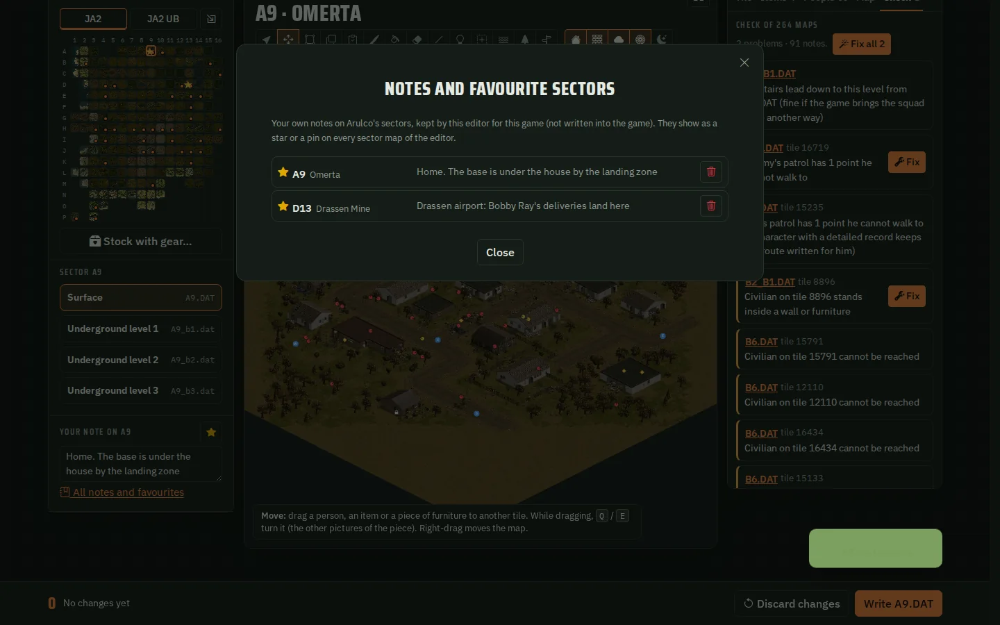</a>
</p>

<details>
<summary>📋 <b>Full feature list</b> (8)</summary>

- **Who holds it:** sector owner; per sector: garrison, militia, underground levels; Reveal the map. The items lying in a sector are listed 200 at a time with a search by name or tile (a stockpile of thousands no longer holds the page up); Reveal all, Repair all, To the base and Move all… still work on every item. Notes and favourite sectors: your own note and a star on any sector, shown on every sector grid, all in one list.
- **Strength:** the queen's strength per sector (elites, tanks, jeeps and robots count more; groups passing through included), the strongest places in a list with ½ and ✕ (empty the garrison) for each.
- **Enemies:** groups on the move (edit, weaken), clear around squads, halve / empty garrisons; soldiers on the loaded map (disarm, weaken, remove; What they drop…: every item each of them carries and whether it drops or vanishes when he dies — with DROP_ALL of Ja2_Options.INI — and Everything drops); route arrows and dashed full routes of every group; Route: draw a new route for a group on the map. What happens next (squad menu): the game's planned events by day — move one to now, a day later or a day and hour of your choice, cancel an e-mail, attack, story scene or delivery (the game skips it; what keeps the game running can only be moved), put off the queen's next decision.
- **Militia:** numbers per sector; everyone elite (or at least regular) and healed — the named militia of 1.13 with their rank, promotion points and the sector's numbers kept in step, One by one… opens each of them; Heal all, repair their gear; Their gear… (squad menu: Militia gear in their sectors…): the guns, magazines and vests lying in each militia sector and who is without a gun or a vest, gear from the base under A9 or new gear put there, and `MILITIA_USE_SECTOR_EQUIPMENT` switched on so the militia take it.
- **Items:** loot lying in visited sectors (add, repair — attachments and what is inside vests and packs too, as a merc's gear is repaired — reveal); move one item or everything to another visited sector; to the base under A9, sorted into its rooms. Loaded sector: Clear and collect the loot, Who stands where (move people on the map). Squad menu → Plan a trip on the map…: legs with travel times on foot, by car, truck, tank or helicopter (the game's own rates; fuel for vehicles, Skyrider's fee over free and hostile skies), go there with the time passing (on foot).
- **Towns & mines:** loyalty, full militia, take a mine, make it pay, output; Town…: one town in one window — loyalty, its sectors with their militia, its dealers, the story characters standing there, its mine.
- **Quests:** quest states, facts. Vehicles & air: repair and refuel vehicles and the helicopter, Add a vehicle… (see Personnel files); SAM sites (take, wreck, repair, free the skies); enemy airspace tinted on the map, SAM coverage on hover. Dealers: cash, stock (add / remove), reopen, repairs and orders now; What he remembers on an open dealer (Franz: the video camera sold — he restocks one until then; Fredo: his rocket-rifle line; in UB Raul: the Barrett sold and his hand-cannon lines) — untick to have it again; The dealers' days…: when the next restock is, each dealer's cash after it, what is on order and what he will order (only what he may sell at that stage of the campaign), with Fill the shelves (orders come at once with Every order arrives now above).
- **Laptop:** e-mail (read / unread / delete, restore lost ones from other saves or older versions, send again, write an e-mail of your own from any sender: the subject and every paragraph go to the end of Email.edt (Email25.edt in Unfinished Business when the game has it) as records of 320 characters, the first one the subject, as the game reads them; a longer paragraph is cut after a sentence; checked in the game in 1.13 and Unfinished Business) and history. Restore leaves out a letter of another save whose text this game's e-mail file does not hold at that place (a save of another version or mod), as it would show another letter's text. The game keeps the kind of every letter in a table of its own, by the letter's place in the inbox; when letters are removed or added, the editor moves that table along, so each letter still shows its own text (checked in the game: after one letter was deleted, A.I.M.'s letters below it read as before).

</details>

<p align="right"><a href="#-contents"></a></p>

<p align="center"></p>

<a name="data"></a>
#### 📦 Game data

<p align="center">
  <a href="https://oleksandrkhrashchevskyi.github.io/Jagged-Alliance-2-Game-Editor/template/#game-data">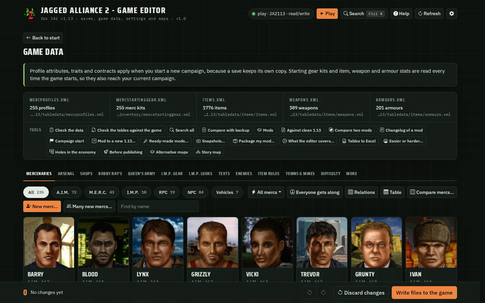</a>
</p>

<p align="center">
  <a href="https://oleksandrkhrashchevskyi.github.io/Jagged-Alliance-2-Game-Editor/template/#game-data"></a>
</p>

<p align="center">
  <a href="https://oleksandrkhrashchevskyi.github.io/Jagged-Alliance-2-Game-Editor/template/#game-data">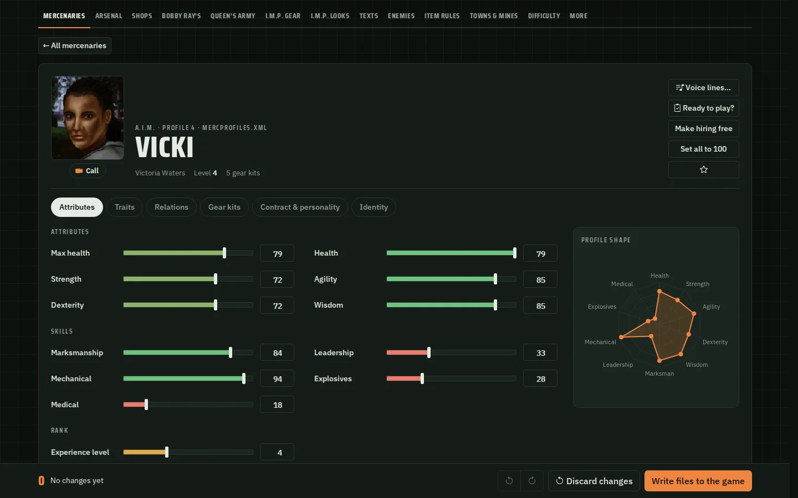</a>
  <a href="https://oleksandrkhrashchevskyi.github.io/Jagged-Alliance-2-Game-Editor/template/#game-data">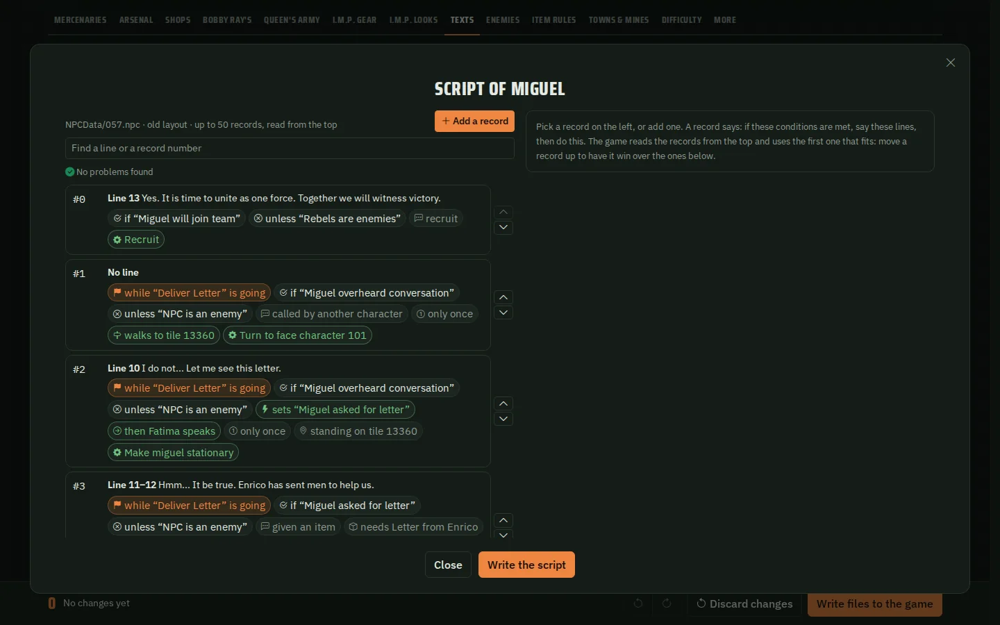</a>
  <a href="https://oleksandrkhrashchevskyi.github.io/Jagged-Alliance-2-Game-Editor/template/#game-data">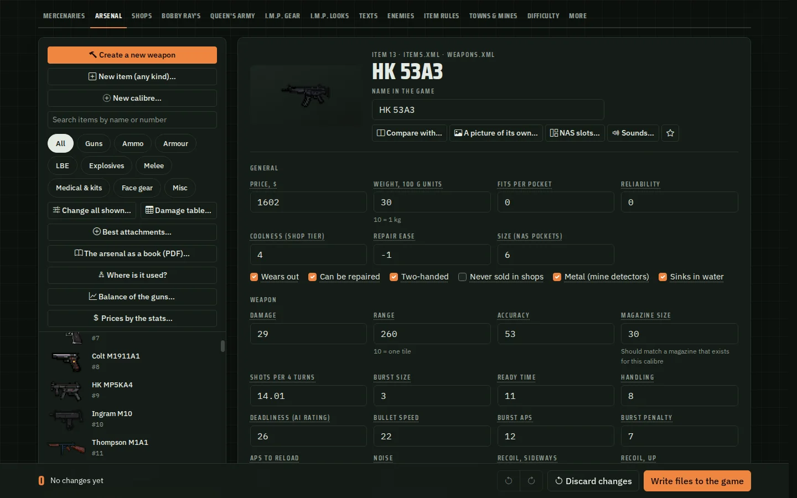</a>
  <a href="https://oleksandrkhrashchevskyi.github.io/Jagged-Alliance-2-Game-Editor/template/#game-data">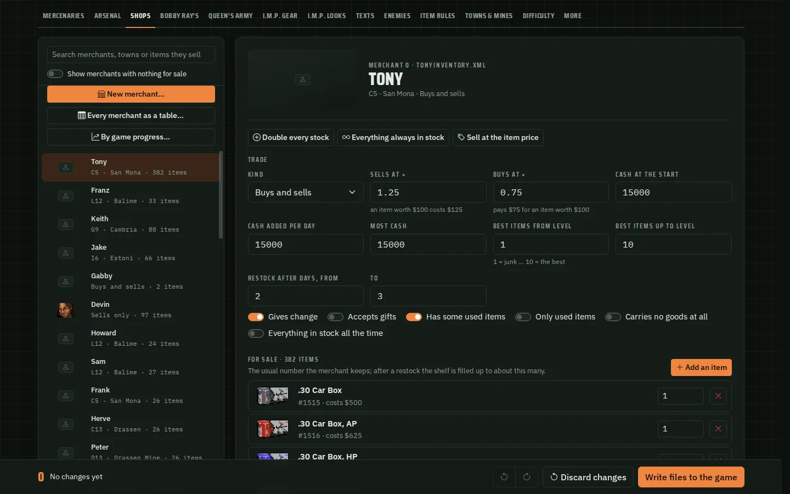</a>
</p>

<details>
<summary>📋 <b>Full feature list</b> (34)</summary>

- **More → Enemy taunts** (TableData/EnemyTaunts): every file of taunts the game reads (attack, got hit, kill, miss, run away, ripostes, zombies…) — the text of a taunt and its censored form, who may say it (attitude, side and rank, man or woman) and when; limits of level, health, energy and morale (−1 = none). Copy as a new taunt, Remove (the numbers of the file stay in order, as the game needs them), Add a property. The game is built so that about 1024 taunts in all files are safe, and a copy is refused beyond that.
- **More → More tables:** E-mails (Emails.xml: from, subject, the parts of the text — a script sends a letter by its place in the file, so letters are only added at the end) and E-mail senders; A.I.M. alumni (nickname, name, what became of him, portrait); Hidden names (whose name is not shown in tactical); Small faces (eyes and mouth on the small portrait); Minerals (the names of the mine types); Explosion looks (animation, speed, sounds); Attaching skill (the skill check an attachment needs); Combo merges (an item with its attachments becomes another); Keys; Action items (the triggers a map can hold); Main menu (where its buttons and pictures stand). Each is written with the other files of Game data, the original kept as .bak; where the game has a limit, a copy stops at it.
- **Texts → Game texts → Credits:** the lines of Credits.edt and Credits_Mod.edt. A line that starts with @ must keep the ; that ends its codes, and a line of the mod credits cannot be emptied (the game would stop the list there) — both are checked.
- **Mercenaries** (MercProfiles.xml): stats, traits, prices, gear kits, portrait; bulk changes; Table (every merc side by side, sortable, CSV); Compare mercs…: two or three mercs in columns — stats, traits, pay — with the best value marked and how well each fits a role (sniper, medic, mechanic…); Relations grid, everyone gets along; New merc…: a new A.I.M. / M.E.R.C. merc from a copy (name, pay, voice, bio, portrait, site entry), a made-up name and biography fitting his best skill, hear the voice. Merc page → Voice lines…: every line he says with its words, whether the game has a sound for it or it is silent, your own .ogg / .wav / .mp3 for a line (or many at once by the numbers in their names), and a voice number of his own when he shares one; lip-sync: every line with a sound shows whether it has its .gap file (the pauses in which the face keeps its mouth shut), Make it for the lines without or again for all works the pauses out of the sound itself, and each new sound gets its .gap when written (a sound without a pause gets one that never closes the mouth); Ready to play?: the site, portrait, voice, words, biography, gear kit, pay and attributes checked, each one a click away (it also follows New merc). Many new mercs…: A.I.M. and M.E.R.C. mercs from a table (CSV from Excel or any spreadsheet; the table to fill can be downloaded): each row a copy of an existing merc with its own nickname, name, site, pay, level, voice and biography, checked and shown row by row before anything is made, each on the next free profile number.
- **Arsenal** (Items / Weapons / Armours / Magazines): every field and flag with what each field means on its label, Change all shown… (the items the list shows: price, weight, reliability, repair ease, coolness, per pocket, damage, range, accuracy, magazine size, ready time, deadliness, protection, coverage or wear, by %, plus or set, with every item previewed before it changes), Compare with… (two items side by side), Where is it used? (every table, map and save that names the item), Damage table (hits per gun through each vest, with ammo types and editable damage), Balance of the guns (too strong? / too weak? against the same calibre and level), Prices by the stats… (a fair price for guns, armour and ammo from what they do; too dear / too cheap, set one or all in a click). Best attachments… (the gun picked in the list): everything Attachments.xml lets onto it, with what each gives, and the best set for all-round, sniper, close-quarters, quiet or night use — one of each kind, no incompatible pairs, up to the level you pick. The arsenal as a book (PDF)…: every item of the kinds you pick with its picture, price, weight and main values, grouped and sorted, printed or saved as a PDF (or a web page) for the players of your mod. New calibre…: a calibre of your own (AmmoStrings.xml) with its magazines copied from the nearest ones, sizes, ammo types, boxes, price per round, and the guns you pick changed to it. Arsenal → A picture of its own…: your PNG or JPG (a plain background taken out) as the item's picture in the inventory, in the description box and on Bobby Ray's, and lying on the ground, in the game's palette; every other picture stays; NAS slots… (guns): the slots its description box shows with the New Attachment System, where they stand and what fits each, its slot layout and the attachment points it offers; Sounds… (guns): its shot, silenced shot, burst, silenced burst, reload and lock-and-load sounds picked from Sounds.xml and BurstSounds.xml, each with ▶.
- **Arsenal → New item (any kind)…:** armour, magazines, medical, kits, face gear, load-bearing gear, grenades, knives or anything else, copied from an item you pick — name, price, weight, level, Bobby Ray's stock, the picture of another item and the main values of its kind (protection and coverage, rounds, damage). Create a new weapon: a gun with its calibre, a new magazine made for it, its level and the picture of another gun.
- **Shops:** dealer inventories, every merchant as a table, By game progress… (what a merchant sells at each stage of the campaign — often, less often, rarely or never), New merchant… (a trader of your own in any surface sector, with hours, looks, cash and a stock copied from another). Bobby Ray's: stock, and By game progress… (every item of the site by level and the campaign progress it is sold from; move an item to another level or off the site). Holes in the economy (file strip): items one dealer or Bobby Ray's sells for less than another dealer pays for them, dealers who pay more than they ask, merges whose result sells for more than its parts — by the game's price rules.
- **Queen's army:** army compositions, garrisons and patrols; draw a patrol on the map, Make up patrols… from the garrisons. Enemies: the guns and gear the queen's soldiers and your militia carry at each stage of the campaign, and what they drop; By campaign stage: pick the progress, sector, difficulty and item speed and see what each kind of soldier and militiaman gets (rating, gun list with chances, armour, grenades, attachments), by the game's own reckoning; Against your armour: hits it takes their guns to bring down a merc in the vest you pick, and hits your gun needs through their vests, at three stages. Difficulty: difficulty levels, enemy ranks, enemy names per sector, the queen's attacks (with calmer / relentless presets); Easier or harder… (file strip): the whole game one step easier or harder in one go, every changed value listed.
- **Item rules:** attachments, merges, transforms, random item classes, ammo types, explosives, locks, attachment slots (NAS); Attachments → Table: what fits on which gun… — guns as rows, attachments as columns, a click adds or takes away.
- **Towns & mines:** town sectors painted on the grid, loyalty, militia, hidden towns, rebel support (Cities.xml); mines — sector, ore, output, tunnels, creatures (initmines.lua); Travel: how squads cross each side of every sector (road, plains, woods, hills, river, closed…) with the time on foot, and the ground of the sector itself (MovementCosts.xml), both directions at once. Money by stage… (Towns & mines header): mine income against a squad's fees stage by stage — mercs, level, mines and militia per stage are yours to change, with town loyalty, two-week contracts and the starting money of each difficulty; where the money runs out.
- **I.M.P. gear** (IMPItemChoices.xml); The personality quiz…: the 16 questions of the I.M.P. site and their answers (also a woman's version) in your own words, with what each answer gives (IMPText.EDT). I.M.P. looks: portraits (also from your own picture) and voices offered on the I.M.P. site, body preview in the chosen colours, A voice of your own… from your .ogg / .wav / .mp3 files.
- **Texts:** A.I.M. / M.E.R.C. biographies, item names and descriptions, Dialogue of characters and mercs — and Street talk: what civilians, militia and the queen's soldiers say on the street (NPCData/CIVnn.edt, each file named by who speaks and in what mood), the hints of a sector, a voice's other dialogue file and the snitch lines of the mercs, edited the same way; Other scripts…: the scripts that have no dialogue file of their own — characters whose lines are kept with the mercs' or nowhere yet, and the scripts of whole sectors (what the civilians there answer, with the sector's hints as lines) — opened in the same script editor — with when each line is said and what it does (NPCData .npc scripts), Dialogue by quest…, Voice check… (lines with no sound file and sound files with no line, for every character and merc), Check all dialogue… (every character's script against its lines: records that play an empty line or a line past the end, facts out of range, a hand-over to an empty record of another character, actions the game does not know; lines that fill all 239 characters and may be cut; with the voice check summed up — only shows), ▶ hear a line and Call the character; Edit the script: every record of a character's .npc file as a form — who may start it (approach, facts, day, time, standing on a tile), what he says (the line text itself, a new line for a record), what happens (a named action before or after he walks, a quest started or ended, a fact set, an item or money given, another record), up / down, duplicate, remove and a list of problems (lines past the end, facts over 499, a quest started and ended at once, triggers to empty records); A task of your own…: a quest in a few steps — who gives it and when, what he says, what must be done (bring him an item, bring it to someone else, talk to someone), what he says when it is done and the reward (experience, loyalty, an item) — written as records of his script with free facts, with a warning when an earlier record would be said first; optionally a quest in the laptop — a quest number of its own (28–254) started with the task and ended when it is done, its two history lines (BinaryData/QUESTS.EDT), and an e-mail when it starts and when it is done (added to Emails.xml and sent by a marked block at the end of Scripts/Quests.lua, checked before it is written). Your own quests show by name in the script editor.
- **More:** vehicles (seats), backgrounds, diseases, food, militia names, looks and pay (with generated names), facilities (with Production lines of the factories…: what each line of FacilityTypes.xml makes, the name on the screen, minutes for one, cost an hour, the town loyalty it needs, the tile where it appears, whether a merc must work there, the items it uses up, with how many a day and the price of each worked out; lines are changed, not added or removed, because the game's scripts keep each factory's progress by line number), helicopter sites, bloodcats, creature groups, pictures (any .sti file of the game — portraits, items, interface, laptop, tiles, cursors, loading screens, animations, the encyclopedia, the map editor, fonts, the tile cache, the briefing room, every subfolder; a folder with more than 500 files is leafed through 500 at a time, with the page picked from a list or by the arrows, and search goes over the whole folder: every picture of a file, PNG one by one or all as .zip, replace one or add one at the end with the file's own colours kept, move one by its x / y offsets, see the colour table), music and sounds (the music of each situation — main menu, laptop, quiet, enemies near, battle, night, victory, death, creatures — the game's own tracks and your `Name_NN` files, which ending the game plays (.mp3 before .ogg before .wav), play, add a track, replace one, take a loose one away; every sound effect of Sounds.xml with its numbers, the ones missing from the game data, play, save a copy, replace — turned into a plain WAV when the game asks for a .wav — or take a loose one away; bursts of BurstSounds.xml with a file per number of shots, add a file for another number; battle cries of every voice set (BattleSNDS: ok, hit, dying, cursing…), the files the game plays in turn, one more for a moment, replace (a lip-sync file of that cry is made again from the new sound), take the last one away; the ambient sounds; Every file: each folder that holds sounds (Speech, NPC_Speech, Sounds, BattleSNDS, Ambient, Music, AltSounds, Laptop, Interface, stsounds) with its sub-folders — also the files no list of the game names, such as Speech/Snitch — 600 at a time with search: play, save a copy, replace, take a loose one away, and in the speech folders see whether a sound has its lip-sync file, make it (again) or take a made one away; calibre sounds (NWSS, AltSounds: the shots of each calibre by gun type, near and far, silenced, for bursts, play, replace, add a slot, take one away, and which file each gun plays in the order the game looks for it); ambient sets (Ambient/N.bad: each sound by time of day, how often and how loud, add, remove, a new set as a copy, and which tileset uses it — give a tileset another set)); in Pictures also A new picture file here… (a new .sti from your PNGs, one colour table, trimmed with offsets if you like), Play as an animation… (the pictures of a file at their offsets, by direction, speed and size; eight directions are assumed only when each has more than one picture, and a face file — the face, its eyes and its mouth — plays as the face itself, blinking and talking, the small pictures laid over it where they fit), Paint… on any picture of a 256-colour file (with the file's own colours, so the other pictures and the shadows stay right) or of a 16-bit file such as a loading screen (any colour, the most used ones at hand): pencil, brush size, fill, take a colour, see-through, undo; a selection to copy, cut, flip left–right or up–down, turn left, right or around, make twice or half as big, and paste — into another picture of the file (go through them without closing) or into another file, the colours matched to its colour table; one colour replaced by another in the picture or in every picture of the file; a colour of a 256-colour file changed for all its pictures; a picture of your own laid under or over to trace (see-through, size, position; never written); Move every picture… (the same x and y added to the offsets of all pictures), Tile data and animated tiles… (what the game reads for each picture when a tileset loads, from the .sti or its .jsd: full tile, animated tile with its frames played in place, dynamic, interactive, ignores height, land height, the wall it stands on; a run of pictures made one animation or taken apart; frames outside the file refused; for tileset files), Tile properties (.xml)… (for tileset pictures: how well wood, desert, urban and snow camouflage work on them, camouflage by stance, the noise of steps, how hard it is to sneak, the bonus to hide traps, the ground type, and a barred window nobody can jump through; written for this tileset or into Tilesets/AdditionalProperties for every tileset without a file of its own; used while COVER_SYSTEM_ADDITIONAL_TILE_PROPERTIES is on), Tile shape (.jsd)… (for tiles: the tiles each picture covers, a 5 × 5 grid of how high it stands on each, drawn over the picture; its material and armour, wall side, what it is — obstacle, door, wall, tree, fence…, walkable tiles, roof tiles; paint the shape, add or remove tiles, copy it to other pictures; in Tilesets/&lt;number> written back with .bak, or made new for a file that has none), in Anims Which move plays which file… (the body animation table built into ja2.exe, read only: every move of mercs, civilians, creatures, animals and vehicles with its file, directions and the body's shape, missing files marked, the move played in place) and, in Tilesets, A tileset of your own… (a new tileset at the end of the list, a copy of another with its pictures in Tilesets/&lt;number> to repaint; Ja2Set.dat.xml and JA2SET.DAT).
- **Texts → Game texts:** the texts of the XML tables not edited elsewhere — loading screen hints, squad names, civilian group names, the laptop's history lines (the %s / %d placeholders must stay), the e-mails of A.I.M. mercs and the M.E.R.C. level-up e-mails, the press reports of the campaign — with the length each one may have, as the game's readers keep it (also no more than 500 bytes a field).
- **Texts → Game texts → Quest log and E-mails (EDT):** QUESTS.EDT (what the laptop's history writes when a quest starts and when it is done, 79 characters a line) and EMAIL.EDT (319 characters a line; subject first, message by message as Laptop/email.h groups them, the 40 A.I.M. replies apart); Unfinished Business reads QUESTS25.EDT and EMAIL25.EDT. The placeholders ($MERCNAME$, $AMOUNT$, %s, %d) must stay. 1.13 reads many e-mails from TableData/Email when they are there.
- **Texts → Game texts → All texts as CSV (translation)…:** one table of every text the editor reads (item names and descriptions, the game texts, quest log, e-mails, merc bios and, if ticked, all dialogue) — file, id, field, max, context, text — saved as game-texts.csv; the translated table read back changes only the rows whose text differs, and lists the rows it skips (not in the game data, longer than the game reads, placeholders changed). Written with Game data.
- **Texts → Game texts, the other .EDT texts of the game** (record sizes as the game reads them): A.I.M. history page and A.I.M. policies page (399 characters a paragraph), Laptop files and Intelligence reports (R.I.S.) (UB reads only RIS25.edt), I.M.P. site texts (UB: IMPText25.edt) and the lines of the I.M.P. results e-mail, the Insurance site, the Florist site (name, price — a number only, the game reads it as one — and description of each flower, the cards) and the Help screens. No % sign may be added or taken away (some texts are format strings). Briefing room: the pages and picture texts of each mission of BriefingRoom.xml (BriefingRoom/EDT/mission&lt;id>.edt, description&lt;id>.edt; 559 characters a page) when a briefing-room mod is there. The encyclopedia of 1.13 is not in the game build and the A.I.M. alumni files (AlumName.edt, Alumni.edt) are no longer read (the archive comes from XML), so they are not offered.
- **All texts as CSV → Compare two CSV files…:** the original and a translation (or two versions): rows translated, not translated yet (the same words as the original), missing, new — by file; Save what is left to translate writes those rows as to-translate.csv.
- **Tools in the file strip:** Ready-made mods… (Hardcore: a much bigger, faster army, less money, fewer drops, enemies investigate; More loot: everything drops, drop chances × 1.5; Quick start: twice the starting money, landing after 3 hours, M.E.R.C. from day 1 — written into Ja2_Options.INI, DifficultySettings.xml and the drop tables, each kept as .bak; the editor remembers every value it changed, and Take it back undoes the last one where the values are still the ones it wrote), Mod to a new 1.13… (three folders or archives — the 1.13 a mod was made on, the new 1.13, the mod: each file of the mod against both; tables whose records have a number (uiIndex, mIndex, usItem) merged record by record and field by field so the new 1.13's new records and fields stay, a record with grouped or repeated fields taken whole from the mod; tables without such numbers (Attachments, Merges…) to look at by hand; clashes, where both changed the same field, listed with the mod's value kept; files changed by both that are not tables to look at by hand; old copies the mod carried unchanged left out; the result as a .zip to unpack as the new mod folder, with a report — the game folder is not changed), Alternative maps (which sectors a new campaign draws 50/50 between their map and its _A map, AltSectors.xml — only sectors that have an _A map, the game's story sectors marked; also in the squad menu for a save: switch a sector nobody has been to yet), Check the data (broken references, duplicates, missing rows, with Fix; also after every write), Search all (text in every TableData XML), Compare with backup, Mods (which folder or library each file comes from), Against clean 1.13 (field by field, the exact release of your game when it is known), Check the tables against the game (every XML table of TableData, or only those of one data folder, against what 1.13 reads — made from the game's own readers: files it cannot read, elements it skips because their name is a slip of the one it reads, numbers that are no numbers or do not fit the value the game keeps, item numbers no item has; the same finding in every record once with its lines; as a text file), Compare two mods (two data folders of the game folder or mod archives, file by file, the tables row by row and field by field, copied as Markdown or saved as .md or a web page), Changelog of a mod (what one data folder changes in the game under it — new files, and in the tables every added, removed and changed row — with a title and version, for release notes), Campaign start (landing sector and tile, start time, arrival delay, starting money), Tables to Excel (any table as .xlsx or .csv and back, changes shown before they go in). Before publishing: every check at once — references between the data files, the files of the mod folder, the tables against the game, every map (links and each map as the game plays it), the voices of the dialogue, the holes in the economy, every Lua script (blocks and brackets), the .EDT text files (whole records) and the maps without a radar map — with problems and notes per check, Open for each and Copy the report. Story map: every quest of the characters' scripts as a map — who starts and ends it, what it needs, and an arrow to the quests it leads to (a quest needed done, a fact set on the way); coloured by a save when one is open. More → Scripts: the game's Lua scripts with colours, line numbers and search, Check (blocks and brackets that do not close), edit and write (.bak kept); for HourlyUpdate.lua the opening hours of the San Mona brothel and bar and of the museum as a form; the numbers of a script as a form also take the money characters carry (SetMoneyInSoldierProfile), the items scripts give (CreateItemInvOrFloor; only an item of Items.xml can be picked) and the town loyalty it gives (CAddTownLoyalty), what dealers sell for intel (AddArmsDealerAdditionalIntelDataItem: the price of each item in intel and how many are kept), in StrategicTownLoyalty.lua the loyalty every town gains or loses after an event (a battle won or lost, a mine or a town sector taken or lost…), in undergroundsectornames.lua the name of every underground level, the money it gives or takes (CAddMoneyToPlayerAccount) and where characters are put (AddNPCtoSector: the sector picked from a list, written the way the script had it); Mini events… (Scripts/MiniEvents.lua: every random event and hidden follow-up with its message, two buttons and what each answer says, length checked against what the game shows and the %s placeholders kept, and the numbers of what it does — morale, breath, damage, intel, money, loyalty, militia, hours away, stats; on or off and how often from the INI); Rules of your own… (“when this happens, do that”: when a quest starts or is done, a sector is taken — any or one, the first time only — a character joins, every day at an hour or every morning; only if a fact is set, only once per campaign; give intel, money, militia volunteers or resources, town loyalty, set a fact, send an e-mail of Emails.xml or show a message — written as a marked block at the end of the script the game runs then, after the game's own code, read back and rewritten by the editor); in every script Numbers of this script: quest experience (Quests.lua, by quest), timed events (time of day and days on), and the intel, militia volunteers, money and experience it hands out, each with the condition it sits under — a change rewrites only that number.
- **Tools in the file strip: Snapshots…:** every file the editor has changed in the game folder (those with a .bak next to them, the whole mod folder when there is one) and Ja2.ini in one .zip with the date, in `Editor snapshots` (the newest 10 kept; files the editor made new have no .bak and are not in it; only files the editor may write are kept); Files lists what is in one, Put back writes them over the files there now after making a snapshot of the moment, and reads the game data again.
- **Tools in the file strip: Package my mod…:** every data file you changed (the same files a snapshot takes, without saves and INI settings) in one .zip to hand out — in a data folder of the mod's name (Data-&lt;name>), laid out as the game reads it, with a README.txt (name, version, author, what it does, how to add it to vfs_config) and a CHANGELOG.md (each table record by record against the game's own); downloaded. Changes as a mod folder → Import a mod archive reads it back.
- **Tools in the file strip: What the editor covers…:** measured on the game folder as it is, how much of what the game reads has a page of its own in the editor — XML tables of TableData, Lua scripts with a form, the .EDT text files, the INI settings it explains, the maps — each with a bar, the per cent and what is left (all of it can still be edited as text). Only shows.
- **Texts → Game texts → Briefing room → New mission…:** a mission of the laptop's briefing room from scratch — its record in BriefingRoom.xml (the next number), its pages (up to 20, 559 characters each) in mission&lt;id>.edt, pictures (PNG or JPG, scaled to fit 500 × 360, made into 8-bit STI) with their texts in description&lt;id>.edt, where the pictures stand, and whether it shows from the start or after another mission is done (that one's NextMission). Needs BRIEFING_ROOM = TRUE in Ja2_Options.INI.
- **More → Scripts, any script:** Quests and facts this script sets — every SetFactTrue / SetFactFalse / SetFact with the condition it waits for and the hint of the comment above it; switch one to set, clear or off (the line gets “-- (editor off)” in front, and loses it again). StartQuest and EndQuest are listed where they stand. initunderground.lua (JA2 and UB): Soldiers in the underground sectors — each sector's administrators, troops and elites at the start of a campaign, per difficulty where the script says so, the part that grows with the level and the random part.
- **More, ten more tables of 1.13** each on a tab of its own (written with Write files to the game, .bak kept): Soldier names (SoldierProfileEnemy\*/Militia\*.xml: a name, body, hair, skin and three traits for up to 300 of the queen's soldiers and militiamen of each kind; used when Ja2_Options.INI turns SOLDIER_PROFILES_ENEMY / _MILITIA on); Merc remarks (MercQuote.xml: who says “found something special” and “after a kill”, to men, women or both, and the head-shot-only lines); Random stats (RandomStats.xml: which attributes and skills of each merc are rolled when MERCS_RANDOM_STATS is 2 or 3); Food likes (FoodOpinion.xml: how much each merc likes or hates each food, morale −10…10); Face gear (FaceGear.xml: the face pictures of helmets, gas masks and goggles — only pictures the game has with their I.M.P. pair; CompatibleFaceItems.xml: which two go on the face together); Uniforms (UniformColors.xml: the vest and trousers colours of administrators, troops, elites and the three kinds of militia, from the palettes of JA2PAL.DAT); Bobby Ray's delivery (ShippingDestinations.xml and DeliveryMethods.xml: the places he ships to, and the fee and days of each way to each place, a new place in one click); Objects to use (InteractiveActions.xml: computers to hack, files to read, taps, soda machines, mini-games and Lua actions on map tiles); Fortifications (StructureConstruct / Deconstruct / Move.xml: what mercs may build, take down and carry); Shot spread (SpreadPatterns.xml: the pellets of a shotgun shot drawn on a target — click to add, drag to move, right-click to remove — with the method, spread and which guns use the pattern).
- **More → Pocket menus** (PocketPopups.xml): the quick menu the game opens when you click an empty pocket on the map screen — for each kind of pocket a tree of entries (ammo for the guns carried, guns, grenades, kits, armour…) and named sub-menus; add, change and take out, give a menu to a pocket that has none. A pocket that is not in the file keeps the game's own menu (ammo and grenades) — checked in the game: a changed menu shows only on the kinds of pocket the file lists; an empty menu opens nothing. More → Multiplayer teams (RandomTeams.xml): the teams the server deals out at random — up to seven mercs each (profiles 0–127), the page says which built-in mercs the game puts on the empty places; new team, remove team.
- **More → Scripts → Intro.lua:** The films of the game — every step of the three chains (a new game, the ending, the start of the program) with the film it plays; swap it or pick “Nothing” (the films end there, so a campaign can start without them), and change the characters the ending looks at (Miguel, Skyrider). A choice that would make a film play for ever is refused.
- **More → Layered bodies** (TableData/LogicalBodyTypes, the soldiers drawn from layers when TOPTION_USE_LOGICAL_BODYTYPES is on), five tabs. Layers: drawn or not, casts a shadow, and the arrows move a layer up or down in the drawing order (the order of the file is what the game goes by). Body types: the filter that picks each and its picture cache. Palettes: the colour file of each (.stp / .act of the Palettes folder), a new palette, one taken out — not while a rule uses it; the page says which files use each. Filters: every filter read out in plain lines (“any of: Vestpos is one of 809…”), with search, links to the filters it uses and where it is used. Check: Check the layered bodies, which reads all the rule files and picture lists (tens of thousands of lines) the way the game does and names what would stop it: a picture file that is missing or whose path is over 49 letters, a picture named twice, a rule with a layer, filter, palette or picture that is not defined.
- **Game settings on three tabs:** INI settings (the cards with the whole file name), XML tables (every table of TableData by folder, with search; opened as text in an editor of full height, Check reads it as the game would, Write refuses a file that is not well-formed or has unwritten changes in Game data, the original kept as .bak; a table that declares entities and the pieces it takes in — the animation tables of LogicalBodyTypes, files without a root element of their own — are checked as what they are and can be written too) and Lua scripts (opened in Game data → More → Scripts).
- **Game settings** (Ja2_Options.INI and the other INI files) with a quick setup page: hiring, I.M.P., shops, militia, weather (with the hours of rain, sandstorm and snow a day the numbers add up to) and the start time of a new campaign, the enemy's medics, officers and generals (No roles, 1.13 default, A tougher army), and the queen's special division with Prices, times and helicopters… (one form: what each kind costs her, how long it takes to arrive, from which campaign progress she may buy it, the fuel it needs, whether it joins her groups; her helicopters' hit points, repairs, fuel and the damage SAMs do to them; presets for a richer or poorer queen; also from the ASD window of a save); where the Features screen of Ja2_Features.ini decides a switch instead, its value is shown. Ja2.ini → Mod, screen and start: the mod to play (every vfs_config of the game folder as a choice; after Write the editor reads that mod), game and map editor resolution with your own size, window or full screen, tooltip size, the program to start — ja2.exe or ja2ub.exe from a list; picking a mod sets it (ja2ub.exe for Unfinished Business, ja2.exe otherwise), and Play starts that one — the intro, the CD drive and Windows 98 mode.
- **Features** (the fifth card of the start page): the 43 switches of the game's own Features screen, one card each, in six groups — zombies and raids, the queen's army (roles, ambushes, assassins, counterattacks, the special division, helicopters, vehicles, transport groups), your side (Kerberus, Rebel Command, intel, prisoners, mine workers, militia), your mercs (food, disease, opinions, dialogue, mini events), combat rules (new chance to hit, suppression, close combat, interrupts, overheating, enemies drop everything) and weather. A card says what the feature does, whether it is on, and which line decides: while Use these overrides is on (FF_FEATURES_SCREEN) the game takes every switch from Ja2_Features.ini, otherwise from its own setting of Ja2_Options.INI (zombies: “Allow Zombies”, TOPTION_ZOMBIES of Ja2_Settings.ini) — the card changes that one. Fill from Ja2_Options.INI sets every switch of Ja2_Features.ini to what the settings say now, so switching the overrides on keeps the game as it is (the overrides themselves make suppression 100 or 0 and switch extra civilians and merchants on with intel). What a switch needs is said on the card (zombie raids need zombies; medics, officers and generals need enemy roles; helicopters the special division), the two of a pair (drop everything / damaged, city / multiple counterattacks) switch each other off, New campaign marks what a running campaign does not pick up, and Its settings opens the numbers behind a feature in Game settings. Written with Write, .bak kept. Show under the bar picks all cards or one group (each with how many are on) and On only. The last group, Editor extras, holds tools of the editor itself: Merc base puts the button Merc base under A9 with its stairs and lights into Maps (off at first; kept by the editor at once, no file of the game changes).
- **Game settings: the files' own notes:** a setting the editor has no words for shows the note the INI file itself has right above it (rulers and commented-out settings left out); settings written one under another below one note share that note (said so, with the setting it stands above); the same setting for another class of weapon in Item_Settings.ini (…_SMG, …_RIFLE, …_SHOTGUN…) is explained by the one for pistols. The settings no note reaches are explained by the editor (the next line). Descriptions are shown and searched only; nothing of them is written to a file.
- **Game settings: every setting explained, with the game's limits:** all settings of all INI files have words — the INI Editor description where the game folder has one, the note of the file itself, the game's own text of an option (Ja2_Settings.ini) or a feature (Ja2_Features.ini), or the editor's own explanation (aiming and recoil numbers of CTHConstants.ini, IntroVideos.ini, Ja2_mp.ini, Ja2_sp.ini, Mod_Settings.ini, morale, Rebel Command, reputation, skills, UB_Options.INI). A number without an INI Editor description keeps the range the game itself gives it when it reads the file (taken from the 1.13 source and cut to what the setting can hold); a sector of Mod_Settings.ini stays on the map (columns and rows 1–16, levels 0–3); No limits known is shown only where the game sets none. What the editor covers counts the INI settings by the same measure and lists what is Without words yet.
- **Game settings: settings the game ties together** (found by running the game itself with every number at its lowest and at its highest): IMP_MAX_ATTRIBUTE is at least IMP_MIN_ATTRIBUTE, the longest rain, sandstorm and snow at least a minute over the shortest, the ambush circles in order, the interrogation points rising by rank, a raid no larger than the slots of a battle, NUMBER_OF_MAJOR_TRAITS_ALLOWED under MAX_NUMBER_OF_TRAITS. The card of the dependent setting says so and offers only the range its partner leaves; change the partner and it is moved along with a note. NUM_P_ITEMS stops at the number of item-picture sets the game data has (a higher one stops the game at its first screen), and the four GAME_PROGRESS_MAX_POINTS_FROM_… shares show whether they make 100 (the game ignores them otherwise). Write first lists whatever the game would still not take as written.

</details>

<p align="right"><a href="#-contents"></a></p>

<p align="center"></p>

<a name="maps"></a>
#### 🗺️ Maps

<p align="center">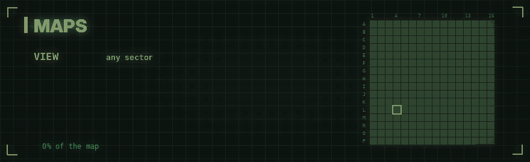</p>

<p align="center">
  <a href="https://oleksandrkhrashchevskyi.github.io/Jagged-Alliance-2-Game-Editor/template/#maps">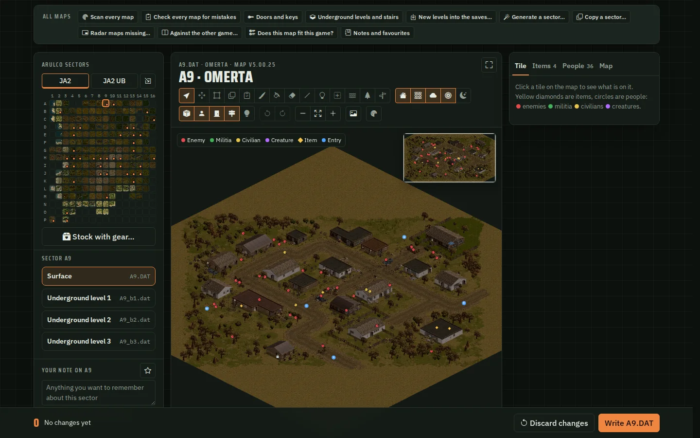</a>
</p>

<p align="center">
  <a href="https://oleksandrkhrashchevskyi.github.io/Jagged-Alliance-2-Game-Editor/template/#maps"></a>
</p>

<p align="center">
  <a href="https://oleksandrkhrashchevskyi.github.io/Jagged-Alliance-2-Game-Editor/template/#maps">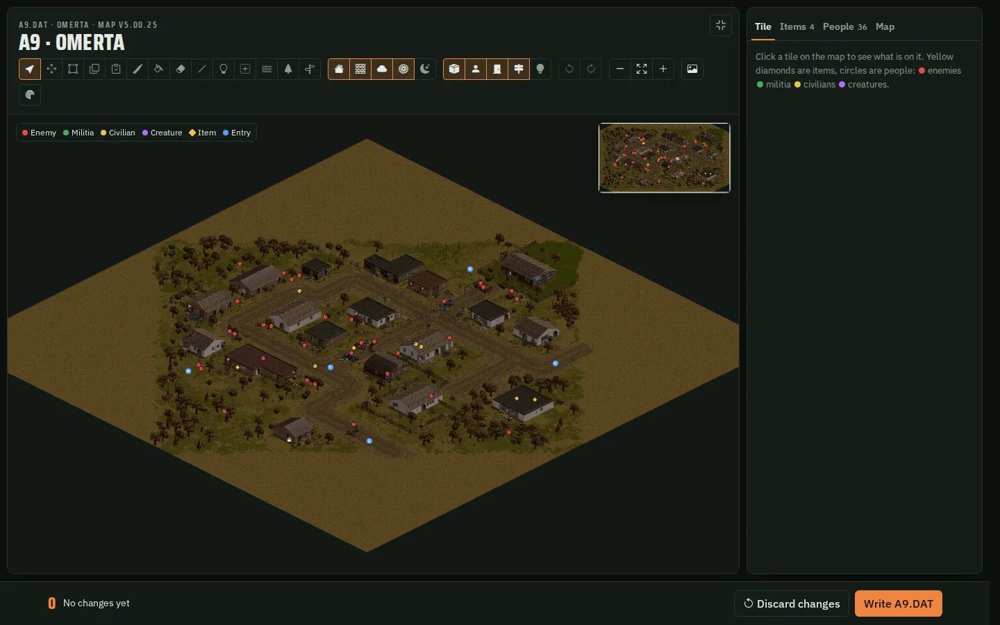</a>
  <a href="https://oleksandrkhrashchevskyi.github.io/Jagged-Alliance-2-Game-Editor/template/#maps">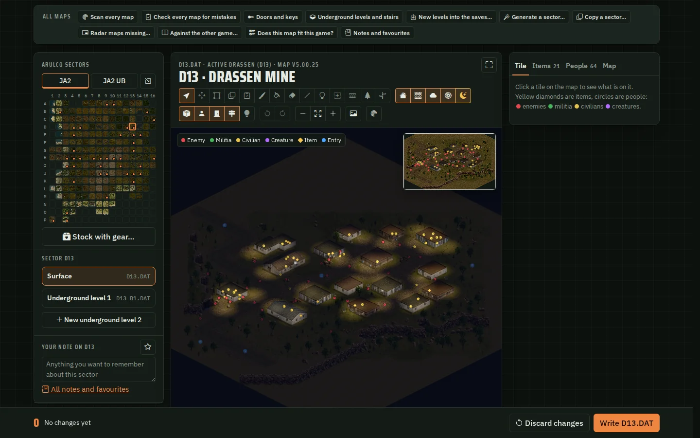</a>
  <a href="https://oleksandrkhrashchevskyi.github.io/Jagged-Alliance-2-Game-Editor/template/#maps">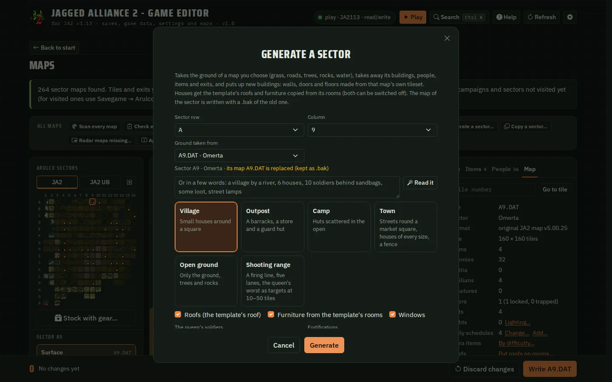</a>
  <a href="https://oleksandrkhrashchevskyi.github.io/Jagged-Alliance-2-Game-Editor/template/#maps">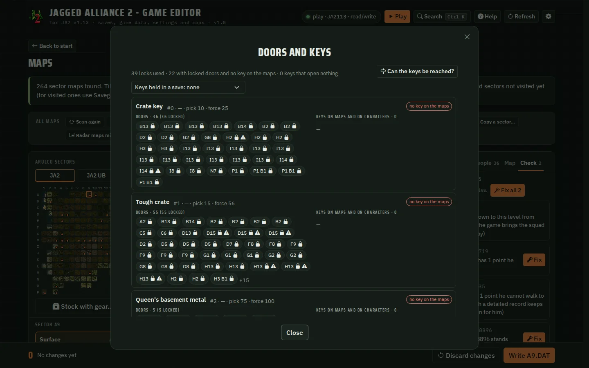</a>
</p>

<details>
<summary>📋 <b>Full feature list</b> (20)</summary>

- **The map over the whole window:** the button at the top right of the map (F10) spreads the toolbar, the map and the tile panel over the whole window, the list of sectors steps aside; the same button or Esc goes back. The Write bar stays at the bottom.
- **JA2 / JA2 UB above the sector grid:** the maps of Jagged Alliance 2 (the first time) or of Unfinished Business. The editor reads them through that game's own set of data folders (vfs_config.JA2113.ini or vfs_config.UB113.ini) while the maps are open — Ja2.ini, what the game plays, is not changed — and goes back to the set Ja2.ini names when you leave the maps (when nothing is left unwritten). The grid is Arulco sectors for JA2 and Tracona sectors for UB (the country of Unfinished Business). UB has maps only for its own campaign (about 37: H7–L15 and their levels), so most of its grid stays empty; its set of folders leaves the JA2 maps library out on purpose.
- **View any sector map** (items, people, doors, exits, lights). Edit: items, people (side, kind, attributes, gear, orders), Group… (up to 32 at once), patrol routes (click up to 9 points, as the game reads them, Roads: up to 9 points spread along the roads and house doors near him, or Paint the way with the mouse held down: the points are spread along it and moved onto tiles he can walk to), doors and locks, exits (stairs, ladders, holes), entry points; Template… (Tile tab): a ready group around the picked tile — guard post, ambush, patrol, sniper nest, HQ, militia post, townsfolk walking about, supply cache, weapons stash. Maps of every format: the original 5.00, 1.13's 7.0 and the newest 8.0 of the 1.13 map editor (16-bit soldier numbers), read and written in their own format. Map tab → More → Edge points…: where squads coming in from the north, east, south or west are put (main and isolated), shown on the map; click a tile to add or take away a point, Take away the bad ones (blocked or cut off), or let the game make them when it loads the map.
- **Build:** move tool, room tool (floor, walls, door, windows, roof), copy / paste a piece of a map (also into another sector; Mirror the piece swaps left and right on screen, walls, doors, windows and roofs turned with it), brush, fill, eraser, Wall tool, Lights tool, Place objects (O: any single piece of the tileset — furniture, a tree, a rock, a car… — with a preview), tiles here (turn, move, copy, add any picture).
- **Lines tool (D):** a dirt road 6 tiles wide with corners and ends made for you (worn in places if you like), a line of cliff, a fence (the tileset's own: barbed wire, planks, chain link…), a low wall of sandbags, or a hedge of bushes — click the corners, Enter makes it; a gap is left where a road crosses.
- **River tool (A):** click the way, width 2–8, winding, deep water in the middle, banks smoothed like the game's editor; roads stay dry as a crossing (the tilesets have no bridge pictures).
- **Plants and battle marks tool (T):** trees, bushes or grass and weeds of the tileset, light / medium / dense, brush 5–21 tiles, or take them away; battle marks scatter scorch marks, cracks, rubble, litter and bones of the tileset, also on roads.
- **Tile tab:** Fortify… (sandbag ring with openings, cover inside, barbed wire outside, guards), Ruin… (a room as after a battle, three grades), Furnish… (a kitchen, bedroom, living room, office, bathroom, bar or store room: the furniture of a room of the same size from the game's own maps of this tileset, sorted by what its pictures show; press again for another), Cellar or bunker… (a new underground level under the house of this tile, in the rock and walls of an underground map you pick: one room under its walls, or a hall, a corridor and 2–6 rooms with doors; stairs right under the way down, the exit put into the house, the level added to the game's list), Minefield… (buried, armed mines in a square of 7–21 tiles, with a safe lane if you like), Vehicle… (a tank or combat jeep of the queen, or a parked Hummer, Eldorado, jeep or ice cream truck; says whether there is room around it and whether it can be reached), A quiet way here… (the route from an entry point to this tile that the queen's soldiers see least, by day or night, compared with the shortest one; drawn on the map).
- **Map tab → More:** Check it before playing… (entry points on blocked tiles, people in walls or out of reach, patrol points they cannot walk to, items nobody can reach, exits to maps the game does not have — with Fix), Light the streets… (lights along the roads and at the house doors, by night or always), After a battle… (battle marks where the soldiers stood, their guns and magazines worn on the ground, the soldiers taken off if you like), Another tileset… (the map drawn with the pictures of another tileset — ground, walls, roofs, trees and furniture stay where they are; pictures a file lacks move to the nearest one, kinds neither that tileset nor GENERIC 1 has are taken away), A convoy on the road… (the queen's soldiers in a column at one end of the longest road, walking it to the other end and back, and the places beside it with cover and the road in sight where your squad can wait for them), Sniper spots on the roofs… (places on the edges of flat roofs that can be climbed, best first for seeing the most ground, the entry points, the roads or the queen's soldiers, within 20–50 tiles; other roofs and trees hide what lies behind them; Show marks what he sees, Sniper here puts an elite with sniper orders there), Hide loot caches… (crates in quiet corners, loot matched to the enemies on the map), Can they get there? (tiles nobody can reach in red, behind locked doors in amber), Bring the town to life… (townsfolk in the houses, each with a day: wakes at home, walks out to the street or a neighbour's door, comes home, sleeps), Ambush along the road… (the queen's soldiers in cover on both sides of the way in from an entry point, all looking at it), Loading screen… (a picture of your own shown while the sector loads, by day and at night; underground levels too), Against the original… (every tile, person and item changed against the .bak or the map as opened, marked on the map; Put back one place at a time), What they see… (each guard's field of view and the blind spots near them, for soldiers, militia or civilians, by day, in the evening or late at night: at night only as far as the light of each tile allows, the map's lamps lit up, who stands in the light), Where to land… (every entry point: which soldiers see the landing spot, the nearest one, how far to cover — quiet, careful or under fire; by day or at night), Defend the sector… (spots for the queen's soldiers by role — sentries by the doors and facing the ways in, patrols round the houses, snipers on flat roofs, a reserve inside — early, middle or late in the campaign, nobody near an entry point), Roofs and the ways up (where the mercs can climb onto each flat roof, roofs without a way up, people and items stuck up there — marked on the map), Test it in the game… (a copy of a save with a squad put into this sector, healed and loaded if you like, then Play), Cover on the map (every tile you can walk on: cover out of sight green, cover in sight amber, open ground the guards see red; by day or night; the nearest hidden cover from each entry point), A map from a picture… (download a template of the map, paint over it in the listed colours — water, deep water, forest, bushes, grass, sand, road — and bring it back: those tiles get the tileset's own ground, water and plants)
- **Radar map** (the radar button above the map): the small picture of the sector in the corner of the tactical screen, drawn from the map as it is (with unwritten changes) the way the 1.13 map editor draws it — the playing area from above, 88 × 44, averaged, its own palette, an 8-bit STI — shown next to the radar map it replaces and written as Radarmaps/&lt;map>.STI (.bak kept). A sector without one shows an empty radar in the game.
- **Write a map:** Draw its radar map again too (a tick in the Write dialog, remembered in this browser) — the radar picture is made from the map as written, every time.
- **All maps → Does this map fit this game?** (and after copying a sector from the other game): can squads get there — MovementCosts.xml read for the sector: BadSector, ground of “nobody passes”, every side closed or barrier only; Open the way makes its ground plains and opens the sides towards its open neighbours both ways (written, .bak kept). In UB it says when UB_Options.INI makes the game use its own travel table instead.
- **A sector from the other game** (the button next to JA2 / JA2 UB): the maps of the other game read through its own set of data folders (not changed); pick one and it is copied, with its radar map, into the maps on screen. Refused when this game has no tileset under the map's number, one of another name, or lacks its tile pictures; characters placed by number (other people in the other game) and items on the ground are listed first. This is how a JA2 sector becomes editable in UB's grid.
- **All maps:** Radar maps missing… (every map without a radar map, ticked; each drawn off screen from its map with its tileset and written as Radarmaps/&lt;map>.STI), Against the other game… (a sector both games have: tileset, size, items, people by side, exit tiles, how many tiles differ in each layer and a picture of where), Does this map fit this game? (the open map against the game in use: the tileset, exit tiles leading to maps it does not have, item numbers not in its Items.xml, characters placed by number with the name this game gives them; also shown after copying a sector from the other game).
- **Map tab:** Put windows into rooms…, Put roofs on rooms…, Daily schedules of the people on a map (time, what, tile; Add… gives one person a schedule, or one new civilian with a schedule on the picked tile), Lighting (tint of the lamps, darkness underground, every lamp at once, a lamp in every room) with a night preview, Extra items per difficulty (surface sectors).
- **Generate a sector…:** the ground of any map without its buildings, with a new village, outpost, camp, town (a ring street round a market square, houses of every size with their doors to the street, a fence round it) or open ground on it (walls, doors, floors, windows, roofs and furniture of that tileset), on request with the queen's soldiers, their loot and fortifications. Copy a sector…: one sector's maps, underground levels, stairs, name, loading screen and radar maps into another. Shooting range: open ground cleared into five lanes, sandbags along the firing line and the queen's worst soldiers standing still as targets at 10 to 50 tiles, the squad coming in behind the firing line (then Test it in the game). In a few words (a village by a river, 6 houses, 10 soldiers behind sandbags, some loot, street lamps): Read it sets the choices; a river and street lamps are added on the map afterwards.
- **New underground level** (under the sector's levels): a copy of another underground map, or made new in its rock and walls — a mine (long tunnels, side galleries, dead ends) or caverns (chambers joined by tunnels), all of it reachable, with the way up to the level above; added to the game's list of levels.
- **Photo** (picture button over the map): size, markers, each layer on or off, a transparent background, room names (the base under A9), character names, a caption; PNG or WebP.
- **Merc base under A9** (only A9, where the mercs land; the button shows once Merc base is switched on in Features → Editor extras) on three levels: headquarters; operations and training; barracks with a room, bed and locker for every merc and a shared shooting range; joined by stairwells. Five plans for each level, drawn in the build window (classic, mirrored and three other layouts), remembered. Way down (stairs from the house in A9 nearest to the landing), Light it (a lamp in every room), Stock with gear; delete an underground level. After Build it a window lists the files written (the base is written at once — the Write button has nothing left to do) and names the tile of the way down, with Show the way down in A9. Add the base to my saves is ticked in the build window: a campaign in progress only knows the underground levels it started with, and going down into a level it does not know stops the game (“Assertion Failure … Queen Command.cpp”, or it hangs on Exiting Sector). New levels into the saves… above the map does the same at any time for every level the game data has, and Check this save names such levels with Fix — as it does things a campaign left in a level that was built again on another plan and that now lie inside solid rock (moved to the nearest free floor). Way down puts four exit tiles (2 × 2, as in Tixa and Orta) with a trapdoor picture inside a house: the one nearest to where the mercs land that can be walked into, or — click a floor tile inside a house of A9 first — the place you pick. The house is chosen from a list — in the build window and under Way down — with a little map of A9: the house in orange, the way down in red, the landing place in blue; first on the list is the usual place, the room with the sofa next to the landing place (tile 3286). Pressed again, Way down moves it. Remove (next to Light it) takes the base out again: the way down and the levels the editor built (maps kept as .bak, the levels off the game's list) — refused while a save has mercs standing down there. In the game: point at the trapdoor until the cursor is a walking man, click twice, OK.
- **All maps:** Scan every map (an item or character on all maps, every item of a calibre or kind; grid coloured by enemies, people, loot or value), Check every map for mistakes (before a release: exits and stairs that lead nowhere, levels the game does not know, and in every map people in walls or out of reach, patrol points and items nobody can get to — Fix and Fix all write the maps, the old ones kept as .bak), Doors and keys (every lock, where its keys lie, Can the keys be reached? — can each key be picked up without opening its own door — keys held in a save), Underground levels and stairs (where the stairs lead, what is broken).

</details>

<p align="right"><a href="#-contents"></a></p>

<p align="center"></p>

<a name="ub"></a>
### ❄️ Unfinished Business

<p align="center">
  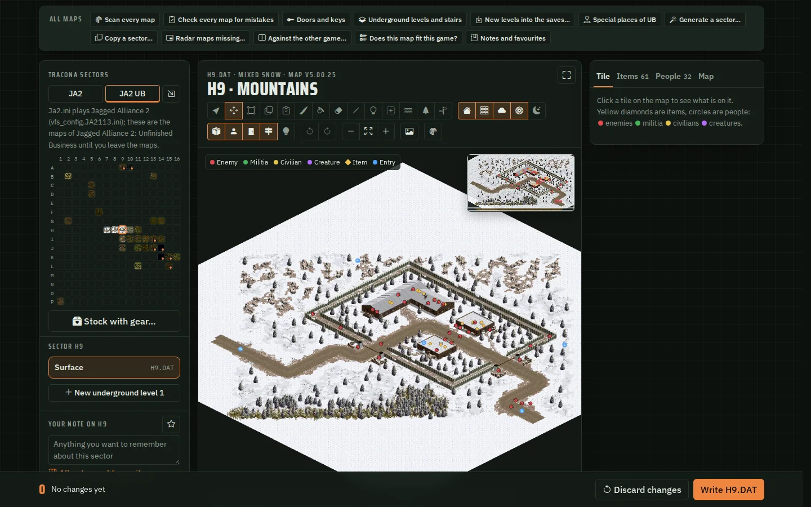
</p>

<details>
<summary>📋 <b>Full feature list</b> (28)</summary>

- **The game in use:** when Ja2.ini names Unfinished Business (Ja2.ini → Mod; the editor knows it by UB_Options.INI in its data), the editor reads UB's own tables — MercProfiles25.xml, MercOpinions25.xml, Inventory/MercStartingGear25.xml — wherever the mercs, their relations or gear kits are shown, and writes them back under those names; the dealers are UB's (Raul and Betty instead of Devin and Perko); quests and facts carry UB's names (Destroy the Missiles, Fix the Laptop, Bloodcats at Betty's, Antique Musket for Raul; facts 400–424 and 430: Biggins, the fan, Tex, imported saves), and A task of your own leaves those facts alone.
- **Militia in a sector** (the sector panel, JA2 and UB): green, regular and elite together are kept within MAX_MILITIA_PER_SECTOR — a number above it is cut with a note. In a UB save the panel speaks of Tracona; UB trains no militia itself, those set here stand in the sector and fight when it is entered (tried in the UB game: the battle screen counts them and the fight runs).
- **Saves:** the save list also looks in UB's own profile folder (Profiles/UserProfile_UnfinishedBusiness/UB_1.13); its saves carry a UB mark. A save of the other game than the one Ja2.ini plays — a Jagged Alliance 2 save while Ja2.ini plays Unfinished Business, or the other way round — is read with its own game's data: the editor mounts that game's set of data folders (vfs_config.JA2113.ini or vfs_config.UB113.ini), as the maps do, before it opens the save, so the items, the characters, the shops and the sector pictures are the right ones; Ja2.ini is not changed, and Back to start goes back to the set it names. Refused, with the reason, while changes of the game data, the settings or a map are not written, or when the other set is not in the game folder. The same for a save picked from disk with Open a save file (a save of 186 or later tells its game by its soldier records).
- **New campaign wizard…** (start page, while UB is the game in use): four kinds (The UB story, Quick start, Easier, Harder) or your own mix — the helicopter crash over the landing sector or a landing like JA2 1.13, Jerry and whether he talks, the start hour and the hours until the mercs arrive, the money at the start per difficulty (DifficultySettings.xml) and the money found in the guard post (H9) and the town (I10) per difficulty, all of it × a factor, the broken laptop quest, Bobby Ray's from the start, the life insurance site, auto-resolve, the early attack on the landing sector; written into UB_Options.INI, Ja2_Options.INI and DifficultySettings.xml of the UB data (each kept as .bak).
- **Game settings → UB_Options.INI:** every setting explained (the game's file has comments only), with a Quick setup group Unfinished Business: how it starts (The UB story, Land like JA2).
- **Maps → Special places of UB** (while UB is the game in use): every tile UB_Options.INI names for the story checked on its sector's map — the seven places the helicopter can come down and Jerry (can they be reached), the money in H9 and I10 (can it be picked up), the soldiers who climb onto roofs in J11 and H11 (from a reachable tile onto a roof), the guards and the fan of the power plant and the way down it opens, the fortified door in the tunnel, the mine entrance and its exits, Morris's switch (an item there) and the switches that launch the missiles — wrong, to look at or fine, with Show on the map; maps in the old format of the first games are named as not checked. Only shows.
- **UB saves read in full:** the mercs, the characters, the map and its sectors (UB keeps bigger sector records), the groups on the move, the items lying in the sectors (an item file the game left with old bytes at its end reads too; the editor writes it without them, as the game reads it), the arms dealers, and the story part below. Written back byte for byte the same when nothing changed.
- **Savegame → squad menu → Unfinished Business: the story…:** what the game keeps about the UB story (JA25 data) — Tex, John Kulba or both in the campaign, the characters already placed, the power plant fan and how the mercs got through, the fortified door, Morris's note, Biggins's detonator, Jerry, the e-mails from the sectors, the 16 milestones of the story; what can be changed safely: an e-mail from a sector sent again, the enemy's hunt stopped, and the milestones that only stand for a remark, a sight or the Barrett's half price (what the maps rely on — the fan, the door, the money picked up, Raul — stays as it is); the four UB quests and the UB facts to change; and the enemy's counter-attacks on every sector of the campaign (enemies, the hourly rise, the chance now, the most it reaches, who holds it) with Calm every sector; the numbers can be changed per sector: enemies (0–30 plus up to 0–30 at random; the game adds the same-sector streak and keeps it under MAX_STRATEGIC_ENEMY_GROUP_SIZE), the rise an hour (0–25, so the chance cannot overflow), the wait (no attack while the chance is at or below it) and the most it reaches (0–100).
- **Story characters in a UB save** (squad menu, or The characters in the story window): Manuel, Biggins, John Kulba, Tex, Gaston, Stogie, Jerry, Betty, Raul, Morris and Rudy, found by their numbers in UB_Options.INI — where each one is, alive, talked to, recruited; move a character, kill or bring back. The mercs of A.I.M. and M.E.R.C. keep their place (they get it when hired).
- **Tools that work in UB saves:** the merc himself (attributes, health, gear, morale, sickness, heal, repair, reload), Contracts, Squads and assignments, Training, The wounded, Why the morale is low, Repairs, Who may leave, Too heavy?, Food and disease ahead, Into battle, Gear by role, Ready for battle, Your gear against the enemy's, Prisoners' and the fallen's gear, Town loyalty, Money by days, Bombs and mines, Take back from another save, Check, Compare, Carry the squad to another save, The campaign over time, the quests and facts; and the campaign: What happens next (the event list with UB's own five events — the early attack on the landing sector can be cancelled), Bobby Ray's deliveries now, The sectors in detail (UB's sector records, the fields three bytes further on), the militia one by one, their gear and the militia plan, the enemy dossier, who comes to help, battle odds, ambush points, if you leave a sector, the dealers (Raul, Betty…), the chronicle. Campaign progress and The dealers' days work too: Unfinished Business reckons its progress by the furthest of its sectors held (H7 44% … J13 75%), but as 1.13 is built the lookup gets a place in its list instead of a sector number and always ends at 50% — the editor shows 50%, the table the game was meant to use and the furthest sector you hold.
- **initunderground.lua of UB:** Soldiers in the underground sectors — the troops and elites of each tunnel and level per difficulty (the if difficultyLevel == n blocks), with their random part.
- **Raul's marks in a UB save** (Arulco → Dealers, Raul open): whether he has sold the Barrett — he keeps one in stock until he has — and his three lines about the hand cannon.
- **A sector copied into Tracona** (Maps → A sector from the other game, or Does this map fit this game?): UB_Options.INI decides whether MovementCosts.xml counts (STRATEGIC_MOVEMENT_COSTS_XML) or UB opens sectors with a map of their own by itself (MAKE_STRATEGIC_MOVEMENT_COSTS); where the XML counts, the way to the sector is opened in one click.
- **Quest and fact names follow the save:** a UB save shows UB's quests and facts even while JA2 is the game in use.
- **Tracona:** in Unfinished Business the Queen's army map of Game data and the save's map (the tab is called Tracona) show the radar pictures only of the sectors UB has maps for — UB's set of folders also reads JA2's radar library, which used to fill the grid with Arulco. On a UB save's map the sectors with UB maps stand out and the sector the enemy hunts the mercs in is marked. The Merc base under A9 and its buttons are left out of the UB maps.
- **Game data → More → Scripts → GameInit.lua of UB:** Enemies at the start of a UB campaign — every sector's administrators, troops and elites per difficulty as a form (“a + b” is a plus 1 to b at random), written into the script in place (UB_SetNumberJa25EnemiesInSurfaceSector). At most 50 of a kind and the random part up to 30 (the game adds the three into one byte).
- **The counter-attacks of UB as 1.13 is built:** the game's choice of the sector to attack (GetSectorJa25SaiWillAttack) was emptied and reports sector −1, so the game looks before the start of the table and never uses any of its sectors — these numbers change nothing; the story dialog says so and keeps the numbers editable for a build that brings it back. The early attack on the landing sector is a separate event and works.
- **UB maps:** only about 37 (H7–L15 and their levels, a few more from Data-1.13) — all of them are read and written, also the five in the old 6.26 format (I13, I10A, I13_B1, J13_B1, K16), which keep that format: UB's set of folders (vfs_config.UB113.ini) leaves the JA2 maps library out, so most of the Tracona grid is empty. To work on another sector there, bring its map over with A sector from the other game or make one with Generate a sector…. The maps are drawn the way the UB game draws them: UB's own tilesets (50 and up) take the pictures they lack from tileset 50 (heavy snow), not from tileset 0.
- **Gear kits in a UB save:** the nineteen kits take what UB's Items.xml has (with attachments, plates, camouflage on the armour, packs and filled pockets as in JA2), for your mercs and for the militia and the soldiers on the loaded map of Tracona, also in the middle of a battle.
- **Doors: locks and traps and Campaign statistics** work in a UB save the same way.
- **More save tools in a UB save:** Move a squad (only to sectors of the UB campaign that have a map of that level), Plan a trip (on foot — UB has no cars and no Skyrider; the ways between the sectors are the ones the save itself keeps, so a sector outside the campaign cannot be entered), Send a group at the squad (the group's new way is the shortest one over those ways, a waypoint in every sector; a group already on the way starts from the sector it is heading for), Where to sell the loot (only the dealers who stand in Tracona — Raul and Betty), Money: the next days, Life insurance (with a note: UB shows the insurance site only when LINK_INSURANCE is on in UB_Options.INI; a payout comes either way, the letters do not), What next in the quests (UB's own quests, without Arulco's notes), Presets, Reveal the map (the enemy numbers in the sectors of the campaign; Tixa, Orta and the SAM sites are Arulco's and are left alone), Free prisoners (in UB the enemy takes none, and this is said) and Town… on the Towns view (Varrez: its sectors, militia, dealers and people). The sectors you hold are counted out of UB's own sectors, and the game's status block (kills, deaths, days without a fight) is read in a UB save too.
- **UB scripts:** strategicmap.lua as a form — the sector and level each piece of its quest code is tied to (entering I10 makes Tex and Betty known, leaving H7 takes Jerry off the map); the same form shows for Jagged Alliance 2. Three scripts UB keeps as empty shells (InterfaceDialogue.lua, StrategicEventHandler.lua, MakeMapsOnHardDrive.lua) are said to do nothing in this game and are not counted in What the editor covers; intro.lua is edited as text.
- **Behind the scenes and What the sectors keep** work in a UB save too (UB's own sizes of the blocks; the map-change kinds of UB), and the INI files of UB show their own notes and group notes the same way — every setting explained.
- **Your reputation, Intel and militia resources, The queen's forecast and Bobby Ray's shopping list** work in a UB save too (checked by loading the changed save in Unfinished Business itself); the shopping list says when UB_Options.INI leaves Bobby Ray's off the laptop. The PMC, the intel market, the special division, Rebel Command and the generals and militia orders are not used by Unfinished Business and say so.
- **UB scripts as forms:** the bloodcats of a sector by difficulty (InitStrategicLayer.lua, UB_SetNumberOfJa25BloodCatsInSector), what dealers sell for intel (Overhead.lua), the loyalty after an event, the names of the underground levels — besides the enemies of GameInit.lua and initunderground.lua.
- **999 action points for everyone in the battle** (Squad menu) and the lip-sync of the voice lines work in UB the same way, on UB's Speech files.
- **Many new mercs…** writes UB's MercProfiles25.xml; What the editor covers… measures UB's own folders; the ten tables of More (soldier names, remarks, random stats, food, face gear, uniforms, delivery, objects to use, fortifications, shot spread) are read where UB's set of folders finds them.
- **Everything else** — maps, items and their pictures, sounds, dialogue, settings, the mercs' tables — works for UB the same way, with the UB data.

</details>

<p align="right"><a href="#-contents"></a></p>

<p align="center"></p>

## ✅ Compatibility

<p align="center">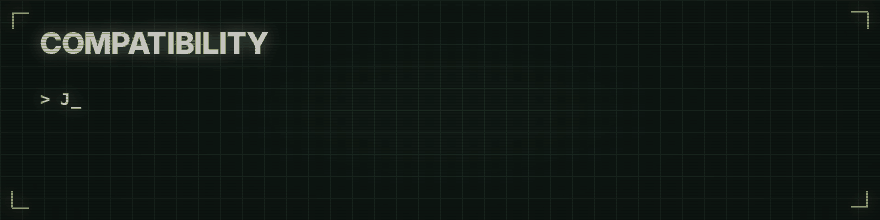</p>

| Game | Status |
|---|---|
| **Jagged Alliance 2 v1.13** | ✅ Supported — the editor is made and tested for it. |
| **Jagged Alliance 2: Unfinished Business (v1.13)** | ✅ Supported — saves, game data, settings and maps work with UB's own files. A few campaign tools are not available in UB saves yet (see [Unfinished Business](#ub)). |
| **Wildfire** (the stand-alone add-on and its v1.13 version) | 🔜 Planned — not supported yet. |
| **Urban Chaos** (v1.13 version) | 🔜 Planned — not supported yet. |
| Other popular mods — **Arulco Revisited**, **Arulco Vacations**, **AIMNAS**, **SDO**, **Deidranna Lives!**, **Night Ops**, **Renegade Republic**, **Vietnam SOG '69**, **Back to Business**, **Shady Job** | 🔜 Planned for future releases — not tested yet. |
| Original JA2 (without v1.13), JA2 Stracciatella and anything else | ❔ Not tested yet — may work in part or not at all. Back up your game first. |

The editor is a Windows app. Support for more mods will come in future releases, the most asked-for first — want one sooner? Say so in an [issue](../../issues). Tried it with another version or mod? Tell us in an [issue](../../issues) — whether it works or not, it helps.

## Getting started

<p align="center">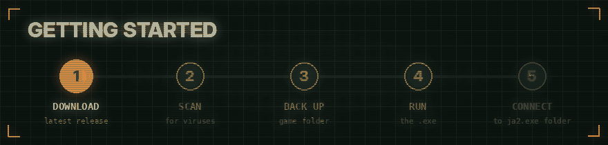</p>

1. [Download the latest release](../../releases/latest) and unpack it.
2. **Scan the files for viruses** (see the links above).
3. **Back up your game folder and saves** — the editor can damage game files.
4. Run `ja2-game-editor.exe`.
5. Type or *Browse* to your game folder (the one that contains `ja2.exe`) and press **Connect**.

### Verify the download (SHA-256)

Every release lists the SHA-256 checksum of its files. Download the editor **only from this repository** and compare the checksum before running it.
In PowerShell, in the folder with the downloaded file:

```powershell
Get-FileHash .\ja2-game-editor.exe -Algorithm SHA256
```

or in the Command Prompt:

```bat
certutil -hashfile ja2-game-editor.exe SHA256
```

If the value differs from the one in the release notes, **do not run the file** — it was changed by someone else.

## Keyboard shortcuts

<p align="center">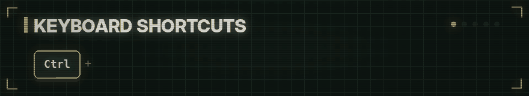</p>

| Keys | Action |
|---|---|
| `Ctrl+S` | Write changes |
| `Ctrl+K` | Search everything |
| `Ctrl+F` | Search box |
| `Ctrl+Shift+F` | Find an item in the save |
| `Alt+1` … `Alt+9` | Switch tabs |
| `Ctrl+↑` / `Ctrl+↓` | Previous / next merc |
| `Ctrl+M` | Music on / off |
| `F11` | Full screen on / off |
| `F1` | Guide |

The full list is in the built-in guide (*Keyboard shortcuts*).

## Troubleshooting / FAQ

<p align="center">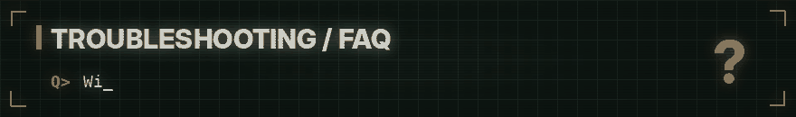</p>

**Windows SmartScreen says "Windows protected your PC".**
Windows shows this for new programs downloaded from the internet that it does not know yet. Check the file with the scanners and the SHA-256 checksum above, then press *More info* → *Run anyway*.

**Connect does not work / the game folder is not found.**
Pick the folder that contains `ja2.exe` itself, not a folder above it or a shortcut. If the game is in `Program Files`, Windows may block writing there — move the game to another folder (for example `C:\Games\JA2`) or run the editor as administrator.

**Something went wrong after an edit — how do I undo it?**
Every file the editor writes keeps the original next to it as a `.bak` copy: delete the edited file and remove `.bak` from the copy's name.
For saves it is even easier: *Save list* → *Save history* keeps the last 30 versions of each save — pick one and *Restore*.

**Where are my editor settings?**
In `%APPDATA%\Jagged Alliance 2 - Game Editor`. Delete that folder to reset the editor to defaults.

## Reporting bugs

<p align="center">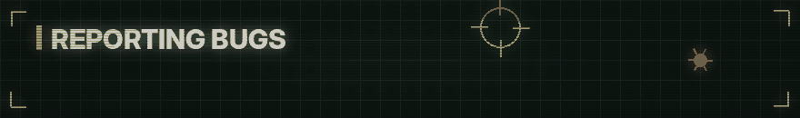</p>

Found a bug or have an idea? The quickest way: in the editor open **⚙ → Report a problem…** — it packs the details, the log and (if you tick them) the open save, map and `Ja2_Options.INI` into one `.zip` and opens the [Issues](../../issues) page to attach it. Otherwise open an [issue](../../issues) and include:

- the editor version and your game version (and any mods you use);
- what you did, what you expected and what happened instead;
- a screenshot, and the save or data file if the problem is with one.

Please check the [open issues](../../issues) first — maybe it is already reported.

<p align="center"></p>

## 💬 Community

<p align="center">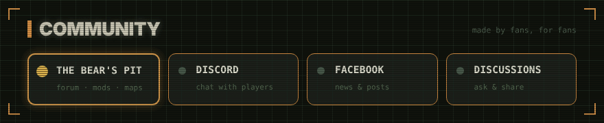</p>

Questions, ideas, mods and talk about Jagged Alliance 2 — come and join the fans:

<p align="center">
  <a href="https://thepit.ja-galaxy-forum.com/"></a>
  <a href="https://discord.com/invite/Ku2H9Hf"></a>
  <a href="https://www.facebook.com/bearspit"></a>
  <a href="../../discussions"></a>
</p>

- **[The Bear's Pit — JA Galaxy Forum](https://thepit.ja-galaxy-forum.com/)** — the home of Jagged Alliance 2 and 1.13 modding: mods, maps, tools and help.
- **[Discord](https://discord.com/invite/Ku2H9Hf)** — chat with other players and modders.
- **[Facebook — The Bear's Pit](https://www.facebook.com/bearspit)** — news and posts from The Bear's Pit community on Facebook.
- **[GitHub Discussions](../../discussions)** — ask a question, share an idea or show your mod right here in the repository: press **New discussion**.
  - Editor creator: [`oleksandr1024`](https://discord.com/users/660456590364901387)
  - Server admins: [`kitty624`](https://discord.com/users/485597085496901633), [`papa_bear2842`](https://discord.com/users/348550304557563905), [`h_world_37628`](https://discord.com/users/1407768046956839042), [`tais0001`](https://discord.com/users/118450058780868613), [`marco6326`](https://discord.com/users/201429346240430080), [`asdow5338`](https://discord.com/users/484390622040686592)

## Changelog

What's new in each version is listed on the [Releases](../../releases) page.

<p align="center"></p>

## Credits

<p align="center">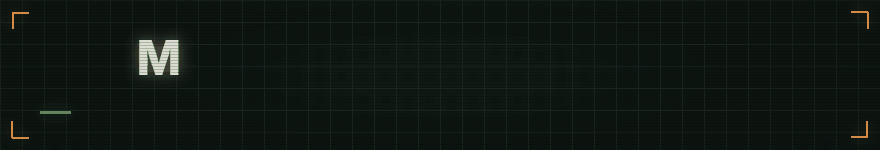</p>

Thanks to the whole **Jagged Alliance 2** fan community — the modders, map makers and players who have kept this game alive for decades and whose research into its file formats made this editor possible. This editor is made by fans, for fans.

Created by **Krainer (Oleksandr Khrashchevskyi)** — [`oleksandr1024`](https://discord.com/users/660456590364901387) on Discord. Thanks to the admins of the Discord server — [`kitty624`](https://discord.com/users/485597085496901633), [`papa_bear2842`](https://discord.com/users/348550304557563905), [`h_world_37628`](https://discord.com/users/1407768046956839042), [`tais0001`](https://discord.com/users/118450058780868613), [`marco6326`](https://discord.com/users/201429346240430080) and [`asdow5338`](https://discord.com/users/484390622040686592).

## License

The editor is licensed under [CC BY-NC-SA 4.0](LICENSE): you may share and change it, but **not sell it or use it commercially**, and changed versions must stay under the same license.

Copyright (c) 2026 Krainer (Oleksandr Khrashchevskyi)

## Disclaimer

This is a fan-made tool and is not affiliated with the owners of Jagged Alliance 2. The editor does not include any game files; you need your own copy of the game. **The editor may damage your game files — always keep a backup copy of your game folder and saves.** You use it at your own risk.
